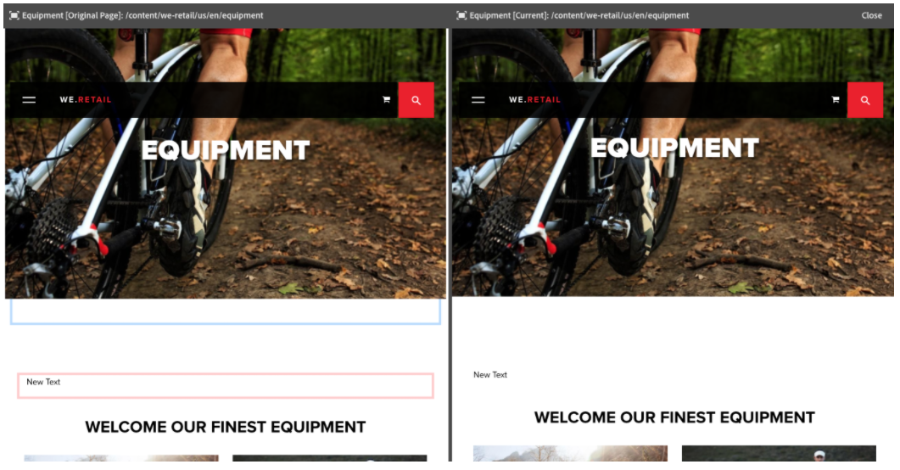

# 頁面差異{#page-diff}

>[!CAUTION]
>
>AEM 6.4已結束延伸支援，本檔案不再更新。 如需詳細資訊，請參閱 [技術支援期](https://helpx.adobe.com//tw/support/programs/eol-matrix.html). 尋找支援的版本 [此處](https://experienceleague.adobe.com/docs/).

## 簡介 {#introduction}

內容建立是一個迭代過程。 以效率製作需要能夠查看從一個迭代到另一個迭代的更改。 檢視一個頁面版本，而另一個頁面版本則效率低下且容易出錯。 作者想要輕鬆並排比較目前的頁面與其他版本。

頁面差異功能可方便地並排比較兩個頁面，並強調顯示其差異。

>[!CAUTION]
>
>如果您執行的是AEM 6.4.3之前的版本，使用者必須具備 **修改/建立/刪除** 節點的權限 `/content/versionhistory` 以便使用功能。
>
>請參閱 [開發與頁面差異](/help/sites-developing/pagediff.md#operation-details) 如需此功能的詳細技術資訊。

## 使用 {#use}

並排差異可以比較：

* [版本](/help/sites-authoring/working-with-page-versions.md#comparing-a-version-with-current-page)  — 具有其當前狀態的頁面的早期版本
* [Live Copies](/help/sites-administering/msm-livecopy.md#comparing-a-live-copy-page-with-a-blueprint-page) - Live Copy及其Blueprint
* [啟動](/help/sites-authoring/launches-editing.md#comparing-a-launch-page-to-its-source-page)  — 透過其來源啟動
* [語言副本](/help/sites-administering/tc-manage.md#comparing-language-copies)  — 翻譯前後的頁面（重新）

請參閱有關如何在這些內容中啟動差異的各個主題。

### 差異的表示 {#presentation-of-differences}

無論比較的內容為何，差異的呈現方式都保持不變。

* 啟動差異時選擇的內容顯示在左側（差異入口點）。
* 比較內容會顯示在右側（比較所選內容的對象）。

例如，如果比較版本，則當前版本顯示在左側，而上一版本顯示在右側。

兩個頁面的來源會清楚顯示在瀏覽器視窗頂端的標題列中。

差異會在元件和HTML層級偵測變更。 已變更的項目會以不同顏色強調顯示。

**元件變更**

* 淺綠色 — 新增元件
* 粉紅色 — 元件已移除
* 藍色 — 元件已變更
* 藍色 — 已移動元件

請注意，「已變更」和「已移動」顏色相同。

**HTML變更**

* 深綠色 — 新增HTML
* 紅色 — 已移除HTML

>[!NOTE]
>
>比較語言副本時，會停用醒目提示，因為在翻譯中，所有變更和醒目提示都沒有好處。

### 全螢幕和退出 {#fullscreen-and-exiting}

若要著重於特定內容，您可以按一下並排差異的任一「側」全螢幕圖示，將其放大至完整瀏覽器視窗。

選取的一側會填入整個視窗，但長條會保留在頂端，讓您在兩頁之間切換。

您也可以按一下退出全螢幕圖示，以選擇關閉全螢幕檢視。

您可以隨時按一下標題中的「關閉」按鈕，以退出並排差異。

## 限制 {#limitations}

在某些情況下，頁面差異可能無法如預期般偵測到差異。

* 差異版本和啟動時，差異不會考慮階層連結、功能表、產品清單或標誌等動態元件（依賴網站結構呈現其內容的元件）。
* 對於版本，差異不會重新建立訪問控制策略和即時副本關係。
* 如果對影像進行任何變更，例如修改alt、title或src屬性，則會以藍色反白標示為已變更。 但是，在某些情況下，影像具有src屬性的Base64表示，即使兩個影像看起來相同，它們也會由差異標籤為不同，因為src屬性不同。
* 差異無法檢測影像旋轉。
* 如果移動了頁面，則無法再對移動前進行的任何版本執行差異。

   * 如果您遇到差異問題，請檢查 [時間表](/help/sites-authoring/basic-handling.md#timeline) ，查看頁面是否已移動。

>[!NOTE]
>
>無法相互比較版本。 只能比較目前版本的頁面。 目前版本一律為醒目提示並變更的版本。

>[!NOTE]
>
>有關頁面差異機制操作以及可能影響頁面差異的限制的詳細資訊，請參見 [開發人員檔案](/help/sites-developing/pagediff.md) 功能。
