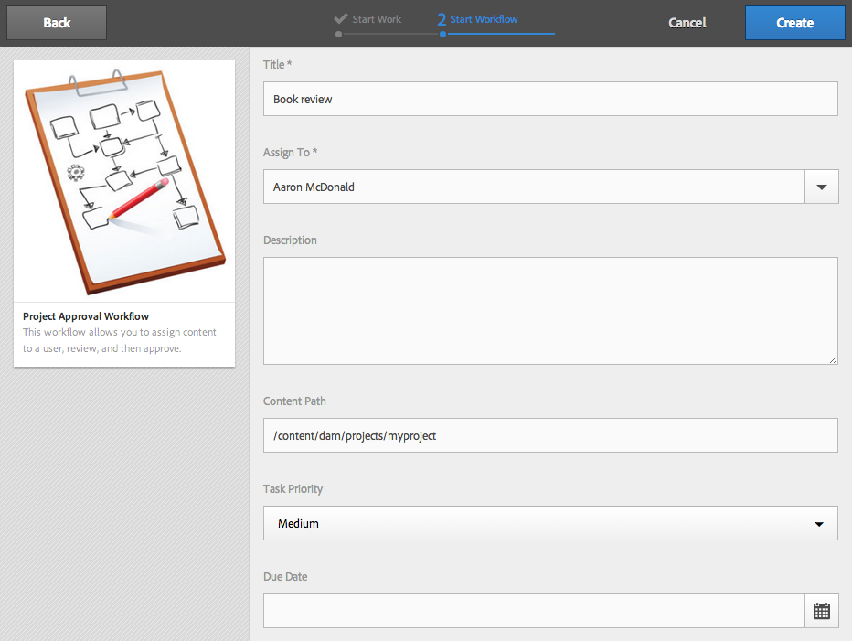
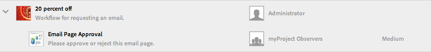

# 使用專案工作流程{#working-with-project-workflows}

>[!CAUTION]
>
>AEM 6.4已結束延伸支援，本檔案不再更新。 如需詳細資訊，請參閱 [技術支援期](https://helpx.adobe.com//tw/support/programs/eol-matrix.html). 尋找支援的版本 [此處](https://experienceleague.adobe.com/docs/).

現成可用的專案工作流程包括下列項目：

* **專案核准工作流程**  — 此工作流程可讓您指派內容給使用者、檢閱，然後核准。
* **請求啟動**  — 要求啟動的工作流程。
* **要求登陸頁面**  — 此工作流程會要求登錄頁面。
* **要求電子郵件**  — 要求電子郵件的工作流程。
* **產品像片拍攝與產品像片拍攝（商務）**  — 將資產與產品對應
* **DAM建立和翻譯復本和DAM建立語言復本**  — 建立資產和資料夾的翻譯二進位檔、中繼資料和標籤。

根據您選取的專案範本，您有特定的工作流程可用：

|  | **簡單專案** | **媒體專案** | **產品像片拍攝專案** | **翻譯專案** |
|---|:-:|:-:|:-:|:-:|
| 請求副本 |  | x |  |  |
| 產品像片拍攝 |  | x | x |  |
| 產品像片拍攝（商務） |  |  | x |  |
| 專案核准 | x |  |  |  |
| 請求啟動 | x |  |  |  |
| 要求登陸頁面 | x |  |  |  |
| 要求電子郵件 | x |  |  |  |
| DAM建立語言副本(&amp;A); |  |  |  | x |
| DAM建立和翻譯語言副本(&amp;A); |  |  |  | x |

>[!NOTE]
>
>&amp;ast;這些工作流程並非從 **工作流程** 標題。 請參閱 [建立資產的語言復本。](/help/sites-administering/tc-manage.md)

無論您選擇哪個工作流程，啟動和完成工作流程的步驟都相同。 僅步驟會變更。

您可以直接在「專案」中啟動工作流程（DAM建立語言副本或DAM建立和翻譯語言副本除外）。 有關項目中任何未完成任務的資訊列在 **工作** 方塊。 需要完成的任務通知會顯示在用戶表徵圖旁邊。

如需在AEM中使用工作流程的詳細資訊，請參閱下列內容：

* [參與工作流程](/help/sites-authoring/workflows-participating.md)
* [將工作流程套用至頁面](/help/sites-authoring/workflows-applying.md)
* [設定工作流程](/help/sites-administering/workflows.md)

本節說明「專案」可用的工作流程。

## 請求複製工作流程 {#request-copy-workflow}

此工作流程可讓您向使用者請求手稿，然後核准。 要啟動請求複製工作流，請執行以下操作：

1. 在您的媒體專案中，選取「工 **作流程」方塊中的** +登入，然後選取「請求復 **制工作流程」******。
1. 輸入手稿標題，以及您要求的摘要。 如果適用，請輸入目標字數、任務優先順序和到期日。

   

1. 按一下&#x200B;**建立**。工作流程會開始。 任務會顯示在 **工作** 方塊。

   

## 產品像片拍攝工作流程 {#product-photo-shoot-workflow}

產品像片拍攝工作流程（商務和無商務）將詳細說明 [創意專案](/help/sites-authoring/managing-product-information.md).

## 專案核准工作流程 {#project-approval-workflow}

在「專案核准」工作流程中，您會將內容指派給使用者、檢閱，然後核准內容。

1. 在您的「簡單」專案中，選取****+** 登入 **工作流程** 拼貼並選取 **專案核准工作流程**.
1. 輸入標題，然後從「團隊」(Team)清單中選擇要為其分配的人員。 如果適用，請輸入說明、內容路徑、任務優先順序和到期日。

   

1. 按一下&#x200B;**建立**。工作流程會開始。 任務會顯示在 **工作** 方塊。

   

## 請求啟動工作流程 {#request-launch-workflow}

此工作流程可讓您要求啟動。

1. 在您的「簡單」專案中，選取「工 **作流程」方塊中的** +登入，然後選取「請求啟 **動工作流程」******。
1. 輸入啟動的標題，並提供啟動來源路徑。 您也可以新增說明和上線日期（如果適用）。 根據您希望啟動的行為方式，選擇「繼承源頁面即時資料」或「排除子頁面」。

   

1. 按一下&#x200B;**建立**。工作流程會開始。 工作流程會顯示在 **工作流程** 清單（按一下橢圓） **...** 在 **工作流程** 並排以存取此清單)。

## 請求登錄頁面工作流程 {#request-landing-page-workflow}

此工作流程可讓您要求登錄頁面。

1. 在您的「簡單」專案中，選取 **+** 登入 **工作流程** 並選取「請求著陸頁面工作流程」 。
1. 輸入登錄頁面的標題和父路徑。 如果適用，請輸入上線日期或為登錄頁面選擇檔案。

   

1. 按一下&#x200B;**建立**。工作流程會開始。 任務會顯示在 **工作** 方塊。

## 要求電子郵件工作流程 {#request-email-workflow}

此工作流程可讓您要求電子郵件。 此工作流程與 **電子郵件** 方塊。

1. 在您的媒體或簡單專案中，選取 **+** 登入 **工作流程** 拼貼並選取 **要求電子郵件工作流程**.
1. 輸入電子郵件標題，以及行銷活動和範本路徑。 此外，您還可以提供名稱、說明和即時日期。

   

1. 按一下&#x200B;**建立**。工作流程會開始。 任務會顯示在 **工作** 方塊。

   

## 建立（和翻譯）資產的語言複製工作流程 {#create-and-translate-language-copy-workflow-for-assets}

此 **建立語言副本** 和 **建立和翻譯語言副本** 工作流程在 [建立資產的語言復本。](/help/assets/translation-projects.md)
