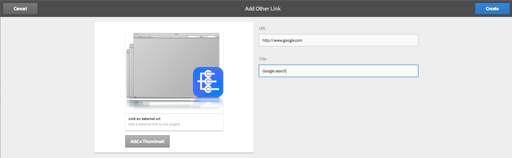
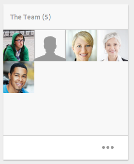

# 專案{#projects}

>[!CAUTION]
>
>AEM 6.4已結束延伸支援，本檔案不再更新。 如需詳細資訊，請參閱 [技術支援期](https://helpx.adobe.com//tw/support/programs/eol-matrix.html). 尋找支援的版本 [此處](https://experienceleague.adobe.com/docs/).

專案可讓您將資源群組到一個實體中。共同的共用環境使您的專案容易管理。您可以與專案相關聯的資源類型在 AEM 中稱為圖磚。圖磚可能包括專案和團隊資訊、資產、工作流程和其他類型的資訊，如[專案圖磚](#project-tiles)中詳細所述。

>[!CAUTION]
>
>如果專案中的使用者在使用專案功能（例如建立專案、建立工作/工作流程、查看及管理團隊）時要查看其他使用者/群組，這些使用者必須擁有的讀取存取權 **/home/users** 和 **/home/groups**. 實作此項目最簡單的方式是提供 **專案 — 使用者** 群組讀取存取權 **/home/users** 和 **/home/groups**.

作為使用者，您可以進行以下作業︰

* 建立專案
* 將內容和資產資料夾與專案建立關聯
* 刪除專案
* 從專案中刪除內容連結

請參閱以下其他主題：

* [管理專案](/help/sites-authoring/touch-ui-managing-projects.md)
* [使用任務](/help/sites-authoring/task-content.md)
* [使用專案工作流程](/help/sites-authoring/projects-with-workflows.md)
* [創意專案與PIM整合](/help/sites-authoring/managing-product-information.md)

## 專案主控台 {#projects-console}

專案主控台是您在 AEM 中存取和管理專案的地方。

* 選取&#x200B;**時間軸**，然後選取專案以檢視其時間軸。
* 按一下/點選&#x200B;**選取**&#x200B;以進選取模式。
* 按一下&#x200B;**建立**&#x200B;以新增專案。
* **切換使用中專案**&#x200B;可讓您在所有專案和僅使用中專案之間切換。
* **顯示統計檢視**&#x200B;可讓您查看有關任務完成情況的專案統計資料。

## 專案圖磚 {#project-tiles}

使用專案，您可以將不同類型的資訊與您的專案相關聯。這些稱為&#x200B;**圖磚**。本章節在說明每個圖磚及其包含的資訊類型。

您可以將以下圖磚與您的專案相關聯。依照以下章節順序說明每個圖磚：

* 資產和資產集合
* 體驗
* 連結
* 專案資訊
* 團隊
* 登陸頁面
* 電子郵件
* 工作流程
* Launch
* 任務

### 資產 {#assets}

在&#x200B;**資產**&#x200B;圖磚中，您可以收集所有要用於特定專案的資產。

您直接將資產上傳到圖磚。此外，如果您有 Dynamic Media 附加元件，您也可以建立影像集、迴轉集或混合媒體集。

### 資產集合 {#asset-collections}

與資產類似，您可以將[資產集合](/help/assets/managing-collections-touch-ui.md)直接新增到您的專案中。您在 Assets 中定義集合。

按一下&#x200B;**新增系列**，並從清單中選取適當的系列，即可新增系列。

### 體驗 {#experiences}

**體驗**&#x200B;圖磚可讓您將行動應用程式、網站或出版物新增到專案中。

這些圖示會指出所呈現的體驗類型：網站、行動應用程式或出版物。按一下+號或按一下「新增體驗」 **並選取體驗類型** ，以新增體驗。

選擇縮圖的路徑，並變更體驗的縮圖 (如果適用)。體驗在&#x200B;**體驗**&#x200B;圖磚中群組在一起。

### 連結 {#links}

連結圖磚可讓您將外部連結與您的專案相關聯。

您可以使用易於識別的名稱為連結命名，也可以變更縮圖。

### 專案資訊 {#project-info}

專案資訊圖磚提供專案的一般資訊，包括描述、專案狀態 (非作用中或作用中)、到期日和成員。此外，您可以加入專案縮圖，它顯示在主要專案頁面上。

可以在此圖磚及團隊圖磚中指派和刪除團隊成員 (或變更他們的角色)。

### 翻譯工作 {#translation-job}

翻譯工作圖磚是您開始翻譯的地方，也是您查看翻譯狀態的地方。若要設定您的翻譯，請參閱[建立翻譯專案](/help/assets/translation-projects.md)。

按一下&#x200B;**翻譯工作**&#x200B;卡底部的省略符號以檢視翻譯工作流程中的資產。翻譯工作清單也會顯示資產中繼資料和標記項目。這些項目表示資產中繼資料和標記也已翻譯。

### 團隊 {#team}

在此圖磚中，您可以指定專案團隊的成員。編輯時，您可以輸入團隊成員的姓名並指派使用者角色。

您可以在團隊中新增和刪除團隊成員。此外，您可以編輯指派給團隊成員的[使用者角色](#user-roles-in-a-project)。

### 登陸頁面 {#landing-pages}

此 **登陸** 「頁面」方塊可讓您請求新的登錄頁面。

此工作流程的說明於 [建立登錄頁面工作流程](/help/sites-authoring/projects-with-workflows.md#request-landing-page-workflow).

### 電子郵件 {#emails}

此 **電子郵件** 「 」圖磚可協助您管理電子郵件的請求。 它會啟動「請求電子郵件」工作流程。

如需詳細資訊，請參閱 [要求電子郵件工作流程。](/help/sites-authoring/projects-with-workflows.md#request-email-workflow)

### 工作流程 {#workflows}

您可以指派專案以遵循特定工作流程。如果有任何工作流程執行中，其狀態將顯示在專案的&#x200B;**工作流程**&#x200B;圖磚中。

您可以指派專案以遵循特定工作流程。視您選擇的專案而定，您可以使用不同的工作流程。

相關說明請參閱[使用專案工作流程](/help/sites-authoring/projects-with-workflows.md)。

### Launch {#launches}

Launch 圖磚顯示透過[要求 Launch 工作流程](/help/sites-authoring/projects-with-workflows.md)要求的任何 Launch。

### 任務 {#tasks}

任務可讓您監控任何專案相關任務的狀態，包括工作流程。如需任務的詳細資訊，請參閱[使用任務](/help/sites-authoring/task-content.md)。

## 專案範本 {#project-templates}

AEM 隨附三種不同範本，可立即可用：

* 簡單專案 - 不屬於其他類別 (全包) 之任何專案的參考樣本。它包括三個基本角色 (所有者、編輯者和觀察者) 和四個工作流程 (專案核准、要求啟動、要求登陸頁面和要求電子郵件)。
* 媒體專案 - 媒體相關活動的參考樣本專案。它包括幾個與媒體相關的專案角色 (攝影師、編輯者、文案人員、設計師、所有者和觀察者)。此外，還包含與媒體內容相關的兩個工作流程： 「要求復本」（用於要求和檢閱文字）和「產品像片拍攝」（用於管理與產品相關的像片）
* [產品像片拍攝專案](/help/sites-authoring/managing-product-information.md)  — 管理電子商務相關產品攝影的參考範例。 它包括攝影師、編輯、像片閱讀者、擁有者、創意總監、社交媒體行銷人員、行銷經理、審核者和觀察者的角色。
* [翻譯專案](/help/sites-administering/translation.md) - 管理翻譯相關活動的參考樣本。它包括三個基本角色 (所有者、編輯者和觀察者)。它包括兩個可透過工作流程使用者介面存取的工作流程。

根據您選擇的範本，您可以使用不同的選項，尤其是在使用者角色和工作流程方面。

## 專案中的使用者角色 {#user-roles-in-a-project}

專案範本中設定不同使用者角色，因兩個主要原因而使用：

1. 權限。使用者角色為列出的三個類別之一：觀察者、編輯者、所有者。例如，攝影師或文案人員將擁有與編輯者相同的權限。權限決定使用者可對專案內容進行的操作。
1. 工作流程。工作流程決定在專案中將任務指派給誰。任務可以與專案角色相關聯。例如，可以將任務指派給攝影師，如此所有具有攝影師角色的團隊成員都將獲得該任務。

所有專案都支援以下預設角色，讓您能管理安全性和控制權限：

<table> 
 <tbody> 
  <tr> 
   <td>
<strong>角色</strong>
 </td> 
   <td>
<strong>說明</strong>
 </td> 
   <td>
<strong>權限</strong>
 </td> 
   <td>
<strong>群組會籍</strong>
 </td> 
  </tr> 
  <tr> 
   <td>
觀察者
 </td> 
   <td>
擁有此角色的使用者可以檢視專案詳細資料，包括專案狀態。
 </td> 
   <td>
專案的唯讀權限
 </td> 
   <td>
工作流程使用者群組
 </td> 
  </tr> 
  <tr> 
   <td>
編輯者
 </td> 
   <td>
擁有此角色的使用者可以上傳和編輯專案的內容。
 
 
 </td> 
   <td> 
    <ul> 
     <li>對專案、相關中繼資料和相關資產的讀取和寫入存取權。</li> 
     <li>上傳照片清單、像片拍攝，以及檢閱和核准資產的權限</li> 
     <li>/etc/commerce的寫入權限</li> 
     <li>具有特定專案的修改權限</li> 
    </ul> </td> 
   <td>
工作流程使用者群組
 </td> 
  </tr> 
  <tr> 
   <td>
所有者
 </td> 
   <td>
擁有此角色的使用者可以起始專案。擁有者可以建立專案、啟動專案中的工作，以及將已核准的資產移至生產資料夾。 儘管所有者也可以檢視和執行專案中的所有其他任務。
 </td> 
   <td> 
    <ul> 
     <li>/etc/commerce的寫入權限</li> 
    </ul> </td> 
   <td> 
    <ul> 
     <li>DAM使用者群組（以便建立專案）</li> 
     <li>專案管理員群組（以便移動資產）</li> 
    </ul> </td> 
  </tr> 
 </tbody> 
</table>

對於創意專案，也提供其他角色 — 例如攝影師 — 。 您可以使用這些角色來衍生特定專案的自訂角色。

>[!NOTE]
>
>當您建立專案並將使用者新增至各種角色時，系統會自動建立與專案相關的群組，以管理相關的權限。例如，名為Myproject的專案會有三個群組 **Myproject Owners**、 **Myproject Editors**、 **Myproject Obsertors**。不過，如果刪除專案，這些群組不會自動刪除。管理員需要手動刪除「工具 **>安全** 性 **>** 群組 ****」。
