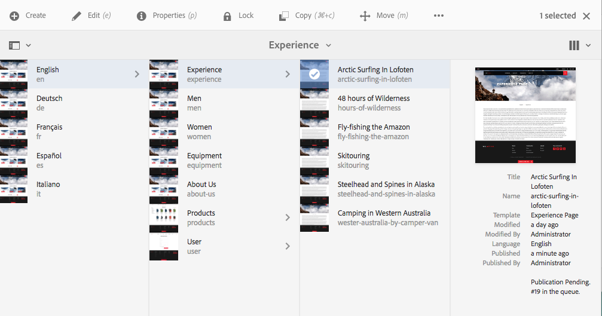
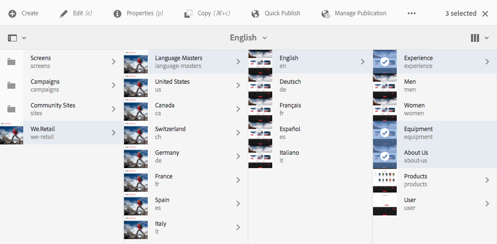
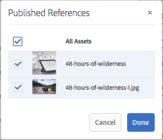
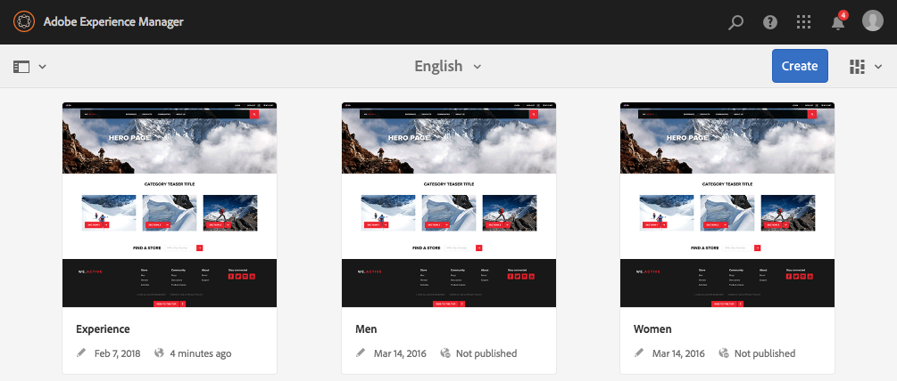

# 發佈頁面{#publishing-pages}

一旦您在製作環境中建立並檢閱內容後，其目標是將[發佈至您的公開網站](/help/sites-authoring/author.md#concept-of-authoring-and-publishing)（您的發佈環境）。

這稱為發佈頁面。 如果您想從發佈環境中移除頁面，即為取消發佈。 發佈和取消發佈頁面時，製作環境仍可供進一步變更，直到您刪除為止。

您也可以立即發佈/取消發佈頁面，或在日後預先定義的日期/時間發佈。

>[!NOTE]
>
>與發佈相關的某些術語可能會混淆：
>
>* **發佈/取消發佈**
   >  這些是可讓您的內容在您的發佈環境（或不可）上公開的動作的主要辭彙。
   >
   >
* **啟用/停用**
   >  這些詞語等同於發佈/取消發佈。
   >
   >
* **複製/複製**
   >  這些技術術語說明資料（例如頁面內容、檔案、程式碼、使用者註解）在某個環境間移動的情形，例如發佈或反向複製使用者註解時。
>

>[!NOTE]
>
>如果您沒有發佈特定頁面所需的權限：
>
>* 系統會觸發工作流程，通知您發佈請求的適當人員。
>* 此[工作流程可能已由您的開發團隊自訂](/help/sites-developing/workflows-models.md)。
>* 系統會短暫顯示訊息，通知您工作流程已觸發。

>

## 發佈頁面 {#publishing-pages-2}

您可以根據您的位置發佈：

* [從頁面編輯器](/help/sites-authoring/publishing-pages.md#publishing-from-the-editor)
* [從網站主控台](/help/sites-authoring/publishing-pages.md#publishing-from-the-console)

### 從編輯器{#publishing-from-the-editor}發佈

如果您正在編輯頁面，則可直接從編輯器發佈頁面。

1. 選擇&#x200B;**頁資訊**&#x200B;表徵圖以開啟菜單，然後選擇&#x200B;**發佈頁**&#x200B;選項。

   

1. 視頁面是否有需要發佈的參考而定：

   * 如果沒有要發佈的參考，則會直接發佈頁面。
   * 如果頁面有需要發佈的參考，這些參考會列在&#x200B;**Publish**&#x200B;精靈中，您可以在此：

      * 指定哪些資產/標籤/等等 您想要與頁面一起發佈，然後使用&#x200B;**Publish**&#x200B;來完成此程式。
      * 使用&#x200B;**取消**&#x200B;來中止動作。

   

1. 選取&#x200B;**Publish**&#x200B;會將頁面復寫至發佈環境。 在頁面編輯器中，會顯示資訊橫幅以確認發佈動作。

   

   在主控台中檢視相同頁面時，更新的發佈狀態會顯示。

   

>[!NOTE]
>
>從編輯器發佈是淺層發佈，亦即只會發佈/發佈選取的頁面/頁面，而不會發佈任何子頁面。

### 從主控台{#publishing-from-the-console}發佈

在網站主控台中，有兩個發佈選項：

* [快速發佈](/help/sites-authoring/publishing-pages.md#quick-publish)
* [管理發佈](/help/sites-authoring/publishing-pages.md#manage-publication)

#### 快速發佈 {#quick-publish}

**快速發** 布以了解簡單案例，並立即發佈選取的頁面，而不需進一步互動。因此，任何未發佈的參考也會自動發佈。

若要使用快速發佈來發佈頁面：

1. 在網站主控台中選取頁面，然後按一下&#x200B;**快速發佈**&#x200B;按鈕。

   

1. 在「快速發佈」對話方塊中，按一下&#x200B;**Publish**&#x200B;確認發佈，或按一下&#x200B;**Cancel**&#x200B;取消。 請記住，所有未發佈的參考也會自動發佈。

   

1. 發佈頁面時，會顯示確認發佈的警報。

>[!NOTE]
>
>「快速發佈」是淺層發佈，亦即只會發佈/發佈選取的頁面/頁面，而不會發佈任何子頁面。

#### 管理發佈 {#manage-publication}

**「管** 理發佈」提供的選項比「快速發佈」更多，可包含子頁面、自訂參考、啟動任何適用的工作流程，並提供可在稍後發佈的選項。

若要使用管理出版物來發佈或取消發佈頁面：

1. 在站點控制台中選擇頁或頁，然後按一下&#x200B;**管理出版物**&#x200B;按鈕。

   

1. 「管 **理出版物** 」嚮導將啟動。第一步&#x200B;**Options**&#x200B;允許您：

   * 選擇發佈或取消發佈所選頁面。
   * 選擇立即或稍後執行該操作。

   稍後發佈會啟動工作流程，以在指定時間發佈選取的頁面。 反之，稍後取消發佈會開始工作流程，以在特定時間取消發佈選取的頁面。

   如果您想要稍後取消發佈/取消發佈，請前往[工作流程控制台](/help/sites-administering/workflows.md)以終止對應的工作流程。

   

   按一下&#x200B;**Next**&#x200B;以繼續。

1. 在「管理發布」嚮導的下一步&#x200B;**Scope**&#x200B;中，您可以定義發佈/取消發佈的範圍，例如包括以包括子頁和/或包括引用。

   

   您可以使用「新 **增內容** 」按鈕，在要發佈的頁面清單中新增其他頁面，以防您在啟動「管理出版物」精靈之前未選取其中一個頁面。

   按一下「新增內容」按鈕會啟動[路徑瀏覽器](/help/sites-authoring/author-environment-tools.md#path-browser)以允許選取內容。

   選擇所需頁面，然後按一下&#x200B;**選擇**&#x200B;將內容添加到嚮導中，或按**取消**取消選擇並返回嚮導。

   返回精靈，您可以選取清單中的項目，以設定其其他選項，例如：

   * 包括其子女。
   * 從選取項目中移除它。
   * 管理其已發佈的參考。

   

   按一下&#x200B;**包含子項**&#x200B;會開啟一個對話框，允許您：

   * 僅包含直接子項.
   * 僅包含修改過的頁面.
   * 僅包含已發佈的頁面.

   按一下&#x200B;**Add**&#x200B;以根據選擇選項將子頁添加到要發佈或取消發佈的頁清單中。 按一下&#x200B;**取消**&#x200B;以取消選擇並返回嚮導。

   

   返回嚮導，您將根據您在「包含子項」對話框中選擇的選項查看添加的頁。

   通過選擇某個頁面，然後按一下&#x200B;**Published References**&#x200B;按鈕，可以查看和修改要發佈或取消發佈的引用。

   

   「**已發佈的參考**」對話方塊會顯示所選內容的參考。 預設會選取所有欄位，且會發佈/取消發佈，但您可以取消勾選以加以設定，以便不會納入動作中。

   按一下&#x200B;**Done**&#x200B;以保存更改，或按一下&#x200B;**Cancel**&#x200B;以取消選擇並返回嚮導。

   

   回到精靈中，將更新&#x200B;**參考**&#x200B;欄，以反映您選擇要發佈或取消發佈的參考。

   

1. 按一下&#x200B;**Publish**&#x200B;以完成。

   在網站主控台中，通知訊息會確認發佈。

   

1. 如果已發佈頁面與工作流程相關聯，則可能會顯示在發佈精靈的最終&#x200B;**Workflows**&#x200B;步驟中。

   >[!NOTE]
   >
   >將根據您的使用者可能擁有或可能沒有的權限，顯示&#x200B;**工作流程**&#x200B;步驟。 如需詳細資訊，請參閱本頁[上一份關於發佈權限的附註，以及[管理對工作流程的存取](/help/sites-administering/workflows-managing.md)和[將工作流程套用至頁面](/help/sites-authoring/workflows-applying.md)。](/help/sites-authoring/publishing-pages.md)

   資源會依觸發的工作流程分組，而每個指定選項可：

   * 定義工作流程的標題。
   * 保留工作流程套件，前提是工作流程具有[多資源支援](/help/sites-developing/workflows-models.md#configuring-a-workflow-for-multi-resource-support)。
   * 如果選擇了保留工作流包的選項，則定義工作流包的標題。

   按一下&#x200B;**Publish**&#x200B;或**Publish Later **以完成發佈。

   

## 取消發佈頁面{#unpublishing-pages}

取消發佈頁面會將其從您的發佈環境中移除，讓讀者無法再使用它。

以類似發佈](/help/sites-authoring/publishing-pages.md#publishing-pages)的方式，可取消發佈一或多個頁面：[

* [從頁面編輯器](/help/sites-authoring/publishing-pages.md#unpublishing-from-the-editor)
* [從網站主控台](/help/sites-authoring/publishing-pages.md#unpublishing-from-the-console)

### 從編輯器{#unpublishing-from-the-editor}取消發佈

編輯頁面時，如果您想要取消發佈該頁面，請在&#x200B;**頁面資訊**&#x200B;功能表中選取&#x200B;**取消發佈頁面**，就像您要[發佈頁面](/help/sites-authoring/publishing-pages.md#publishing-from-the-editor)一樣。

### 從控制台{#unpublishing-from-the-console}取消發佈

就像您[使用「管理出版物」選項來發佈](/help/sites-authoring/publishing-pages.md#manage-publication)一樣，您也可以使用它來取消發佈。

1. 在站點控制台中選擇頁或頁，然後按一下&#x200B;**管理出版物**&#x200B;按鈕。
1. 「管 **理出版物** 」嚮導將啟動。在第一個步驟中， **選項**，選擇「取消發佈」(Unpublish **)，而非「發佈」(Publish)的預設** 選項 ****。

   

   就像稍後發佈會啟動工作流程以在指定時間發佈此版本的頁面一樣，稍後停用會啟動工作流程以在特定時間取消發佈選取的頁面或頁面。

   如果您想要稍後取消發佈/取消發佈，請前往[工作流程控制台](/help/sites-administering/workflows.md)以終止對應的工作流程。

1. 若要完成取消發佈，請繼續執行精靈，如同發佈頁面[一樣。](/help/sites-authoring/publishing-pages.md#manage-publication)

## 發佈和取消發佈樹{#publishing-and-unpublishing-a-tree}

當您輸入或更新相當多的內容頁面時（所有頁面都位於相同的根頁面下），在一個動作中發佈整個樹狀結構會較為容易。

您可以使用網站主控台上的[管理出版物](/help/sites-authoring/publishing-pages.md#manage-publication)選項來執行此作業。

1. 在站點控制台中，選擇要發佈或取消發佈的樹的根頁，然後選擇&#x200B;**管理發布**。
1. 「管 **理出版物** 」嚮導將啟動。選擇發佈或取消發佈，並選擇何時應發生，然後選擇&#x200B;**Next**&#x200B;繼續。
1. 在&#x200B;**範圍**&#x200B;步驟中，選擇根頁，然後選擇&#x200B;**包含子項**。

   

1. 在&#x200B;**包含子項**&#x200B;對話框中，取消選中以下選項：

   * 僅包含直接子項
   * 僅包含已發佈的頁面

   預設會選取這些選項，因此您必須記得取消選取這些選項。 按一下&#x200B;**Add**&#x200B;以確認內容並將其新增至發佈/取消發佈。

   

1. **管理出版物**&#x200B;嚮導列出要查看的樹的內容。 您可以新增其他頁面或移除那些選取的頁面，以進一步自訂選取項目。

   

   請記住，您也可以透過&#x200B;**Published References**&#x200B;選項查看要發佈的參考。

1. [按正常方式繼續「管](#manage-publication) 理出版物」嚮導以完成樹的發佈或取消發佈。

## 確定發佈狀態{#determining-publication-status}

您可以判斷頁面的發佈狀態：

* 在[站點控制台上的資源概述資訊](/help/sites-authoring/basic-handling.md#viewing-and-selecting-resources)中

   

   發佈狀態會顯示在 [網站主控台](/help/sites-authoring/basic-handling.md#card-view)[的卡片](/help/sites-authoring/basic-handling.md#column-view)、欄和 [清單檢視中](/help/sites-authoring/basic-handling.md#list-view) 。

* 在[時間軸](/help/sites-authoring/basic-handling.md#timeline)中

   

* 在編輯頁面時位於[頁面資訊功能表](/help/sites-authoring/author-environment-tools.md#page-information)中

   

