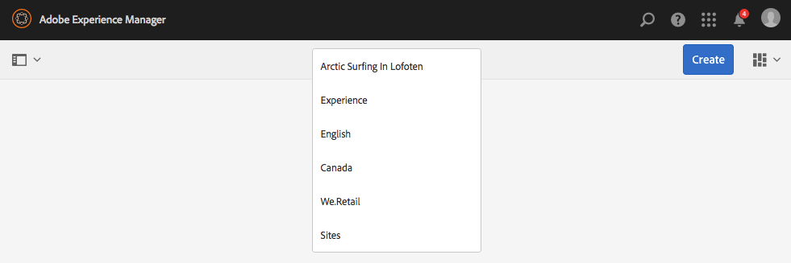
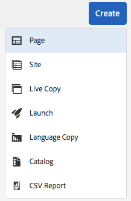
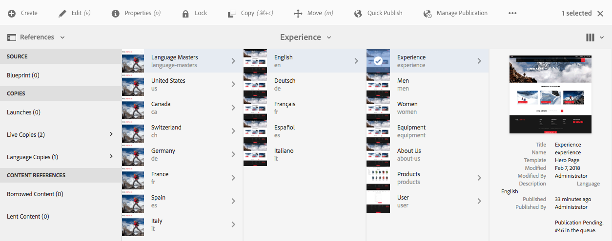
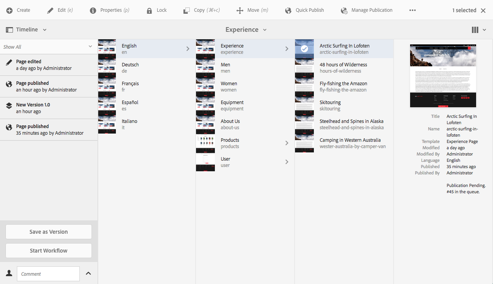

# 製作頁面快速指南{#quick-guide-to-authoring-pages}

>[!CAUTION]
>
>AEM 6.4已結束延伸支援，本檔案不再更新。 如需詳細資訊，請參閱 [技術支援期](https://helpx.adobe.com//tw/support/programs/eol-matrix.html). 尋找支援的版本 [此處](https://experienceleague.adobe.com/docs/).

這些程式旨在快速引導（高階）了解在AEM中製作頁面內容的重要動作。

上述功能為：

* 不是全面的。
* 提供詳細檔案的連結。

如需使用AEM製作的完整詳細資訊，請參閱：

* [作者的第一步](/help/sites-authoring/first-steps.md)
* [使用作者環境](/help/sites-authoring/author-environment-tools.md)

## 一些快速提示 {#a-few-quick-hints}

在概述詳細資訊之前，以下是一些值得記住的一般提示和提示，特別是如果您習慣了 [傳統UI製作環境](/help/sites-classic-ui-authoring/classicui.md).

### Sites Console {#sites-console}

* **建立**

   * 此按鈕在許多主控台中都可用 — 所呈現的選項是內容相關的，因此可能會根據情境而有所不同。

* 重新排序資料夾中的頁面

   * 您可以在 [清單檢視](/help/sites-authoring/basic-handling.md#list-view). 將應用這些更改，並在其他視圖中可見。

* 變更您的UI

   * 您可以從不同位置進行此作業。 請參閱 [選取您的UI](/help/sites-authoring/select-ui.md).

### 頁面編寫 {#page-authoring}

* 導覽連結

   * ***連結無法導覽*** 當您在 **編輯** 模式。 若要導覽至您需要的連結 [預覽頁面](/help/sites-authoring/editing-content.md#previewing-pages) 使用下列其中一項：

      * [預覽模式](/help/sites-authoring/editing-content.md#preview-mode)
      * [以已發佈狀態檢視](/help/sites-authoring/editing-content.md#view-as-published)

* 不再從頁面編輯器啟動/建立工作流程和版本；現在可從 [時間表](/help/sites-authoring/basic-handling.md#timeline) （可從主控台存取）。

>[!NOTE]
>
>有許多鍵盤快速鍵可讓編寫體驗更輕鬆。
>
>* [編輯頁面時的鍵盤快速鍵](/help/sites-authoring/page-authoring-keyboard-shortcuts.md)
>* [控制台的鍵盤快速鍵](/help/sites-authoring/keyboard-shortcuts.md)

## 尋找您的頁面 {#finding-your-page}

1. 開啟 **網站** 主控台(使用 **網站** 選項 [全域導覽](/help/sites-authoring/basic-handling.md#global-navigation)  — 當您選取Adobe Experience Manager連結（左上方）時，就會觸發此動作（下拉式）。

1. 點選/按一下適當的頁面，以向下導覽樹狀結構。 頁面資源的呈現方式取決於您使用的檢視 —  [卡片、清單或欄](/help/sites-authoring/basic-handling.md#viewing-and-selecting-resources):

   

1. 使用 [標題中的階層連結](/help/sites-authoring/basic-handling.md#the-header)，可讓您返回至選取的位置：

   

### 建立新頁面 {#creating-a-new-page}

1. [導覽至位置](#finding-your-page) 建立新頁面的位置。
1. 使用 **建立** 圖示，然後選取 **頁面** 從清單：

   

1. 這會開啟精靈，引導您收集所需的資訊 [建立新頁面](/help/sites-authoring/managing-pages.md#creating-a-new-page). 按照螢幕說明操作。

## 選取您的頁面以執行進一步動作 {#selecting-your-page-for-further-action}

您可以選取頁面，以便對其採取動作。 選取頁面會自動更新工具列，以顯示與該資源相關的動作。

如何選取頁面取決於您在主控台中使用的檢視：

1. 卡片檢視:

   * 進入選擇模式（按） [選擇所需資源](/help/sites-authoring/basic-handling.md#viewing-and-selecting-resources) 包含：

      * 行動裝置：點選並按住
      * 案頭：the [快速動作](/help/sites-authoring/basic-handling.md#quick-actions)  — 刻度表徵圖：

         

      * 卡片將覆蓋上勾號，以顯示已選取頁面。
   >[!NOTE]
   >
   >在選取模式中， **選擇** 表徵圖（勾選）將更改為 **取消選擇** 表徵圖（十字）。

1. 清單檢視:

   * 點選/按一下所需資源的縮圖 — 縮圖將會與勾號重疊，以顯示其已選取。

1. 欄檢視:

   * 點選/按一下所需資源的縮圖 — 縮圖將會與勾號重疊，以顯示其已選取。

## 快速操作（僅限卡片查看/案頭） {#quick-actions-card-view-desktop-only}

1. [導覽至頁面](#finding-your-page) 您想對採取行動。
1. 將滑鼠指標暫留在代表您所需資源的資訊卡上；將顯示快速操作：

   

## 編輯頁面內容 {#editing-your-page-content}

1. [導覽至頁面](#finding-your-page) 要編輯。
1. [開啟您的頁面進行編輯](/help/sites-authoring/managing-pages.md#opening-a-page-for-editing) 使用「編輯」（鉛筆）圖示：

   

   這可透過下列任一項存取：

   * [快速操作（僅限卡片查看/案頭）](#quick-actions-card-view-desktop-only) 適當的資源。
   * 工具列 [已選取頁面](#selecting-your-page-for-further-action).

1. 編輯器開啟時，您可以：

   * [新增內容至您的頁面](/help/sites-authoring/editing-content.md#inserting-a-component) 按：

      * 開啟側面板
      * 選取元件索引標籤( [元件瀏覽器](/help/sites-authoring/author-environment-tools.md#components-browser))
      * 將必要元件拖曳至頁面上。

      側面板可開啟（和關閉），具有：

      

   * [編輯現有元件的內容](/help/sites-authoring/editing-content.md#edit-configure-copy-cut-delete-paste) 在頁面上：

      * 開啟元件工具列，點選或按一下。 使用 **編輯** （鉛筆）圖示來開啟對話方塊。
      * 使用點選並按住或按兩下，開啟元件的就地編輯器。 將顯示可用的動作（對於某些元件，這是有限的選取項目）。
      * 若要查看所有可用動作，請使用以下項目進入全螢幕模式：

      

   * [配置現有元件的屬性](/help/sites-authoring/editing-content.md#component-edit-dialog)

      * 開啟元件工具列，點選或按一下。 使用 **設定** （扳手）圖示，開啟對話方塊。
   * [移動元件](/help/sites-authoring/editing-content.md#moving-a-component) 其中之一：

      * 將所需元件拖曳至其新位置。
      * 開啟元件工具列，點選或按一下。 使用 **剪下** then **貼上** 圖示（如有需要）。
   * [複製（並貼上）](/help/sites-authoring/editing-content.md#edit-configure-copy-cut-delete-paste) 元件：

      * 開啟元件工具列，點選或按一下。 使用 **複製** then **貼上** 圖示（視需要）。
      >[!NOTE]
      >
      >您可以 **貼上** 元件，以存取相同頁面或不同頁面。 如果貼到剪下/復製作業前已開啟的不同頁面，則該頁面需要重新整理頁面。

   * [刪除](/help/sites-authoring/editing-content.md#edit-configure-copy-cut-delete-paste) 元件：

      * 使用點選或按一下，開啟元件工具列，然後使用 **刪除** 表徵圖。
   * [新增註解](/help/sites-authoring/annotations.md#annotations) 到頁面：

      * 選取 **注釋** 模式（語音氣泡圖示）。 使用 **添加註釋** （加號）圖示。 使用右上角的X退出注釋模式。

      

   * [預覽頁面](/help/sites-authoring/editing-content.md#preview-mode) （以檢視其在發佈環境中的顯示方式）

      * 選擇 **預覽** 的上界。
   * 使用 **編輯** 下拉式選取器。

   >[!NOTE]
   >
   >若要在您必須使用的內容中使用連結進行導覽 [預覽模式](/help/sites-authoring/editing-content.md#preview-mode).

## 編輯頁面屬性 {#editing-the-page-properties}

有兩種（主要）方法 [編輯頁面屬性](/help/sites-authoring/editing-page-properties.md):

* 從 **網站** 主控台：

   1. [導覽至頁面](#finding-your-page) 您要發佈。
   1. 選取 **屬性** 表徵圖，來自以下任一項：

      * [快速操作（僅限卡片查看/案頭）](#quick-actions-card-view-desktop-only) 適當的資源。
      * 工具列 [已選取頁面](#selecting-your-page-for-further-action).

   

* 將顯示頁面屬性。 您可以視需要進行更新，然後使用「儲存」來保留這些

   * 當 [編輯頁面](#editing-your-page-content):

      1. 開啟 **頁面資訊** 功能表。
      1. 選擇 **開啟屬性** 開啟對話框以編輯屬性。

         

## 發佈您的頁面（或取消發佈） {#publishing-your-page-or-unpublishing}

有兩種主要方法 [發佈您的頁面](/help/sites-authoring/publishing-pages.md) （以及取消發佈）:

* 從 **網站** 主控台：

   1. [導覽至頁面](#finding-your-page) 您要發佈。
   1. 選取 **快速發佈** 表徵圖，來自以下任一項：

      * [快速操作（僅限卡片查看/案頭）](#quick-actions-card-view-desktop-only) 適當的資源。
      * 工具列 [已選取頁面](#selecting-your-page-for-further-action) (也提供 [稍後發佈](/help/sites-authoring/publishing-pages.md#manage-publication))。

   

* 當 [編輯頁面](#editing-your-page-content):

   1. 開啟 **頁面資訊** 功能表。
   1. 選擇 **發佈頁面**.

   

* 從主控台取消發佈頁面只能透過「管理出版物 **** 」選項完成，此選項只能在工具列上使用 (不能透過快速動作)。

   此 **取消發佈頁面** 選項仍可透過 **頁面資訊** 的下一頁。

   

   請參閱 [發佈頁面](/help/sites-authoring/publishing-pages.md#unpublishing-pages) 以取得更多資訊。

## 移動、複製和貼上或刪除您的頁面 {#move-copy-and-paste-or-delete-your-page}

1. [導覽至頁面](#finding-your-page) 您要移動、複製和貼上或刪除。
1. 選擇複製 (然後貼上) 、移動或刪除圖示 (視需要)，使用下列任一項：

   * [快速操作（僅限卡片查看/案頭）](#quick-actions-card-view-desktop-only) ，以取得所需資源。
   * 工具列 [已選取頁面](#selecting-your-page-for-further-action).

   * 複製:

      * 然後，您需要導覽至新位置並貼上。
   * 移動:

      * 將會開啟精靈，以收集移動頁面所需的資訊。 按照螢幕上的說明操作。
   * 刪除:

      * 系統會要求您確認動作。
   >[!NOTE]
   >
   >刪除不作為快速操作。

## 鎖定頁面（然後解鎖） {#locking-your-page-then-unlocking}

[鎖定頁面](/help/sites-authoring/editing-content.md#locking-a-page) ，會使其他作者無法在您執行時使用頁面。您可以找到「鎖定 (和解除鎖定) 」圖示/按鈕：

* 工具列 [已選取頁面](#selecting-your-page-for-further-action).
* 此 [頁面資訊下拉式功能表](#editing-the-page-properties) 編輯頁面時顯示。
* 編輯頁面時（頁面鎖定時），頁面工具列

例如，鎖表徵圖如下所示：

## 存取頁面參考 {#accessing-page-references}

[快速存取參考](/help/sites-authoring/author-environment-tools.md#references) 「參考」邊欄中提供「至頁面」/「從頁面」。

1. 選擇 **參考** 使用工具列圖示(在前或後 [選取頁面](#selecting-your-page-for-further-action)):

   

   將顯示參考類型清單：

   

1. 點選/按一下所需的參照類型，以顯示更多詳細資訊，並（若適用）採取進一步動作。

## 建立頁面版本 {#creating-a-version-of-your-page}

1. 若要開啟時間軸邊欄，請選取 **[時間表](/help/sites-authoring/basic-handling.md#timeline)** 使用工具列圖示(在前或後 [選取頁面](#selecting-your-page-for-further-action)):

   

1. 點選/按一下「時間軸」欄右下方的向上箭頭，以顯示額外的按鈕，包括 **另存為版本**.

   

1. 選擇 **另存為版本**，然後 **建立**.

## 還原/比較頁面版本 {#restoring-comparing-a-version-of-your-page}

還原和/或比較頁面版本時，會使用相同的基本機制：

1. 選擇 **[時間表](/help/sites-authoring/basic-handling.md#timeline)** 使用工具列圖示(在前或後 [選取頁面](#selecting-your-page-for-further-action)):

   

   如果已儲存您的頁面版本，則時間軸會列出此版本。

1. 點選/按一下您要還原的版本 — 這將顯示其他動作按鈕：

   * **還原為此版本**

      * 版本將會還原。
   * **顯示差異**

      * 將會開啟頁面，並強調顯示差異（兩個版本之間）。
