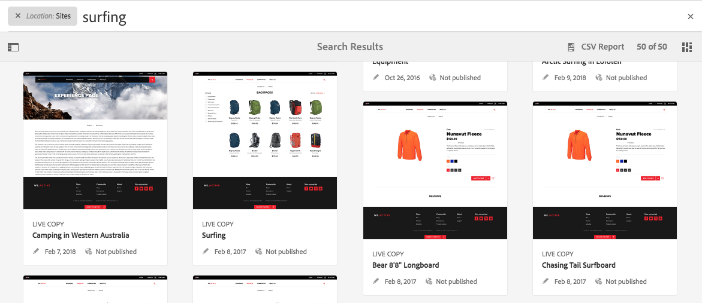
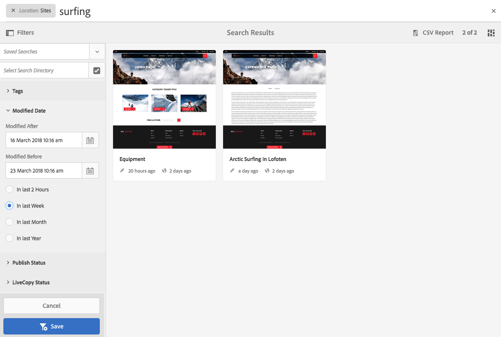
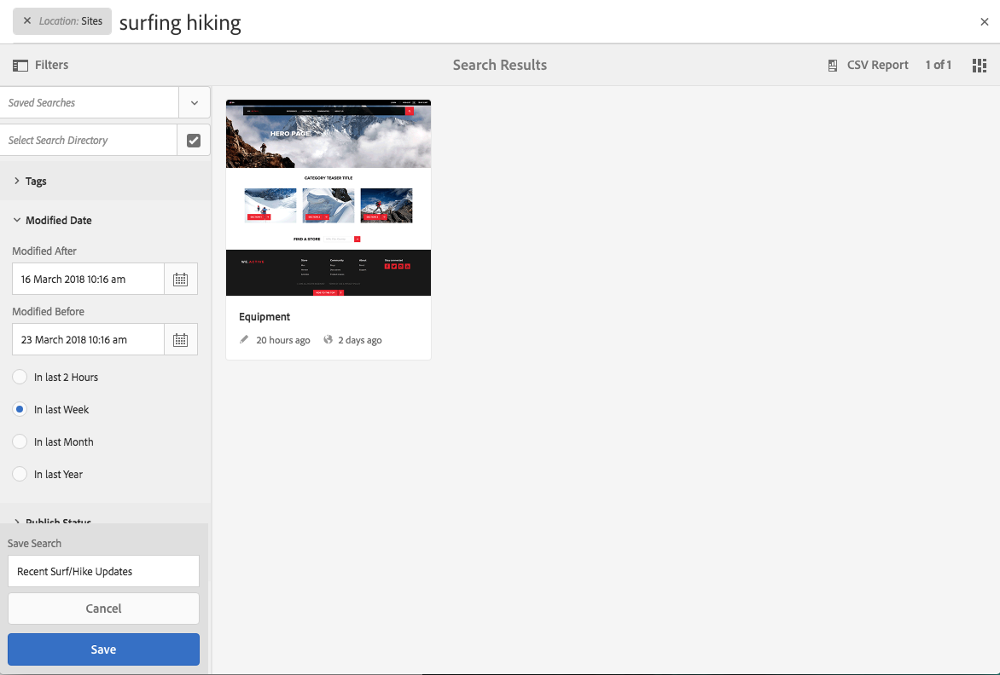
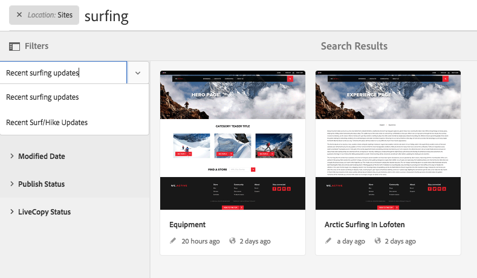

# 搜尋{#search-features}

AEM的作者環境提供多種搜尋內容的機制，視資源類型而定。

>[!NOTE]
>
>在作者環境之外，其他機制也可供搜尋，例如 [Query Builder](/help/sites-developing/querybuilder-api.md)[和CRXDE Lite](/help/sites-developing/developing-with-crxde-lite.md)。

## 搜尋基礎 {#search-basics}

您可從頂端工具列取得搜尋：

使用搜尋邊欄，您可以：

* 搜尋特定關鍵字、路徑或標籤。
* 根據資源特定標準進行篩選，例如修改的日期、頁面狀態、檔案大小等。
* 根據上述條件 [定義](#saved-searches) ，並使用已儲存的搜尋。

>[!NOTE]
>
>當搜尋邊欄顯示時，也可使用 `/` 快速鍵（正斜線）來呼叫搜尋。

## 搜尋與篩選 {#search-and-filter}

要搜索和篩選資源：

1. 開啟 **搜尋** （工具列中有放大鏡）並輸入搜尋詞。 將會提出建議，並可以選擇：

   

   預設情況下，搜索結果將限於您當前的位置（即控制台和相關資源類型）:

   

1. 如果需要，您可以刪除位置篩選器(在要刪除的篩選器上選擇 **X** )，以便在所有控制台／資源類型中進行搜索。
1. 將顯示結果，並根據控制台和相關資源類型對結果進行分組。

   您可以選擇特定資源（以執行進一步操作），或通過選擇所需資源類型進行細化； 例如， **查看所有站點**:

   

1. 如果您想要進一步深入探討，請選取「邊欄」符號（左上）以開啟側面板的「 **濾鏡與選項」**。

   

   根據資源類型，「搜尋」將顯示預先定義的搜尋／篩選條件選擇。

   側面板允許您選擇：

   * 已儲存的搜尋
   * 搜尋目錄
   * 標記
   * 搜索標準； 例如，修改日期、發佈狀態、LiveCopy狀態。

   >[!NOTE]
   >
   >搜索標準可能有所不同：
   >
   >* 視您選擇的資源類型而定； 例如，資產和社群標準是可理解的專業標準。
   >* 您的例項可 [以自訂為「搜尋表單](/help/sites-administering/search-forms.md) 」（適合AEM中的位置）。

   

1. 您也可以新增其他搜尋詞：

   

1. 使用 **X** (右上方 **** )關閉搜尋。

>[!NOTE]
>
>在搜尋結果中選取項目時，搜尋條件會持續存在。
>
>當您在搜尋結果頁面上選取項目時，當使用瀏覽器返回按鈕後返回搜尋頁面時，搜尋准則仍會保留。

## 已儲存的搜尋 {#saved-searches}

除了依廣泛的Facet進行搜尋外，您也可以儲存特定的搜尋設定以供擷取，並在稍後階段使用：

1. 定義搜索標準並選擇「 **保存**」。

   

1. 指定名稱，然後使用「 **儲存** 」確認：

   

1. 下次存取搜尋面板時，您儲存的搜尋將可從選取器使用：

   

1. 儲存後，您可以：

   * 使 **用x** （相對於已保存的搜索的名稱）啟動新查詢（不會刪除已保存的搜索本身）。
   * **編輯已儲存的搜尋**，變更搜尋條件，然後再 **次儲** 存。

通過選擇保存的搜索並按一下搜索面板底部的「編 **輯保存的搜索** 」(Edit Saved Search)，可以修改保存的搜索。

