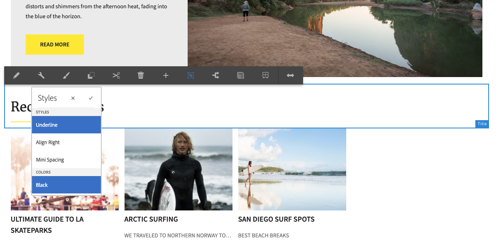

# 樣式系統{#style-system}

樣式系統允許模板作者在元件的內容策略中定義樣式類，以便內容作者在編輯頁面上的元件時能夠選擇它們。 這些樣式可以替代元件的視覺變化，讓元件更具彈性。

這樣就不需要為每個樣式開發自定義元件，或自定義元件對話框以啟用這種樣式功能。 它可提供更多可重複使用的元件，可快速輕鬆地配合內容作者的需求，毋需進行任何AEM後端開發。

## 使用案例 {#use-case}

範本作者不僅需要設定元件如何為內容作者運作的能力，還需要設定元件的多種替代視覺變化。

同樣地，內容作者不僅需要建構和排列內容的能力，還需要選擇內容的視覺呈現方式。

Style System針對範本作者和內容作者的需求提供統一的解決方案：

* 範本作者可在元件的內容原則中定義樣式類別。
* 然後，內容作者可以在編輯頁面上的元件時，從下拉式清單中選取這些類別，以套用對應的樣式。

然後，樣式類會插入元件的裝飾包裝元件上，讓元件開發人員不需要處理樣式，而不需要提供其CSS規則。

## 概覽 {#overview}

使用「樣式系統」通常採用下列形式。

1. 網頁設計人員會建立不同的元件視覺變化。

1. HTML開發人員會提供元件的HTML輸出以及所要實作的視覺變化。

1. HTML開發人員會定義對應於每個視覺變化且要插入在元素上、包住元件的CSS類別。

1. HTML開發人員會針對每個視覺變化建置對應的CSS程式碼（和選擇性的JS程式碼），讓它們看起來都如定義。

1. AEM開發人員會將提供的CSS（和選用的JS）放入「用戶 [端程式庫](/help/sites-developing/clientlibs.md) 」中並加以部署。

1. AEM開發人員或範本作者會設定頁面範本並編輯每個樣式元件的原則、新增已定義的CSS類別、為每個樣式指定好用的名稱，以及指出哪些樣式可以合併。

1. 然後，AEM頁面作者就可以透過元件工具列的樣式選單，在頁面編輯器中選擇設計的樣式。

請注意，AEM實際上只會執行最後三個步驟。 這表示不需AEM，就可完成所有必要CSS和Javascript的開發。

實際實作樣式只需要在AEM上部署，並在所需範本的元件中選取。

下圖說明了樣式系統的體系結構。

## 使用 {#use}

為了展示該功能，我們將以 [WKND](https://docs.adobe.com/content/help/en/experience-manager-learn/getting-started-wknd-tutorial-develop/overview.html)&#39;s implementation of the core component&#39;s [title component](https://www.adobe.com/go/aem_cmp_title_v2) 為例。

以下幾 [節As a Content Author](#as-a-content-author)[和As a Template Author](#as-a-template-author) （以內容作者和範本作者的身份）說明如何使用WKND的樣式系統來測試樣式系統的功能。

如果要將樣式系統用於自己的元件，請執行以下操作：

1. 將CSS安裝為用戶端程式庫，如「概述」一節所 [述](#overview)。
1. 設定您要提供給內容作者的CSS類別，如「身為範本作者」一節 [所述](#as-a-template-author)。
1. 然後，內容作者可依「身為內容作者」一節所述 [使用樣式](#as-a-content-author)。

### 身為內容作者 {#as-a-content-author}

1. 安裝WKND專案後，請導覽至WKND的英文主版首頁，並 `http://<host>:<port>/sites.html/content/wknd/language-masters/en` 編輯該頁面。
1. 在頁面 **下方** ，選取Title元件

   

1. 點選或按一下 **List** （清單）元件工具欄上的「樣式」( **Styles** )按鈕，開啟樣式菜單並更改元件的外觀。

   

   >[!NOTE]
   >
   >在此示例中， **Colors** 樣式(**Black**、 **Grey Styles**、 ******************** Gray Styles和Colors)是混合的，同時The Options(A PS、RIght Right Light，和Align Align Align Align Mini Hidin（混合的混合白色）可以將混合。 這可在范 [本中設定為範本作者](#as-a-template-author)。

### 身為範本作者 {#as-a-template-author}

1. 在編輯WKND的英文主版首頁時， `http://<host>:<port>/sites.html/content/wknd/language-masters/en`請透過「頁面資訊->編輯範本」 **編輯頁面範本**。

   

1. 點選或按一下 **Title** （標題）元件的 **Policy** （原則）按鈕，編輯Title（標題）元件的原則。

   

1. 在屬性的「樣式」索引標籤上，您可以看到樣式的設定方式。

   

   * **群組名稱：** 樣式可在樣式選單中分組，內容作者在設定元件的樣式時會看到這些樣式。
   * **可組合樣式：** 允許同時選取該群組中的多種樣式。
   * **樣式名稱：** 設定元件樣式時，將顯示給內容作者的樣式說明。
   * **CSS類別：** 與樣式關聯的CSS類的實際名稱。
   使用拖動控制滑塊來排列組的順序和組內的樣式。 使用新增或刪除圖示來新增或移除群組或群組中的樣式。

>[!CAUTION]
>
>CSS類別（以及任何必要的Javascript）若要運作，必須部署為元件原則的樣式屬性 [Client Libraries](/help/sites-developing/clientlibs.md) 。

## 設定 {#setup}

核心元件版本2及更新版本已完全啟用，以利用樣式系統，而且不需額外設定。

只有為您自己的自訂元件啟用「樣式系統」或在「編輯」對話方塊中啟用選 [用的「樣式」索引標籤時，才需執行下列步驟。](#enable-styles-tab-edit)

### 在「設計」對話框中啟用「樣式」頁籤 {#enable-styles-tab-design}

若要讓元件搭配AEM的「樣式系統」運作，並在其設計對話方塊中顯示樣式標籤，元件開發人員必須在元件上加入具有下列設定的樣式標籤：

* `path = "/mnt/overlay/cq/gui/components/authoring/dialog/style/tab_design/styletab"`
* `sling:resourceType = "granite/ui/components/coral/foundation/include"`

在設定元件後，頁面作者所設定的樣式將會由AEM自動插入裝飾元素上，AEM會自動環繞每個可編輯的元件。 元件本身不需要做其他任何動作，就能達成此目標。

### 在「編輯」對話框中啟用「樣式」頁籤 {#enable-styles-tab-edit}

自AEM 6.4.7.0版起，「編輯對話方塊」(Edit Dialog)中的「樣式」(Styles)頁籤現已可供使用。 與「設計對話框」頁籤不同，「編輯對話框」中的頁籤對於「樣式系統」的運作並不重要，但對於內容作者來說，它是設定樣式的可選替代介面。

編輯對話框頁籤可以以與設計對話框頁籤類似的方式包括：

* `path = "/mnt/overlay/cq/gui/components/authoring/dialog/style/tab_edit/styletab"`
* `sling:resourceType = "granite/ui/components/coral/foundation/include"`

>[!NOTE]
>
>「編輯」(Edit)對話框上的「樣式」(Styles)頁籤預設不啟用。

### 具有元素名稱的樣式 {#styles-with-element-names}

開發人員也可以使用字串陣列屬性，設定元件上樣式的允許元素 `cq:styleElements` 名稱清單。 然後，在設計對話方塊中原則的「樣式」索引標籤中，範本作者也可以選擇要針對每個樣式設定的元素名稱。 這將設定包裝器元素的元素名稱。

此屬性在節點上設 `cq:Component` 置。 例如：

* `/apps/<yoursite>/components/content/list@cq:styleElements=[div,section,span]`

>[!CAUTION]
>
>避免為可組合的樣式定義元素名稱。 定義多個元素名稱時，優先順序為：
>
>1. HTL優先於一切： `data-sly-resource="${'path/to/resource' @ decorationTagName='span'}`
>1. 然後，在多個作用中樣式中，會選取元件原則中設定之樣式清單中的第一個樣式。
>1. 最後，元件的 `cq:htmlTag`/將 `cq:tagName` 視為備援值。
>

此定義樣式名稱的功能對於非常一般的元件（例如「版面容器」或「內容片段」元件）非常有用，以提供其他意義。

例如，它可讓配置容器具有諸如、 `<main>`、 `<aside>``<nav>`等語義。
