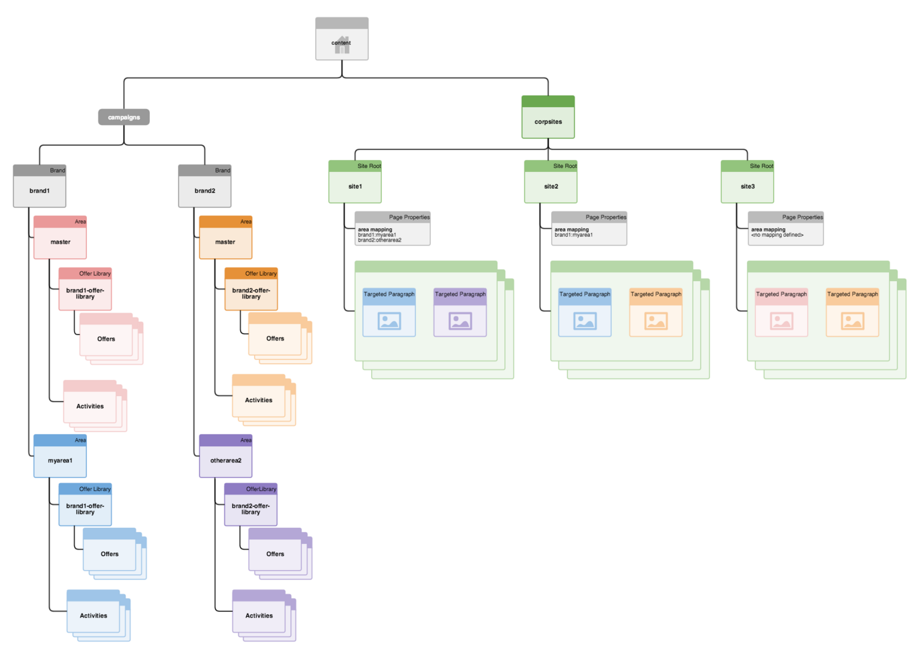

# 如何架構目標內容的多網站管理{#how-multisite-management-for-targeted-content-is-structured}

>[!CAUTION]
>
>AEM 6.4已結束延伸支援，本檔案不再更新。 如需詳細資訊，請參閱 [技術支援期](https://helpx.adobe.com//tw/support/programs/eol-matrix.html). 尋找支援的版本 [此處](https://experienceleague.adobe.com/docs/).

下圖顯示如何架構目標內容的多網站支援。

區域顯示在下方 **/content/campaigns/&lt;brand>** 預設情況下，每個品牌都有自動建立的主版區域。 每個區域都包含其專屬的活動、體驗和選件集。

若要尋找目標內容，頁面或網站可對應至某個區域。 如果未設定任何區域，AEM會回復至此特定品牌的主版區域。

下圖為邏輯在三個網站（稱為site1、site2和site3）中如何運作的範例。

* site1會根據區域對應，為brand1尋找myarea1，為brand2尋找otherarea2。
* site2會針對brand1查詢myarea1，並針對brand2查詢主版區域，因為只定義brand1的區域對應。
* site3會查找brand1和brand2的主版區域，因為此網站完全未定義其他區域對應。
