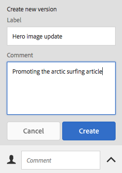
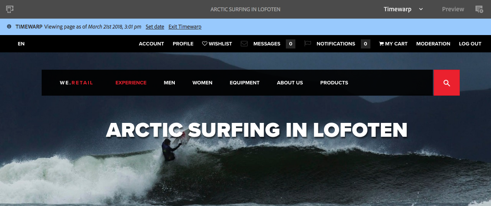

# 使用頁面版本{#working-with-page-versions}

>[!CAUTION]
>
>AEM 6.4已結束延伸支援，本檔案不再更新。 如需詳細資訊，請參閱 [技術支援期](https://helpx.adobe.com//tw/support/programs/eol-matrix.html). 尋找支援的版本 [此處](https://experienceleague.adobe.com/docs/).

版本設定會在特定時間點建立頁面的「快照」。 使用版本設定，您可以執行下列動作：

* 建立頁面版本。
* 將頁面還原為舊版，以還原您對頁面所做的變更（例如）。
* 比較目前版本的頁面與先前版本，其文字和影像會反白顯示差異。

## 建立新版本 {#creating-a-new-version}

您可以從以下來源建立資源版本：

* the [時間軸邊欄](#creating-a-new-version-timeline)
* the [建立](#creating-a-new-version-create-with-a-selected-resource) 選項（選取資源時）

### 建立新版本 — 時間軸 {#creating-a-new-version-timeline}

1. 導覽以顯示您要建立版本的頁面。
1. 選取 [選擇模式](/help/sites-authoring/basic-handling.md#viewing-and-selecting-resources).
1. 開啟 **時間表** 欄。
1. 按一下/點選註解欄位旁的箭頭，以顯示選項：

   

1. 選擇 **另存為版本**.
1. 輸入 **標籤** 和 **註解** （如果需要）。

   

1. 使用確認新版本 **建立**.

   時間軸中的資訊將會更新，以指出新版本。

### 建立新版本 — 使用所選資源建立 {#creating-a-new-version-create-with-a-selected-resource}

1. 導覽以顯示您要建立版本的頁面。
1. 選取 [選擇模式](/help/sites-authoring/basic-handling.md#viewing-and-selecting-resources).
1. 選取 **建立** 選項。
1. 對話方塊將會開啟。 您可以輸入 **標籤** 和 **註解** 如果需要：

   

1. 使用確認新版本 **建立**.

   將開啟時間軸，其中會更新指示新版本的資訊。

## 回復為頁面版本 {#reverting-to-a-page-version}

建立版本後，您就可以視需要回復該版本。

>[!NOTE]
>
>還原頁面時，所建立的版本將成為新分支的一部分。
>
>以說明：
>
>* 建立任何頁面的版本。
>* 初始標籤和版本節點名稱將為1.0、1.1、1.2等。
>* 還原第一個版本；即1.0。
>* 再次建立新版本。
>* 產生的標籤和節點名稱現在會是1.0.0、1.0.1、1.0.2等。
>

要回復到以前的版本：

1. 導覽以顯示您要回復為舊版的頁面。
1. 選取 [選擇模式](/help/sites-authoring/basic-handling.md#viewing-and-selecting-resources).
1. 開啟「時 **間軸** 」欄，然後選 **取「全部顯示** 」 **或「版本**」。將列出所選頁面的頁面版本。
1. 選擇要恢復的版本。 可能的選項將顯示：

   

1. 選擇 **回復到此版本**. 將還原所選版本，並更新時間軸中的資訊。

## 預覽版本 {#previewing-a-version}

您可以預覽特定版本：

1. 導覽以顯示您要比較的頁面。
1. 選取 [選擇模式](/help/sites-authoring/basic-handling.md#viewing-and-selecting-resources).
1. 開啟「時 **間軸** 」欄，然後選 **取「全部顯示** 」 **或「版本**」。
1. 將列出頁面版本。 選擇要預覽的版本：

   

1. 選擇 **預覽**. 頁面會顯示在新索引標籤中。

   >[!CAUTION]
   >
   >如果頁面已移動，則您無法再對移動前進行的任何版本執行預覽。
   >
   >如果預覽遇到問題，請核取 [時間表](/help/sites-authoring/basic-handling.md#timeline) ，查看頁面是否已移動。

## 比較版本與目前頁面 {#comparing-a-version-with-current-page}

若要比較舊版與目前頁面：

1. 導覽以顯示您要比較的頁面。
1. 選取 [選擇模式](/help/sites-authoring/basic-handling.md#viewing-and-selecting-resources).
1. 開啟「時 **間軸** 」欄，然後選 **取「全部顯示** 」 **或「版本**」。
1. 將列出頁面版本。 選取您要比較的版本：

   

1. 選擇 **與目前比較**. 此 [頁面差異](/help/sites-authoring/page-diff.md) 會開啟並顯示差異。

## Timewarp {#timewarp}

時間扭曲功能是專為模擬 *已發佈* 過去特定時間的頁面狀態。

其目的是讓您在選取的時間點追蹤已發佈的網站。 這會使用頁面版本來判斷發佈環境的狀態。

要執行此操作：

* 系統會尋找在選取時間處於作用中狀態的頁面版本。
* 這表示顯示的版本已建立/啟用 *befor* 時間扭曲中選取的時間點。
* 導覽至已刪除的頁面時，這也會呈現 — 只要儲存庫中仍有舊版頁面可用即可。
* 如果找不到已發佈的版本，則Timewarp會回復到製作環境上頁面的目前狀態（這是為了防止錯誤/404頁面，這會防止瀏覽）。

### 使用時間扭曲 {#using-timewarp}

時間扭曲是 [模式](/help/sites-authoring/author-environment-tools.md#page-modes) 頁面編輯器中。 要啟動它，只需像切換任何其他模式一樣切換它。

1. 啟動您要啟動Timewarp的頁面的編輯器，然後選取 **時間扭曲** 在模式選擇中。

   

1. 在對話方塊中設定目標日期和時間，然後按一下或點選「設 **定日期」**。如果您未選取時間，則預設為目前時間。

   

1. 頁面會根據日期集顯示。 時間扭曲模式會透過視窗頂端的藍色狀態列來指示。 使用狀態列中的連結來選取新的目標日期或退出時間扭曲模式。

   

### 時間扭曲限制

時間扭曲會盡力在選取的時間點重制頁面。 不過，由於AEM中持續製作內容的複雜度，這並非總是可能的。 使用「時間扭曲」時，請謹記這些限制。

* **時間扭曲會根據已發佈的頁面運作**  — 只有在您先前已發佈頁面時，時間扭曲才會完全運作。 否則，時間扭曲會顯示製作環境上的目前頁面。
* **時間扭曲使用頁面版本**  — 如果您導覽至已從存放庫移除/刪除的頁面，如果存放庫中仍有舊版頁面，則會正確呈現該頁面。
* **移除的版本會影響時間扭曲**  — 如果從存放庫中移除版本，時間扭曲無法顯示正確的檢視。
* **時間扭曲為唯讀**  — 您無法編輯舊版頁面。 它僅供檢視。 如果要還原較舊的版本，則必須使用還原手動執行此操作。
* **時間扭曲僅根據頁面內容**  — 如果轉譯網站的元素（例如程式碼、CSS、資產/影像等）已變更，檢視會與原本不同，因為這些項目未在存放庫中版本化。

>[!CAUTION]
>
>Timewarp是專為協助作者了解及建立其內容而設計的工具。 此檔案並非作為稽核記錄檔，或用於法律用途。
