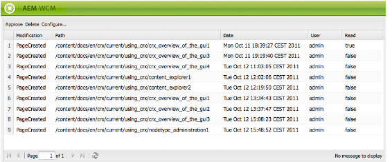

# 您的收件匣{#your-inbox}

您可以從AEM的不同區域收到通知，例如有關工作項目或代表您需要在頁面內容上執行之動作之工作的通知。

您會在兩個收件匣中收到這些通知，這些收件匣依通知類型分隔：

* 下節將介紹一個收件匣，您可在此收到訂閱後收到的通知。
* 「參與工作流」文檔中描述了工作流項 [目的專用收件箱](/help/sites-classic-ui-authoring/classic-workflows-participating.md) 。

## 檢視您的通知 {#viewing-your-notifications}

若要檢視您的通知：

1. 開啟通知收件箱： 在「網 **站** 」主控台中，按一下右上角的使用者按鈕，然後選取「通知收件 **匣」**。

   

   >[!NOTE]
   >
   >您也可以直接在瀏覽器中存取主控台； 例如：
   >
   >` https://<host>:<port>/libs/wcm/core/content/inbox.html`

1. 將會列出您的通知。 您可以視需要採取下列動作：

   * [訂閱通知](#subscribing-to-notifications)
   * [處理通知](#processing-your-notifications)

   

## 訂閱通知 {#subscribing-to-notifications}

若要訂閱通知：

1. 開啟通知收件箱： 在「網 **站** 」主控台中，按一下右上角的使用者按鈕，然後選取「通知收件 **匣」**。

   

   >[!NOTE]
   >
   >您也可以直接在瀏覽器中存取主控台； 例如：
   >
   >`https://<host>:<port>/libs/wcm/core/content/inbox.html`

1. 按一下 **配置……** 的下界。

   

1. 選擇通知渠道：

   * **收件匣**: 通知會顯示在您的AEM收件匣中。
   * **電子郵件**: 通知將會以電子郵件寄到您使用者設定檔中定義的電子郵件地址。

   >[!NOTE]
   >
   >需要設定一些設定，才能透過電子郵件收到通知。 您也可以自訂電子郵件範本，或新增新語言的電子郵件範本。 請參閱「設 [定電子郵件通知](/help/sites-administering/notification.md#configuringemailnotification) 」，在AEM中設定電子郵件通知。

1. 選擇要通知的頁面操作：

   * 已啟動： 頁面啟動時。
   * 已停用： 頁面已停用時。
   * 已刪除（匯集）: 刪除複製頁面時，即複製頁面上執行的刪除操作時。

      刪除或移動頁面時，會自動複製刪除動作： 該頁將在執行刪除操作的源實例和複製代理定義的目標實例上刪除。

   * 已修改： 頁面已修改時。
   * 已建立： 頁面建立時。
   * 已刪除： 頁面刪除動作刪除頁面時。
   * 已推出： 頁面推出時的問題。

1. 定義要通知您的頁面路徑：

   * 按一下 **添加** ，將新行添加到表中。
   * 按一下「 **路徑** 」(Path)表單元格並輸入路徑，例如 `/content/docs`.
   * 要通知子樹的所有頁面，請設定「完 **全」?** 至 **否**。

      若要僅收到路徑所定義之頁面上動作的通知，請設定「完 **全」?** 為 **是**。

   * 若要允許規則，請將「規 **則** 」設 **為「允許」**。 如果設為 **Deny**，則規則會被拒絕，但無法移除，稍後可加以允許。

   要刪除定義，請按一下表單元格，然後按一下「刪除」( **Delete**)。

1. 按一下 **確定** ，保存配置。

## 處理通知 {#processing-your-notifications}

如果您已選擇在AEM收件匣中接收通知，您的收件匣將會填入通知。 您可 [以檢視通知](#viewing-your-notifications) ，然後選取所需通知以：

* 按一下「核准」以 **核准**: 「讀取 **」(Read** )列中的值設 **為true**。

* 按一下「刪除」即 **可刪除**。

