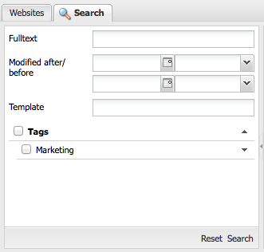

# 搜尋{#search-features}

AEM的作者環境提供多種搜尋內容的機制，視資源類型而定。

>[!NOTE]
>
>在作者環境之外，其他機制也可供搜尋，例如 [Query Builder](/help/sites-developing/querybuilder-api.md)[和CRXDE Lite](/help/sites-developing/developing-with-crxde-lite.md)。

## 搜尋基礎 {#search-basics}

若要存取搜尋面板，請按一 **下適當控制台左窗格上方的「搜尋** 」標籤。

搜尋面板可讓您搜尋所有網站頁面。 它包含下列欄位和Widget:

* **全文**:搜尋指定的文字
* **修改後／之前**:僅搜尋在特定日期之間變更的頁面
* **範本**:僅根據指定的範本搜尋這些頁面
* **標籤**:僅搜尋具有指定標籤的頁面

>[!NOTE]
>
>當您的例項設定為 [Lucene搜尋時](/help/sites-deploying/queries-and-indexing.md) ，您可在 **Fulltext中使用下列項目**:
>
>* [萬用字元](https://lucene.apache.org/core/5_3_1/queryparser/org/apache/lucene/queryparser/classic/package-summary.html#Wildcard_Searches)
>* [布林運算子](https://lucene.apache.org/core/5_3_1/queryparser/org/apache/lucene/queryparser/classic/package-summary.html#Boolean_operators)
   >
   >
* [規則運算式](https://lucene.apache.org/core/5_3_1/queryparser/org/apache/lucene/queryparser/classic/package-summary.html#Regexp_Searches)
>* [欄位分組](https://lucene.apache.org/core/5_3_1/queryparser/org/apache/lucene/queryparser/classic/package-summary.html#Field_Grouping)
>* [Boosting](https://lucene.apache.org/core/5_3_1/queryparser/org/apache/lucene/queryparser/classic/package-summary.html#Boosting_a_Term)
>

按一下窗格底 **部的** 「搜尋」以執行搜尋。 按一 **下重設** ，以清除搜尋准則。

## 篩選 {#filter}

您可以在不同位置設定（並清除）篩選器，以下列方式深入檢視並細化檢視：

## Find and Replace {#find-and-replace}

在「網 **站** 」主控台 **** 中，「尋找與取代」功能表選項可讓您在網站的某個區段內搜尋及取代字串的多個例項。

1. 選擇根頁面或資料夾，您希望在其中執行查找和替換操作。
1. 依序 **選擇** 「工 **具」和「尋找和取代**:

   

1. 「查 **找和替換** 」對話框執行下列操作：

   * 確認尋找動作應該開始的根路徑
   * 定義要找到的詞語
   * 定義應替換的詞語
   * 指出搜尋是否應區分大小寫
   * 指出是否只應找到整個字詞（否則也找到子字串）
   按一 **下** 「預覽」會列出找到詞語的位置。 您可以選擇／清除要替換的特定實例：

   

1. 按一下「 **替換** 」(Replace)以實際替換所有實例。 系統會要求您確認動作。

查找和替換servlet的預設範圍涵蓋以下屬性：

* `jcr:title`
* `jcr:description`
* `jcr:text`
* `text`

範圍可使用Apache Felix Web Management Console(例如，在 `http://localhost:4502/system/console/configMgr`)變更。 根據 `CQ WCM Find Replace Servlet (com.day.cq.wcm.core.impl.servlets.FindReplaceServlet)` 需要選擇並配置範圍。

>[!NOTE]
>
>在標準AEM安裝中，「尋找和取代」會使用Lucene來提供搜尋功能。
>
>Lucene索引長度高達16k的字串屬性。 超過此值的字串將不會被搜尋。

