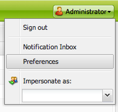

# 設定帳戶環境{#configuring-your-account-environment}

>[!CAUTION]
>
>AEM 6.4已結束延伸支援，本檔案不再更新。 如需詳細資訊，請參閱 [技術支援期](https://helpx.adobe.com//tw/support/programs/eol-matrix.html). 尋找支援的版本 [此處](https://experienceleague.adobe.com/docs/).

AEM可讓您設定帳戶，以及製作環境的某些方面。

使用 [帳戶設定](#account-settings) 和 [使用者偏好設定](#user-preferences) 可定義下列選項和偏好設定：

* **編輯工具列**
選擇是否要具有全局編輯工具欄。 此工具列會顯示在瀏覽器視窗頂端，提供您 
**複製**, **剪下**, **貼上**, **刪除** 用於與該頁面上的段落元件一起使用的按鈕：

   * 需要時顯示 (預設)
   * 永遠顯示
   * 隱藏

* **模擬為**
使用 [模擬為](/help/sites-administering/security.md#impersonating-another-user) 功能使用者可以代表其他使用者運作。

* **語言**
用於製作環境UI的語言。 從可用清單中選取所需語言。

* **視窗管理**
選擇以下任一項：

   * 多個窗口（預設）:頁面將在新視窗中開啟。
   * 單個窗口：將在當前窗口中開啟頁面。

## 帳戶設定 {#account-settings}

使用者圖示可讓您存取下列各種選項：

* 登出
* [模擬為](/help/sites-administering/security.md#impersonating-another-user)
* [使用者偏好設定](#user-preferences)
* [通知收件匣](/help/sites-classic-ui-authoring/author-env-inbox.md)

## 使用者偏好設定 {#user-preferences}

每個使用者都可自行設定特定屬性。 這可從 **偏好設定** 對話方塊。

對話方塊提供下列選項：

