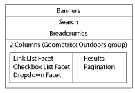

# 新增Search&amp;Promote功能至您的頁面{#adding-search-promote-features-to-your-page}

若要整合網站中的Search&amp;Promote功能，請使用[!UICONTROL Search&amp;Promote]元件，將下列功能新增至您的頁面：

* 關鍵字搜尋
* 「搜索結果」頁
* 搜尋精細化
* 橫幅

請注意，只有在您的AEM管理員已啟用Search&amp;Promote功能時，您才可以使用這些功能。 請參閱[與AdobeSearch&amp;Promote整合](/help/sites-administering/search-and-promote.md)。

Facet是在Search&amp;Promote伺服器上配置的，每個元件提供的資訊也是如此。 下表提供每個元件的簡短說明。 後續章節提供其使用的詳細資訊。

<table> 
 <tbody> 
  <tr> 
   <th>Search&amp;Promote元件</th> 
   <th>說明</th> 
  </tr> 
  <tr> 
   <td>橫幅</td> 
   <td>顯示橫幅廣告。 根據透過Search&amp;Promote收集的資料來選取橫幅。  </td> 
  </tr> 
  <tr> 
   <td>階層連結</td> 
   <td>顯示搜尋關鍵字以及使用者已套用至搜尋結果的篩選器順序。</td> 
  </tr> 
  <tr> 
   <td>核取方塊清單 — 面向</td> 
   <td>用於選擇用於篩選搜索結果的刻面的複選框清單。</td> 
  </tr> 
  <tr> 
   <td>下拉式清單 Facet</td> 
   <td>篩選搜尋結果的Facet下拉式清單。</td> 
  </tr> 
  <tr> 
   <td>連結清單 Facet</td> 
   <td>篩選搜尋結果的Facet連結清單。</td> 
  </tr> 
  <tr> 
   <td>分頁</td> 
   <td>控制瀏覽搜尋結果頁面。</td> 
  </tr> 
  <tr> 
   <td>結果</td> 
   <td>顯示關鍵字搜尋的結果。</td> 
  </tr> 
  <tr> 
   <td>搜尋</td> 
   <td>新增搜尋欄位至頁面。</td> 
  </tr> 
 </tbody> 
</table>

## 建立搜索結果頁{#creating-the-search-results-page}

使用WCM網站控制台建立用於顯示搜索結果的頁。 如果任何搜尋元件使用相同的Search&amp;Promote服務，其搜尋結果都會顯示在此頁面上。

可讓使用者檢閱搜尋結果的元件包括「結果」和「分頁」。 在[!UICONTROL Edit]或[!UICONTROL Design]模式中，**[!UICONTROL Results]**&#x200B;元件沒有可配置屬性。 「結果」元件僅列出搜索結果（提供指向其他頁的連結），並顯示搜索關鍵字的結果數。

**[!UICONTROL 分頁]**&#x200B;元件可讓使用者導覽多個搜尋結果頁面。 使用者可以查看頁數、移至下一頁或上一頁、選取要開啟的頁面，或合併一個頁面上的所有結果。

您可以在[!UICONTROL Edit]模式中配置以下元件屬性，以控制運行時行為：

* **[!UICONTROL 隱藏單個結果頁]**  — 選擇此選項可在搜索返回單個結果頁時隱藏頁面導航控制項。
* **[!UICONTROL 隱藏第一頁/最後一頁]**  — 選取此選項可防止使用者跳到結果的第一頁或最後一頁。
* **[!UICONTROL 隱藏上一頁/下一頁]**  — 決定使用者是否可以相對於目前頁面導覽結果頁面。
* **[!UICONTROL 全部隱藏視圖]**  — 決定使用者是否可以合併單一頁面上的所有搜尋結果。通常，提供分頁資料可以更有效地使用伺服器資源。 選擇此選項可防止在一條響應消息中傳輸大型資料集。

## 啟用按Facet篩選結果{#enabling-the-filtering-of-results-by-facets}

您可以讓使用者依Facet來篩選搜尋結果。 **[!UICONTROL 核取方塊清單Facet]**、**[!UICONTROL 下拉式Facet]**&#x200B;和&#x200B;**[!UICONTROL 連結清單Facet]**&#x200B;元件可讓使用者選取一或多個Facet進行篩選。 使用這些元件時，您也應包含&#x200B;**[!UICONTROL Breadcrumbs]**&#x200B;元件。 階層連結會指出目前使用的篩選器。

**[!UICONTROL 核取方塊清單Facet]**、**[!UICONTROL 下拉式Facet]**&#x200B;和&#x200B;**[!UICONTROL 連結清單Facet]**&#x200B;元件各自具有您在&#x200B;**[!UICONTROL 編輯]**&#x200B;模式中設定的下列屬性：

* **[!UICONTROL Facet名稱]**  — 用於篩選的Facet的名稱。

**[!UICONTROL 核取方塊清單Facet]**&#x200B;元件會顯示Facet清單及隨附的核取方塊。 使用&#x200B;**[!UICONTROL 核取方塊清單Facet]** ，讓使用者可以檢視包含多個Facet之項目的結果子集。 例如，品牌面向是適當的，因為有數個品牌提供相同類型的產品。

與搜尋結果相關聯的每個面向會出現一個核取方塊。 當使用者選取核取方塊時，頁面會重新載入更新的結果集。 所有核取方塊都會保留在頁面上，讓客戶隨時都可以新增或移除篩選器的面向：

**[!UICONTROL 下拉式Facet]**&#x200B;元件可讓客戶從下拉式清單中選取Facet項目。 當您希望客戶一次專注於單一Facet項目時，此元件相當實用。 例如，「部門」面向適合讓客戶能夠依性別縮小產品搜尋範圍。 John先搜尋&#x200B;*jeans*，然後在「男」部門進行篩選。

下拉式清單中會填入與所有搜尋結果相關聯的Facet。 在下拉式清單中選取項目時，頁面會以更新的結果集重新載入。 下拉式清單中的項目不會變更，因此客戶可隨時從Facet切換至Facet。

**[!UICONTROL 連結清單Facet]**&#x200B;元件可讓客戶逐步將注意力集中在分類到多個Facet成員或Facet下的項目上。

Facet成員以連結清單的形式出現。 每個連結的文本是與當前搜索結果關聯的Facet成員的名稱。 當客戶點按Facet連結時，頁面會重新載入，並出現搜尋結果的子集。 相應地更新連結清單，使得焦點更窄。

從不同類型的[!UICONTROL Search&amp;Promote]元件套用篩選器時，清單中的連結也會變更。 使用多種類型的篩選元件可提供有效的篩選組合。

**[!UICONTROL 階層連結]**&#x200B;元件可讓客戶依套用的順序查看目前套用至搜尋結果的篩選器。 客戶可以按一下階層連結中的項目，以回復至該篩選組合。

您可以在「編輯」模式中為階層連結設定下列屬性，以自訂元件的外觀：

* **[!UICONTROL 分隔字元]**  — 定義字元或字元字串，作為每個階層連結之間的分隔字元。分隔字元欄位接受任何字串作為輸入。 預設設定為：&quot;>&quot;（不含引號）
* **[!UICONTROL 尾端分隔字元]**  — 定義要顯示在階層連結結尾的字元或字元字串。尾端分隔字元欄位接受任何字元字串作為輸入。 此項目的預設設定為「空白」（亦即，階層連結行的結尾不會顯示任何內容）

## 添加搜索框{#adding-search-boxes}

**[!UICONTROL Search]**&#x200B;元件可讓客戶執行關鍵字搜尋。 將「搜尋」元件新增至您要提供搜尋存取權的每個頁面。

在&#x200B;**[!UICONTROL Edit]**&#x200B;模式中配置以下屬性以控制運行時行為：

* **[!UICONTROL 結果頁面路徑]**  — 顯示搜尋結果之頁面的路徑。
* **[!UICONTROL 啟用自動完成]**  — 選取此選項，可在客戶開始在搜尋方塊中輸入內容時，顯示建議的搜尋關鍵字。

## 新增橫幅{#adding-banners}

**[!UICONTROL 橫幅]**&#x200B;元件會根據客戶的Search&amp;Promote搜尋顯示橫幅廣告。 Search&amp;Replace伺服器上的邏輯決定要顯示哪些橫幅。 例如，在牛仔褲上搜尋可能會顯示時尚相關橫幅。 篩選男性部門可以進一步細化橫幅的選擇。

**[!UICONTROL Banners]**&#x200B;元件提供一個名為&#x200B;**[!UICONTROL Banner Area]**&#x200B;的可配置屬性。 在&#x200B;**[!UICONTROL 編輯]**&#x200B;模式中，選擇一個屬性值以指定橫幅的顯示方式。 Search&amp;Promote服務會決定您可以選取的值清單。

## Search&amp;Promote搜索頁{#example-search-promote-search-page}示例

此圖表顯示添加到頁面中以建立下面的完整功能Search&amp;Promote結果頁的元件。

 
