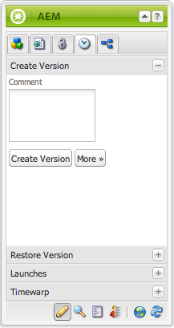
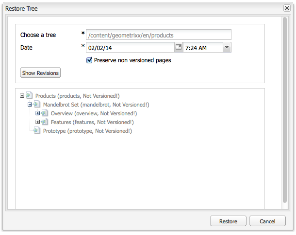

# 使用頁面版本{#working-with-page-versions}

版本設定會在特定時間點建立頁面的「快照」。 使用版本設定，您可以執行下列動作：

* 建立頁面版本。
* 將頁面還原為舊版，以還原您對頁面所做的變更（例如）。
* 比較目前版本的頁面與先前版本，其文字和影像會反白顯示差異。

## 建立新版本{#creating-a-new-version}

若要建立新版本的頁面：

1. 在瀏覽器中，開啟您要建立新版本的頁面。
1. 在Sidekick中，選擇&#x200B;**Versioning**&#x200B;頁簽，然後選擇&#x200B;**Create Version**&#x200B;子頁簽。

   

1. 輸入&#x200B;**注釋**（可選）。
1. 若要將標籤設定為版本（選用），請按一下&#x200B;**更多>>**&#x200B;按鈕並設定&#x200B;**標籤**&#x200B;來命名版本。 如果未設定標籤，則版本為自動遞增的數字。
1. 按一下「**建立版本**」。 頁面上會顯示灰色訊息；例如：

   1.2版為：襯衫。

>[!NOTE]
>
>頁面啟動時會自動建立版本。

## 從Sidekick {#restoring-a-page-version-from-sidekick}還原頁面版本

若要將頁面還原為舊版：

1. 開啟您要還原舊版本的頁面。
1. 在sidekick中，選擇&#x200B;**Versioning**&#x200B;頁簽，然後選擇&#x200B;**Restore Version**&#x200B;子頁簽。

   

1. 選擇要還原的版本，然後選擇&#x200B;**Restore**。

## 從控制台{#restoring-a-page-version-from-the-console}還原頁面版本

此方法可用來還原頁面版本。 它也可用來還原先前已刪除的頁面：

1. 在&#x200B;**網站**&#x200B;控制台中，導航到要還原的頁面並選擇它。
1. 從頂部菜單中，選擇&#x200B;**工具**，然後選擇&#x200B;**還原**:

   

1. 選擇**還原版本……**列出當前資料夾中的文檔版本。 即使已刪除頁面，也會列出最後一個版本：

   

1. 選擇要還原的版本，然後按一下&#x200B;**Restore**。 AEM會還原您選取的版本（或樹狀結構）。

### 從控制台{#restoring-a-tree-from-the-console}還原樹

此方法可用來還原頁面版本。 它也可用來還原先前已刪除的頁面：

1. 在&#x200B;**網站**&#x200B;控制台中，導航到要還原的資料夾並選中它。
1. 從頂部菜單中，選擇&#x200B;**工具**，然後選擇&#x200B;**還原**。
1. 選擇&#x200B;**還原樹……**&#x200B;開啟對話方塊，讓您選取要還原的樹：

   

1. 按一下&#x200B;**Restore**。 AEM會還原您選取的樹狀結構。

## 與舊版{#comparing-with-a-previous-version}比較

若要比較頁面的目前版本與舊版：

1. 在瀏覽器中，開啟您要與舊版比較的頁面。
1. 在Sidekick中，選擇&#x200B;**Versioning**&#x200B;頁簽，然後選擇&#x200B;**Restore Version** n子頁簽。

   

1. 選擇要比較的版本，然後按一下&#x200B;**Diff**&#x200B;按鈕。
1. 當前版本與所選版本之間的差異如下所示：

   * 已刪除的文本為紅色，並且已通過。
   * 已新增的文字為綠色並反白顯示。
   * 已新增或刪除的影像會以綠色框架呈現。

   

1. 在Sidekick中，選擇&#x200B;**Restore Version**&#x200B;子頁簽，然後按一下&#x200B;**&lt;&lt;Back**&#x200B;按鈕以顯示當前版本。

## Timewarp {#timewarp}

時間扭曲功能旨在模擬過去特定時間頁面的&#x200B;***已發佈***&#x200B;狀態。

其目的是讓您在選取的時間點追蹤已發佈的網站。 這會使用頁面啟動來判斷發佈環境的狀態。

要執行此操作：

* 系統會尋找在選取時間處於作用中狀態的頁面版本。
* 這表示顯示的版本是在時間扭曲中選取的時間點之前建立/啟動&#x200B;*。*
* 導覽至已刪除的頁面時，這也會呈現 — 只要儲存庫中仍有舊版頁面可用即可。
* 如果找不到已發佈的版本，則時間扭曲會回復到製作環境上頁面的目前狀態（這是為了防止錯誤/404頁面，這表示您無法再瀏覽）。

>[!NOTE]
>
>如果從存放庫中移除版本，時間扭曲無法顯示正確的檢視。 此外，如果用於轉譯網站的元素（例如程式碼、CSS、影像等）已變更，檢視會與原本不同，因為這些項目未在存放庫中建立版本。

### 使用時間扭曲日曆{#using-the-timewarp-calendar}

Sidekick提供時間扭曲功能。

如果您有特定的要檢視的日期，則會使用日曆版本：

1. 開啟&#x200B;**Versioning**&#x200B;標籤，然後按一下&#x200B;**Timewarp**（靠近側腳底）。 將顯示以下對話框：

   

1. 使用日期和時間選擇器指定您想要的日期/時間，然後按一下&#x200B;**Go**。

   時間扭曲會在您選擇的日期之前/之後，顯示頁面的發佈狀態。

   >[!NOTE]
   >
   >只有在您先前已發佈頁面時，時間扭曲才會完全運作。 否則，時間扭曲會顯示製作環境上的目前頁面。

   >[!NOTE]
   >
   >如果您導覽至已從存放庫移除/刪除的頁面，如果該頁面的舊版本仍存在於存放庫中，則會正確呈現該頁面。

   >[!NOTE]
   >
   >您無法編輯舊版頁面。 它僅供檢視。 如果要還原較舊的版本，則必須使用[restore](/help/sites-classic-ui-authoring/classic-page-author-work-with-versions.md#restoring-a-page-version-from-sidekick)手動執行此操作。

1. 檢視完頁面後，按一下：

   * **退** 出Timewarpto並返回目前的製作頁面。
   * [顯示](#using-the-timewarp-timeline) 時間線以查看時間軸。

   

### 使用時間扭曲時間軸{#using-the-timewarp-timeline}

如果您想查看頁面上發佈活動的概觀，則會使用時間軸版本。

如果要查看文檔的時間軸：

1. 若要顯示時間軸，您可以執行下列任一操作：

   1. 開啟&#x200B;**Versioning**&#x200B;標籤，然後按一下&#x200B;**Timewarp**（靠近側腳底）。
   1. 使用Timewarp Calendar](#using-the-timewarp-calendar)使用[後顯示的sidekick對話方塊。

1. 按一下&#x200B;**顯示時間軸** — 將顯示文檔的時間軸；例如：

   

1. 選擇並移動（按住和拖動）時間軸以在文檔的時間軸中移動。

   * 所有行都表示已發佈的版本。

      啟動頁面時，會起始新行。 每次編輯文檔時，都會顯示新顏色。

      在以下範例中，紅線表示頁面是在初始綠色版本的時間範圍內編輯的，而黃線表示頁面在紅色版本等期間曾編輯過。
   

1. 按一下:

   1. **** 前往顯示所選時間點的已發佈頁面內容。
   1. 顯示該內容時，請使用&#x200B;**退出時間扭曲**&#x200B;來退出並返回目前的製作頁面。

### 時間扭曲限制

時間扭曲會盡力在選取的時間點重制頁面。 不過，由於AEM中持續製作內容的複雜度，這並非總是可能的。 使用「時間扭曲」時，請謹記這些限制。

* **時間扭曲會根據已發佈的頁面運作**  — 「時間扭曲」只有在您先前已發佈頁面時才會完全運作。否則，時間扭曲會顯示製作環境上的目前頁面。
* **時間扭曲使用頁面版本**  — 如果您導覽至已從存放庫移除/刪除的頁面，如果存放庫中仍有舊版頁面，則會正確呈現該頁面。
* **移除的版本會影響時間扭曲**  — 如果從存放庫移除版本，時間扭曲無法顯示正確的檢視。
* **時間扭曲為唯讀**  — 您無法編輯舊版頁面。它僅供檢視。 如果要還原較舊的版本，則必須使用還原手動執行此操作。
* **時間扭曲僅根據頁面內容**  — 如果轉譯網站的元素（例如程式碼、CSS、資產/影像等）已變更，則檢視會與原本不同，因為這些項目未在存放庫中版本化。

>[!CAUTION]
>
>Timewarp是專為協助作者了解及建立其內容而設計的工具。 此檔案並非作為稽核記錄檔，或用於法律用途。
