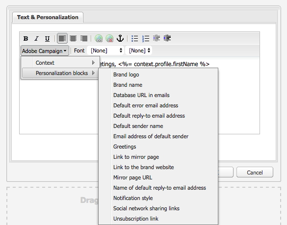

# 使用Adobe Campaign 6.1和Adobe Campaign Standard{#working-with-adobe-campaign-and-adobe-campaign-standard}

您可以在AEM中建立電子郵件內容，並在Adobe Campaign電子郵件中處理。 要做到這一點，您必須：

1. 從Adobe Campaign特定範本在AEM中建立新的電子報。
1. 在編輯內容以存取所有功能之前，請選取[Adobe Campaign服務](#selectingtheadobecampaigncloudservice)。
1. 編輯內容。
1. 驗證內容。

然後，您就可在Adobe Campaign中將內容與傳送同步。 本檔案將詳細說明。

>[!NOTE]
>
>您必須先將AEM設定為與[Adobe Campaign](/help/sites-administering/campaignonpremise.md)或[Adobe Campaign Standard](/help/sites-administering/campaignstandard.md)整合，才能使用此功能。

## 透過Adobe Campaign傳送電子郵件內容{#sending-email-content-via-adobe-campaign}

在您設定AEM和Adobe Campaign後，您可以直接在AEM中建立電子郵件傳送內容，然後在Adobe Campaign中處理它。

當您在AEM中建立Adobe Campaign內容時，您必須先連結至Adobe Campaign服務，才能編輯內容以存取所有功能。

可能有兩種情況：

* 內容可與Adobe Campaign的傳送同步。 這可讓您在傳送中使用AEM內容。
* （僅限Adobe Campaign內部部署）內容可直接傳送至Adobe Campaign，而Adobe Campaign會自動產生新的電子郵件傳送。 此模式有其限制。

本檔案將詳細說明。

### 建立新的電子郵件內容{#creating-new-email-content}

>[!NOTE]
>
>新增電子郵件範本時，請務必在&#x200B;**/content/campaigns**&#x200B;下加入範本，讓範本可供使用。

1. 在AEM中，選取&#x200B;**Websites**&#x200B;資料夾，然後瀏覽您的檔案總管，以尋找管理電子郵件促銷活動的位置。 在下列範例中，相關節點為&#x200B;**Websites** > **Campaigns** > **Geometrixx Outdoors** > **Email Campaigns**。

   >[!NOTE]
   >
   >[電子郵件範例僅在Geometrixx中提供](/help/sites-developing/we-retail.md#weretail)。請從Package Share下載範例Geometrixx內容。

   

1. 選擇「**新建** > **新建頁面**」以建立新的電子郵件內容。
1. 選取Adobe Campaign專用的可用範本之一，然後填寫頁面的一般屬性。 預設提供3個範本：

   * **Adobe Campaign電子郵件(AC 6.1)**:可讓您先將內容新增至預先定義的範本，再將其傳送至Adobe Campaign 6.1進行傳送。
   * **Adobe Campaign電子郵件(ACS)**:可讓您先將內容新增至預先定義的範本，再將其傳送至Adobe Campaign Standard進行傳送。

   

1. 按一下&#x200B;**Create**&#x200B;以建立您的電子郵件或電子報。

### 選擇Adobe Campaign雲端服務和範本{#selecting-the-adobe-campaign-cloud-service-and-template}

若要與Adobe Campaign整合，您必須將Adobe Campaign雲端服務新增至頁面。 如此可讓您存取個人化和其他Adobe Campaign資訊。

此外，您也可能需要選取Adobe Campaign範本，並變更主題，並為不會以HTML檢視電子郵件的使用者新增純文字內容。

1. 在sidekick中選擇&#x200B;**Page**&#x200B;標籤，然後選擇&#x200B;**Page properties.**
1. 在快顯視窗的&#x200B;**雲端服務**&#x200B;標籤中，選取&#x200B;**新增服務**&#x200B;以新增Adobe Campaign服務，然後按一下&#x200B;**確定**。

   

1. 從下拉式清單中選取符合您Adobe Campaign例項的設定，然後按一下「確定」。****

   >[!NOTE]
   >
   >新增雲端服務後，請務必點選／按一下「確定」或「套用」。 ********&#x200B;這可讓&#x200B;**Adobe Campaign**&#x200B;標籤正常運作。

1. 如果您想要套用除預設&#x200B;**mail**&#x200B;範本以外的特定電子郵件傳送範本（來自Adobe Campaign），請再次選取「頁面屬性」**。**&#x200B;在&#x200B;**Adobe Campaign**&#x200B;標籤中，在相關的Adobe Campaign例項中輸入電子郵件傳送範本的內部名稱。

   在Adobe Campaign Standard中，範本為&#x200B;**與AEM內容一起傳送**。 在Adobe Campaign 6.1中，範本為&#x200B;**電子郵件傳送與AEM內容**。

   當您選取範本時，AEM會自動啟用&#x200B;**Adobe Campaign Newsletter**&#x200B;元件。

### 編輯電子郵件內容{#editing-email-content}

您可以在傳統使用者介面或觸控最佳化使用者介面中編輯電子郵件內容。

1. 從工具箱中選擇&#x200B;**頁面屬性** > **電子郵件**，輸入電子郵件的主題和文本版本。

   

1. 從sidekick中可用的元素新增您想要的元素，以編輯電子郵件內容。 若要這麼做，請拖放它們。 然後按兩下您要編輯的元素。

   例如，您可以新增包含個人化欄位的文字。

   

   如需Adobe Campaign電子報／電子郵件促銷活動可用元件的說明，請參閱[Adobe Campaign元件](/help/sites-classic-ui-authoring/classic-personalization-ac-components.md)。

   

### 插入個人化{#inserting-personalization}

編輯內容時，您可以插入：

* Adobe Campaign內容欄位。 這些欄位可插入文字中，並根據收件者的資料（例如名字、姓氏或目標維度的任何資料）進行調整。
* Adobe Campaign個人化會封鎖。 這些是預先定義的內容區塊，與收件者的資料無關，例如品牌標誌或鏡像頁面連結。

如需促銷活動元件的完整說明，請參閱[Adobe促銷活動元件](/help/sites-classic-ui-authoring/classic-personalization-ac-components.md)。

>[!NOTE]
>
>* 只會考慮Adobe Campaign **Profiles**&#x200B;定位維度的欄位。
>* 從&#x200B;**Sites**&#x200B;檢視屬性時，您無法存取Adobe Campaign內容欄位。 您可以在編輯時直接從電子郵件存取這些內容。

>

1. 插入新的&#x200B;**電子報** > **文字與個人化（促銷活動）**&#x200B;元件。
1. 按兩下元件以開啟元件。 **Edit**&#x200B;視窗具有可讓您插入個人化元素的功能。

   >[!NOTE]
   >
   >可用的上下文欄位對應至Adobe Campaign中的&#x200B;**Profiles**&#x200B;定位維度。
   >
   >請參閱[將AEM頁面連結至Adobe Campaign電子郵件](/help/sites-classic-ui-authoring/classic-personalization-ac-campaign.md#linkinganaempagetoanadobecampaignemail)。

   

1. 在sidekick中選擇&#x200B;**Client Context**，使用角色描述檔中的資料來測試個人化欄位。

   

1. 此時會出現一個窗口，可讓您選擇您喜歡的角色。 個人化欄位會自動由選取的描述檔資料取代。

   

### 預覽電子報{#previewing-a-newsletter}

您可以預覽電子報的外觀，也可以預覽個人化。

1. 開啟您要預覽的電子報，然後按一下「預覽（放大鏡）」以縮小側鍵。
1. 按一下其中一個電子郵件用戶端圖示，查看您的電子報在每個電子郵件用戶端中的外觀。

   

1. 展開側鍵，再次開始編輯。

### 在AEM {#approving-content-in-aem}中核准內容

內容完成後，您可以開始核准程式。 前往工具箱的&#x200B;**Workflow**&#x200B;標籤，並選取「核准Adobe Campaign **」工作流程。**

這個現成可用的工作流程包含兩個步驟：修訂然後批准，或修訂然後拒絕。 不過，此工作流程可以延伸並適應更複雜的程式。

若要核准Adobe Campaign的內容，請在側點中選取&#x200B;**Workflow**&#x200B;並選取&#x200B;**Approve for Adobe Campaign**，然後按一下&#x200B;**Start Workflow**，以套用工作流程。 執行步驟並核准內容。 您也可以在最後一個工作流程步驟中選擇&#x200B;**拒絕**，而非&#x200B;**批准**&#x200B;來拒絕內容。

內容核准後，就會在Adobe Campaign中顯示為核准。 然後可傳送電子郵件。

在Adobe Campaign Standard中：

在Adobe Campaign 6.1中：

>[!NOTE]
>
>未核准的內容可與Adobe Campaign中的傳送同步，但無法執行傳送。 只能透過促銷活動傳送傳送已核准的內容。

## 將AEM與Adobe Campaign Standard和Adobe Campaign 6.1 {#linking-aem-with-adobe-campaign-standard-and-adobe-campaign}連結

>[!NOTE]
>
>如需詳細資訊，請參閱標準製作說明檔案中「使用Adobe Campaign 6.1和Adobe Campaign Standard」下的「將AEM與Adobe Campaign Standard和Adobe Campaign 6.1](/help/sites-authoring/campaign.md#linking-aem-with-adobe-campaign-standard-and-adobe-campaign-classic)連結」。[

