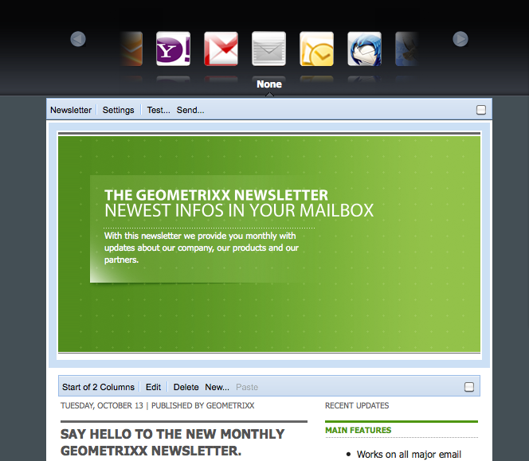

# 電子郵件行銷{#e-mail-marketing}

>[!NOTE]
>
>Adobe不打算進一步增強AEM SMTP服務所傳送的已開啟/已退信電子郵件。\
>建議[運用Adobe Campaign及其AEM整合](/help/sites-administering/campaign.md)。

電子郵件行銷（例如，電子報）是任何行銷活動的重要部分，因為您使用這些行銷活動將內容推送至銷售機會。 在AEM中，您可以從現有的AEM內容建立電子報，並新增電子報專屬的新內容。

建立後，您可以立即或在其他排程時間（透過使用工作流程）將電子報傳送給特定使用者群組。 此外，使用者可以選擇的格式訂閱電子報。

此外，AEM還讓您管理電子報功能，包括維護主題、封存電子報和檢視電子報統計資料。

>[!NOTE]
>
>在Geometrixx中，電子報範本會自動開啟電子郵件編輯器。 您可以在其他要傳送電子郵件的範本（例如，邀請）中使用電子郵件編輯器。 每當頁面繼承自&#x200B;**mcm/components/newsletter/page**&#x200B;時，電子郵件編輯器都會顯示。

本檔案說明在AEM中建立電子報的基本知識。 有關如何使用電子郵件行銷的更多詳細資訊，請參閱以下文檔：

* [建立有效的電子報登陸頁面](/help/sites-classic-ui-authoring/classic-personalization-campaigns-email-landingpage.md)
* [管理訂閱](/help/sites-classic-ui-authoring/classic-personalization-campaigns-email-subscriptions.md)
* [向電子郵件服務提供者發佈電子郵件](/help/sites-classic-ui-authoring/classic-personalization-campaigns-email-newsletters.md)
* [追蹤跳出的電子郵件](/help/sites-classic-ui-authoring/classic-personalization-campaigns-email-tracking-bounces.md)

>[!NOTE]
>
>如果您更新電子郵件提供者、進行飛行測試或傳送電子報，如果電子報未先發佈至「發佈」執行個體，或者「發佈」執行個體無法使用，則這些操作會失敗。 請務必發佈電子報，並確認Publish執行個體已開啟並執行。

## 建立新聞稿體驗{#creating-a-newsletter-experience}

>[!NOTE]
>
>電子郵件通知需透過osgi設定來設定。 請參閱[設定電子郵件通知。](/help/sites-administering/notification.md)

1. 在左窗格中選取新促銷活動，或在右窗格中按兩下它。

1. 使用圖示選取清單檢視：

   

1. 按一下「**新建……」**

   您可以指定&#x200B;**Title**、**Name**&#x200B;以及要建立的體驗類型；在此情況下，請參閱電子報。

   

1. 按一下&#x200B;**建立**。

1. 新對話方塊將立即開啟。 您可以在此輸入電子報的屬性。

   **預設收件者清單**&#x200B;是必填欄位，因為這構成電子報的接觸點（如需清單的詳細資訊，請參閱[使用清單](/help/sites-classic-ui-authoring/classic-personalization-campaigns.md#workingwithlists)）。

   

   * **寄件者姓名**

      應顯示為 Newsletter 寄件者的名稱。

   * **寄件者地址**

      應顯示為 Newsletter 寄件者的郵件地址。

   * **主旨**

      Newsletter 的主題。

   * **回覆**

      郵件地址，負責處理已傳送 Newsletter 的回覆。

   * **說明**

      電子報說明。

   * **開啟時間**

      傳送電子報的準時。

   * **預設收件者清單**

      應接收電子報的預設清單。
   稍後可從&#x200B;**屬性……更新這些內容**&#x200B;對話方塊。

1. 按一下&#x200B;**OK**&#x200B;以儲存。

## 將內容新增至Newsletters {#adding-content-to-newsletters}

您可以像在任何AEM元件中一樣，將內容（包括動態內容）新增至電子報。 在Geometrixx中，電子報範本有某些元件可用來新增和修改電子報中的內容。

1. 在MCM中，按一下&#x200B;**Campaigns**&#x200B;標籤，然後按兩下您要新增內容或編輯的電子報。 電子報開啟。

1. 如果元件不可見，請前往「設計」檢視，並在您開始編輯前啟用必要的元件（例如電子報元件）。
1. 視情況輸入任何新文字、影像或其他元件。 在Geometrixx範例中，有4個元件可供使用：文字、影像、標題和2欄。 根據您的設定方式，電子報的元件可能會多或少。

   >[!NOTE]
   >
   >您使用變數來個人化電子報。 在Geometrixx電子報中，變數可在文字元件中使用。 變數的值繼承自使用者設定檔中的資訊。

   

1. 若要插入變數，請從清單中選取變數，然後按一下&#x200B;**插入**。 變數會從設定檔填入。

## 個人化電子報{#personalizing-newsletters}

您可以在電子報的Text元件中插入預先定義的變數，以個人化電子報Geometrixx。 變數的值繼承自使用者設定檔中的資訊。

您也可以使用用戶端內容並載入設定檔，模擬電子報的個人化方式。

若要個人化電子報並模擬其外觀：

1. 從MCM開啟要自定義設定的電子報。

1. 開啟您要個人化的文字元件。

1. 將游標置於要顯示變數的位置，然後從下拉清單中選擇變數，然後按一下&#x200B;**插入**。 視需要對變數執行此操作，然後按一下&#x200B;**OK**。

   

1. 若要模擬變數在傳送時的外觀，請按CTRL+ALT+c以開啟用戶端內容，並選取&#x200B;**Load**。 從要載入其配置檔案的清單中選擇用戶，然後按一下&#x200B;**確定**。

   您載入之設定檔的資訊已填入變數。

   

## 測試不同電子郵件客戶端中的電子報{#testing-newsletters-in-different-e-mail-clients}

>[!NOTE]
>
>在傳送電子報之前，請在`http://localhost:4502/system/console/configMgr`檢查Day CQ Link Externalizer的OSGi設定。
>
>預設情況下，參數的值為`localhost:4502`，如果運行實例的埠已更改，則操作無法完成。

在常用的電子郵件用戶端之間切換，可查看銷售機會端所看到的 Newsletter 外觀。依預設，您的電子報會開啟，且未選取任何電子郵件用戶端。

目前，您可以在以下電子郵件客戶端中查看電子報：

* Yahoo郵件
* Gmail
* Hotmail
* Thunderbird
* Microsoft Outlook 2007
* Apple Mail

若要在用戶端之間切換，請按一下對應的圖示，以檢視該電子郵件用戶端中的電子報：

1. 從MCM開啟要自定義設定的電子報。

1. 按一下頂端列中的電子郵件用戶端，查看該用戶端中的電子報外觀。

   

1. 對您要查看的任何其他電子郵件客戶端重複此步驟。

   

## 自訂新聞稿設定{#customizing-newsletter-settings}

雖然只有授權的使用者可以傳送電子報，但您應自訂下列內容：

* 主旨行，讓使用者可以開啟您的電子郵件，同時確保電子報最後不會標示為垃圾訊息。
* 寄件者地址，例如noreply@geometrixx.com，讓使用者從指定的位址接收電子郵件。

若要自訂電子報設定：

1. 從MCM開啟要自定義設定的電子報。

   

1. 在電子報頂端，按一下&#x200B;**設定**。

   

1. 

   1. 輸入&#x200B;**From**&#x200B;電子郵件地址
   1. 如有必要，修改電子郵件的&#x200B;**主旨**。
   1. 從下拉清單中選擇&#x200B;**預設收件者清單**。
   1. 按一下&#x200B;**「確定」**。

   當您測試或傳送電子報時，收件者會收到包含指定電子郵件地址和主旨的電子郵件。

## 飛行測試通訊{#flight-testing-newsletters}

雖然飛行測試並非強制性，但在您發送電子報之前，您可能想要加以測試，以確保它以您想要的方式顯示。

飛行測試可讓您執行下列操作：

* 查看[所有預期用戶端](#testing-newsletters-in-different-e-mail-clients)中的電子報。
* 驗證郵件伺服器設定正確。
* 判斷您的電子郵件是否被標示為垃圾訊息。 （請務必將自己納入收件者清單中。）

>[!NOTE]
>
>如果您更新電子郵件提供者、進行飛行測試或傳送電子報，如果電子報未先發佈至「發佈」執行個體，或者「發佈」執行個體無法使用，則這些操作會失敗。 請務必發佈電子報，並確認Publish執行個體已開啟並執行。

要飛行測試快訊：

1. 在MCM中，開啟您要測試並傳送的電子報。

1. 在電子報頂端，按一下&#x200B;**Test**&#x200B;以在傳送前進行測試。

   

1. 輸入要發送電子報的測試郵件地址，然後按一下&#x200B;**Send**。 如果要變更設定檔，請在用戶端內容中載入另一個設定檔。 要執行此操作，請按CTRL+ALT+c並選取「載入」並載入設定檔。

## 傳送電子報{#sending-newsletters}

您可以從電子報或清單中傳送電子報。 描述了兩個過程。

>[!NOTE]
>
>在傳送電子報之前，請在`http://localhost:4502/system/console/configMgr`檢查Day CQ Link Externalizer的OSGi設定。
>
>預設情況下，參數的值為`localhost:4502`，如果運行實例的埠已更改，則操作無法完成。

>[!NOTE]
>
>如果您更新電子郵件提供者、進行飛行測試或傳送電子報，如果電子報未先發佈至「發佈」執行個體，或者「發佈」執行個體無法使用，則這些操作會失敗。 請務必發佈電子報，並確認Publish執行個體已開啟並執行。

### 從促銷活動{#sending-newsletters-from-a-campaign}傳送電子報

若要從行銷活動內傳送電子報：

1. 在MCM中，開啟您要發送的電子報。

   >[!NOTE]
   >
   >傳出之前，請確定您已透過[自訂其設定](#customizing-newsletter-settings)自訂電子報的主旨和原始電子郵件地址。
   >
   >[建議](#flight-testing-newsletters) 在傳送前先測試電子報。

1. 在電子報頂端，按一下&#x200B;**Send**。 電子報精靈隨即開啟。

1. 在收件者清單中，選取您要接收電子報的清單，然後按一下&#x200B;**Next**。

   

1. 已確認安裝完成。 按一下&#x200B;**Send**&#x200B;以實際傳送電子報。

   

   >[!NOTE]
   >
   >請確定您是其中一位收件者，以確保收到電子報。

### 從清單{#sending-newsletters-from-a-list}傳送電子報

若要從清單傳送電子報：

1. 在MCM中，按一下左窗格中的&#x200B;**Lists**。

   >[!NOTE]
   >
   >傳出之前，請確定您已透過[自訂其設定](#customizing-newsletter-settings)自訂電子報的主旨和原始電子郵件地址。 如果您從清單中傳送電子報，則無法測試電子報；如果您從電子報發送[飛行測試](#flight-testing-newsletters)，則可以執行此操作。

1. 選取您要傳送電子報的銷售機會清單旁的核取方塊。

1. 在&#x200B;**Tools**&#x200B;菜單中，選擇&#x200B;**Send Newsletter**。 將開啟「**傳送電子報**」窗口。

   

1. 在&#x200B;**電子報**&#x200B;欄位中，選取您要傳送的電子報，然後按一下&#x200B;**Next**。

   

1. 已確認安裝完成。 按一下&#x200B;**Send**，將所選新聞稿發送到指定的銷售機會清單。

   

   您的電子報會傳送給選取的收件者。

## 訂閱電子報{#subscribing-to-a-newsletter}

本節說明如何訂閱電子報。

### 訂閱電子報{#subscribing-to-a-newsletter-1}

若要訂閱電子報(以Geometrixx網站為例):

1. 按一下「**網站**」並導覽至Geometrixx **工具列**&#x200B;並開啟它。

   

1. 在「Geometrixx電子報&#x200B;**註冊**」欄位中，輸入您的電子郵件地址，然後按一下&#x200B;**註冊**。 您現在已訂閱電子報。
