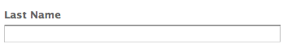

# 登陸頁面{#landing-pages}

>[!CAUTION]
>
>AEM 6.4已結束延伸支援，本檔案不再更新。 如需詳細資訊，請參閱 [技術支援期](https://helpx.adobe.com//tw/support/programs/eol-matrix.html). 尋找支援的版本 [此處](https://experienceleague.adobe.com/docs/).

登錄頁面功能可讓您快速輕鬆地將設計和內容直接匯入AEM頁面。 網頁開發人員可準備HTML和其他資產，這些資產可匯入為完整頁面或僅匯入頁面的一部分。 此功能對於建立僅在有限時間內有效且需要快速建立的行銷登錄頁面非常有用。

本頁面說明下列項目：

* AEM中的登錄頁面看起來是什麼樣子，包括可用的元件
* 如何建立登錄頁面及如何匯入設計套件
* 如何使用AEM中的登錄頁面
* 如何設定行動登錄頁面

有關準備要導入的設計包的介紹，請參見 [擴充和設定設計匯入工具](/help/sites-administering/extending-the-design-importer-for-landingpages.md). 與Adobe Analytics整合的相關內容 [將登錄頁面與Adobe Analytics整合。](/help/sites-administering/integrating-landing-pages-with-adobe-analytics.md)

## 什麼是登錄頁面？ {#what-are-landing-pages}

登錄頁面是單頁或多頁面網站，是行銷外展的「端點」，例如電子郵件、廣告詞/橫幅、社交媒體。 登錄頁面可以有多種用途，但都有一個共同點：訪客應完成一項工作，並定義登錄頁面的成功。

AEM中的「登錄頁面」功能可讓行銷人員與代理商或內部創意團隊的網頁設計人員合作，建立可輕鬆匯入AEM、仍可由行銷人員編輯的頁面設計，並在與其他AEM支援網站相同的控管下發佈。

在AEM中，您需執行下列步驟以建立登錄頁面：

1. 在AEM中建立包含登錄頁面畫布的頁面。 AEM隨以下範例提供： **匯入工具頁面**.

1. [準備HTML和資產。](/help/sites-administering/extending-the-design-importer-for-landingpages.md)
1. 將資源封裝成ZIP檔案，即此處所稱的「設計套件」。
1. 在匯入工具頁面上匯入設計套件。
1. 修改並發佈頁面。

### 案頭登錄頁面 {#desktop-landing-pages}

AEM中的著陸頁面範例如下所示：

### 行動登陸頁面 {#mobile-landing-pages}

登錄頁面也可以有頁面的行動版本。 若要擁有登錄頁面的個別行動版本，匯入設計必須有兩個html檔案： *index.htm(l)* 和 *mobile.index.htm(l)*.

登錄頁面匯入程式與一般登錄頁面的程式相同，登錄頁面設計有與行動登錄頁面對應的其他html檔案。 此html檔案也必須具有畫布 `div` with `id=cqcanvas` 就像案頭登錄頁面html，並支援案頭登錄頁面說明的所有可編輯元件。

行動登錄頁面會建立為案頭登錄頁面的子頁面。 若要開啟，請導覽至網站中的登陸頁面，然後開啟子頁面。

>[!NOTE]
>
>如果案頭登錄頁面遭刪除或停用，行動登錄頁面會與案頭登錄頁面一併刪除/停用。

## 登錄頁面元件 {#landing-page-components}

若要讓AEM中匯入的部分HTML可以編輯，您可以直接將登錄頁面HTML內的內容對應至AEM元件。 設計匯入工具可依預設了解下列元件：

* 文本，適用於任何文本
* 標題，適用於H1-6標籤中的內容
* 影像，用於應可更換的影像
* 呼叫動作：

   * 點進連結
   * 圖形連結

* CTA銷售機會表單，以擷取使用者資訊
* 段落系統(Parsys)，以允許新增任何元件，或轉換上述元件

此外，您也可以擴充此功能，並支援自訂元件。 本節將詳細說明這些元件。

### 文字 {#text}

Text元件可讓您使用WYSIWYG編輯器輸入文字區塊。 請參閱 [文字元件](/help/sites-authoring/default-components.md#text) 以取得更多資訊。

以下是登錄頁面上的文字元件範例：

### 標題 {#title}

標題元件可讓您顯示標題並設定大小(h1-6)。 請參閱 [標題元件](/help/sites-authoring/default-components.md#title) 以取得更多資訊。

以下是登錄頁面上的標題元件範例：

### 影像 {#image}

影像元件會顯示一個影像，您可以從「內容尋找器」拖放或按一下以上傳。 請參閱 [影像元件](/help/sites-authoring/default-components.md) 以取得更多資訊。

以下是登錄頁面上的影像元件範例：

### 行動要求(CTA) {#call-to-action-cta}

登錄頁面設計可能有數個連結，其中有些可能是以「行動呼籲」的形式呈現。

動作呼叫(CTA)可用來讓訪客在登陸頁面上立即採取動作，例如「立即訂閱」、「檢視此影片」、「僅限時間」等。

* 點進連結 — 可讓您新增文字連結，當點按連結時，會將訪客帶往目標URL。
* 圖形連結 — 可讓您新增在點按時將訪客帶往目標URL的影像。

兩個CTA元件都有類似的選項。 點進連結有其他RTF選項。 下文各段將詳細說明這些構成部分。

### 點進連結 {#click-through-link}

此CTA元件可用來在登錄頁面上新增文字連結。 可以按一下該連結，將使用者帶往元件屬性中指定的目標URL。 這是「行動呼籲」群組的一部分。

**標籤** 用戶看到的文本。 您可以使用RTF編輯器修改格式。

**目標URL** 如果用戶按一下文本，請輸入要他們訪問的URI。

**呈現選項** 說明呈現選項。 您可以選取下列項目：

* 在新瀏覽器視窗中載入頁面
* 在目前視窗中載入頁面
* 在父框架中載入頁面
* 取消所有幀，並在完整瀏覽器窗口中載入頁

**CSS** 在樣式標籤中，輸入CSS樣式表的路徑。

**ID** 在樣式標籤中，輸入元件的ID以唯一識別元件。

以下是點進連結的範例：

### 圖形連結 {#graphical-link}

此CTA元件可用來新增任何圖形影像，其中包含登陸頁面上的連結。 影像可以是簡單按鈕或任何以圖形影像作為背景的影像。 按一下影像時，會將使用者帶至元件屬性中指定的目標URL。 這是 **行動要求** 群組。

**標籤** 用戶在圖形中看到的文本。 您可以使用RTF編輯器修改格式。

**目標URL** 如果用戶按一下影像，請輸入要他們訪問的URI。

**呈現選項** 說明呈現選項。 您可以選取下列項目：

* 在新瀏覽器視窗中載入頁面
* 在目前視窗中載入頁面
* 在父框架中載入頁面
* 取消所有幀，並在完整瀏覽器窗口中載入頁

**CSS** 在樣式標籤中，輸入CSS樣式表的路徑。

**ID** 在樣式標籤中，輸入元件的ID以唯一識別元件。

以下是範例圖形連結：

## 行動要求(CTA)銷售機會表單 {#call-to-action-cta-lead-form}

銷售機會表單是用於收集訪客/銷售機會設定檔資訊的表單。 這些資訊可以儲存，並稍後用於根據這些資訊進行有效的營銷。 此資訊通常包括標題、姓名、電子郵件、出生日期、地址、興趣等。 這是 **CTA銷售機會表單** 群組。

CTA銷售機會表單範例如下：

CTA銷售機會表單是由數個不同元件所建立：

* **銷售機會表單**
銷售機會表單元件定義頁面上新銷售機會表單的開頭和結尾。 接著，您就可以將其他元件放在這些元素之間，例如電子郵件ID、名字等。

* **表單欄位和元素**
表單欄位和元素可以包含文字方塊、選項按鈕、影像等。 使用者通常會在表單欄位中完成動作，例如輸入文字。 如需詳細資訊，請參閱個別表單元素。

* **設定檔元件**
設定檔元件與用於社交協作的訪客設定檔，以及需要訪客個人化的其他區域相關。

前面是示例表單；由 **銷售機會表單** 元件（開始和結束），帶 **名字** 和 **電子郵件Id** 輸入欄位和 **提交** 欄位

從sidekick,CTA Lead Form可使用下列元件：

### 許多潛在客戶表單元件的常見設定 {#settings-common-to-many-lead-form-components}

雖然每個銷售機會表單元件的用途不同，但許多元件都包含類似的選項和參數。

配置任何表單元件時，對話框中都提供以下頁簽：

* **標題和文字**
您需要在此指定基本資訊，例如元件的標題和任何隨附的文字。 如果適用，它還允許您定義其他關鍵資訊，例如欄位是否為多個可選欄位，以及可供選擇的項目。

* **初始值**
可讓您指定預設值。

* **限制**
您可以在此處指定欄位是否為必要欄位，並將限制放在該欄位上（例如，必須是數值，以此類推）。

* **樣式**
指示欄位的大小和樣式。

>[!NOTE]
>
>您看到的欄位會依個別元件而異。
>
>並非所有選項都適用於所有銷售機會表單元件。 如需這些項目的詳細資訊，請參閱Forms [常見設定](/help/sites-authoring/default-components.md#formsgroup).

#### 銷售機會表單元件 {#lead-form-components}

以下章節說明「行動要求」銷售機會表單可用的元件。

**關於** 讓使用者新增關於資訊。

**地址欄位** 允許用戶輸入地址資訊。 配置此元件時，必須在對話框中輸入「元素名稱」。 「元素名稱」是表單元素的名稱。 這表示資料儲存在存放庫中的位置。

**出生日期** 用戶可以輸入出生日期資訊。

**電子郵件Id** 允許用戶輸入電子郵件地址（標識）。

**名字** 提供欄位供使用者輸入其名字。

**性別** 使用者可從下拉式清單中選取其性別。

**姓氏** 用戶可以輸入姓氏資訊。

**銷售機會表單** 新增此元件以新增銷售機會表單至您的登錄頁面。 銷售機會表單自動包含銷售機會表單的開始和銷售機會表單的結束欄位。 在中間，添加本節所述的銷售機會表單元件。

銷售機會表單元件使用 **表單開始** 和 **表單結尾** 元素。 這些一律會配對，以確保表單已正確定義。

新增銷售機會表單後，按一下「 」即可設定表單的開頭或結尾 **編輯** 在對應的列中。

**銷售機會表單的開頭**

有兩個索引標籤可供設定 **表單** 和 **進階**:

**感謝頁面** 要參考的頁面，感謝訪客提供其輸入。 如果保留為空白，表單會在提交後重新顯示。

**開始工作流程** 決定提交銷售機會表單後觸發的工作流程。

**貼文選項** 可使用下列貼文選項：

* 建立銷售機會
* 電子郵件服務：建立訂閱者和添加到清單 — 如果您使用的是電子郵件服務提供程式，如ExactTarget，請使用。
* 電子郵件服務：傳送自動回應者電子郵件 — 如果您使用ExactTarget等電子郵件服務提供者，請使用。
* 電子郵件服務：從清單中取消訂閱使用者 — 如果您使用ExactTarget等電子郵件服務提供者，請使用。
* 取消訂閱用戶

**表單識別碼** 表單識別碼可唯一識別銷售機會表單。 如果單一頁面上有數個表單，請使用表單識別碼；請確定它們有不同的識別碼。

**載入路徑** 是節點屬性的路徑，用於將預定義值載入到銷售機會表單欄位中。

這是一個可選欄位，它指定儲存庫中節點的路徑。 如果此節點的屬性與欄位名稱匹配，則表單上的相應欄位將預載這些屬性的值。 如果不存在匹配項，則欄位包含預設值。

**用戶端驗證** 指示此表單是否需要客戶端驗證（始終進行伺服器驗證）。 這可與Forms驗證碼元件一起實現。

**驗證資源類型** 如果要驗證整個銷售機會表單（而非個別欄位），則定義表單驗證資源類型。

如果您正在驗證完整的表單，也包括下列其中一項：

* 用於客戶端驗證的指令碼：

   ` /apps/<myApp>/form/<myValidation>/formclientvalidation.jsp`

* 伺服器端驗證的指令碼：

   ` /apps/<myApp>/form/<myValidation>/formservervalidation.jsp`

**動作設定** 根據「貼文選項」中的選項，「動作設定」會變更。 例如，當您選擇建立銷售機會時，可以配置銷售機會添加到的清單。

* **顯示提交按鈕**
指出是否應顯示「提交」按鈕。

* **提交名稱**
在表單中使用多個提交按鈕時的識別碼。

* **提交標題**
按鈕上顯示的名稱，例如「提交」或「發送」。

* **顯示重置按鈕**
選中複選框以使「重置」按鈕可見。

* **重設標題**
顯示在「重置」按鈕上的名稱。

* **說明**
顯示在按鈕下方的資訊。

## 建立登錄頁面 {#creating-a-landing-page}

建立登錄頁面時，您需要執行三個步驟：

1. 建立匯入工具頁面。
1. [準備要匯入的HTML。](/help/sites-administering/extending-the-design-importer-for-landingpages.md)
1. 匯入設計套件。

### 建立匯入工具頁面 {#creating-an-importer-page}

您必須先建立匯入工具頁面（例如在促銷活動下），才能匯入登錄頁面設計。 「匯入者頁面」範本可讓您匯入完整的HTML登陸頁面。 頁面包含一個放置方塊，您可透過拖放來匯入登錄頁面設計套件。

>[!NOTE]
>
>依預設，匯入工具頁面只能建立在促銷活動下，但您也可以覆蓋此範本，以便在下建立登錄頁面 `/content/mysite.`

若要建立新的登錄頁面：

1. 前往 **網站** 控制台。
1. 在左窗格中選取您的促銷活動。
1. 按一下 **新增** 以開啟**建立頁面**視窗。
1. 選取 **匯入工具頁面** 範本，並新增標題和（可選）名稱，然後按一下 **建立**.

   

   隨即顯示您的新匯入工具頁面。

### 準備匯入HTML {#preparing-the-html-for-import}

匯入設計套件之前，需要準備HTML。 請參閱 [擴充和設定設計匯入](/help/sites-administering/extending-the-design-importer-for-landingpages.md) 以取得更多資訊。

### 匯入設計套件 {#importing-the-design-package}

建立匯入工具頁面後，您可以將設計套件匯入至該頁面。 有關建立設計套件及其建議結構的詳細資訊，請參閱 [擴充和設定設計匯入](/help/sites-administering/extending-the-design-importer-for-landingpages.md).

假設您已準備好設計套件，下列步驟說明如何將設計套件匯入至匯入工具頁面。

1. 開啟匯入工具頁面 [已建立較早](#creatingablankcanvaspage). 您會看到下拉式方塊中，有文字指出 **郵遞區號**.

   

1. 將設計套件拖放至下拉式方塊。 請注意，拖曳套件至該套件時，箭頭會變更方向。
1. 拖放後，您會看到您的登陸頁面取代匯入工具頁面。 您的HTML登錄頁面已成功匯入。

   

>[!NOTE]
>
>如果導入設計包時遇到問題，請參閱 [疑難排解](/help/sites-administering/extending-the-design-importer-for-landingpages.md#troubleshooting).

## 使用登錄頁面 {#working-with-landing-pages}

登錄頁面的設計和資產通常由設計人員在代理商處建立，而他們使用的工具有：Adobe Photoshop或Adobe Dreamweaver。 設計完成時，設計人員會傳送包含所有資產的zip檔案至行銷。 然後行銷中的連絡人負責將zip檔案拖放到AEM中並發佈內容。

此外，設計人員在匯入登錄頁面後，可能需要編輯或刪除內容並設定動作呼叫元件來對其進行修改。 最後，行銷人員會想要預覽登錄頁面，然後啟動促銷活動以確保登錄頁面已發佈。

本節說明如何執行下列操作：

* 刪除登錄頁面
* 下載設計套件
* 查看導入資訊
* 重設登錄頁面
* [設定CTA元件並新增內容至頁面](#call-to-action-cta)
* 預覽登錄頁面
* 啟動/發佈登錄頁面

匯入設計套件時，登錄頁面頂端會提供下列工具列：

### 下載匯入的設計套件 {#downloading-the-imported-design-package}

下載zip檔案可讓您記錄哪個zip是透過特定登錄頁面匯入的。 請注意，頁面上所做的變更不會新增至Zip。

若要下載匯入的設計套件，請按一下 **下載Zip** （在「登錄頁面」工具列中）。

### 查看導入資訊 {#viewing-import-information}

您可以隨時按一下傳統使用者介面登陸頁面頂端的藍色驚嘆號，以檢視上次匯入的相關資訊。

如果匯入的設計套件有某些問題，例如，如果它參考的是套件內不存在的影像/指令碼等，則設計匯入工具會以清單的形式顯示這些問題。 若要檢視問題清單，請在傳統使用者介面中，按一下「登錄頁面」工具列中的「問題」連結。 在下列影像中，按一下 **問題** 連結會開啟「匯入問題」視窗。

### 重設登錄頁面 {#resetting-a-landing-page}

若您想在變更後重新匯入登錄頁面設計套件，您可以按一下「 **清除** 在傳統使用者介面的登錄頁面頂端，或按一下觸控最佳化使用者介面之設定功能表中的「清除」 。 這麼做會刪除匯入的登錄頁面，並建立空白匯入工具頁面。

清除登錄頁面時，您可以移除內容變更。 如果您按一下 **否**，則會保留內容變更，即底下的結構 `jcr:content/importer`會保留，且僅匯入工具頁面元件和中的資源 `etc/design` 中的任何值。 然而，若您按一下 **是**, `jcr:content/importer` 也會移除。

>[!NOTE]
>
>如果您決定移除內容變更，當您按一下「 」時，您在匯入的登陸頁面上所做的所有變更，以及所有頁面屬性都會遺失 **清除**.

### 修改和新增登錄頁面上的元件 {#modifying-and-adding-components-on-a-landing-page}

若要修改登錄頁面上的元件，請連按兩下元件以開啟元件並進行編輯，如同您對任何其他元件一樣。

若要在登錄頁面上新增元件，請將元件拖放至登錄頁面（從傳統使用者介面的sidekick或觸控最佳化使用者介面的「元件」窗格），並視需要編輯。

>[!NOTE]
>
>如果無法編輯登錄頁面上的元件，您必須在 [修改HTML檔案。](/help/sites-administering/extending-the-design-importer-for-landingpages.md) 這表示在匯入期間，不可編輯的部件不會轉換為AEM元件。

### 刪除登錄頁面 {#deleting-a-landing-page}

刪除登錄頁面就像刪除一般的AEM頁面。

唯一的例外是當您刪除案頭登陸頁面時，也會刪除對應的行動登陸頁面（如果存在），但反之亦然。

### 發佈登錄頁面 {#publishing-a-landing-page}

您可以發佈登錄頁面及其所有相依性，就像發佈一般頁面一樣。

>[!NOTE]
>
>發佈案頭登錄頁面也會發佈其對應的行動版本（如果有的話）。 但發佈行動登錄頁面不會發佈案頭版本。
