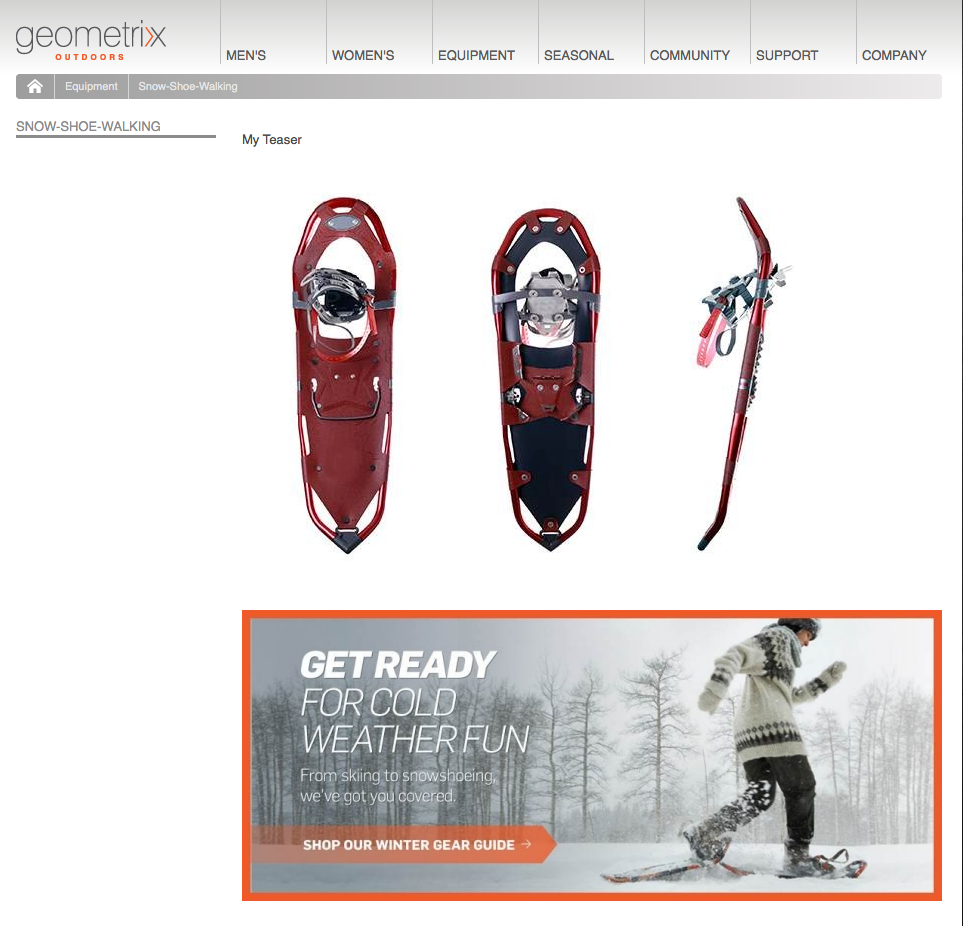

# 預告與策略{#teasers-and-strategies}

促銷活動通常會使用廣告作為吸引特定訪客群體的機制，以關注其興趣的內容。 會為特定促銷活動定義一或多個廣告。

>[!NOTE]
>
>AEM 6.2已淘汰Teaser元件。

* **品牌頁面** ，會儲存在網站的「促銷活動」區段中。 品牌包含個別的促銷活動。

* **促銷活動頁面** ，會儲存在網站的「促銷活動」區段中。 每個促銷活動都有個別頁面，摘要定義會在其中保留。 容器（或概述）頁面也包含與個別摘要頁面相關的特定資訊和統計資料。

AEM中的茶匙由數個部分組成：

* **摘要頁面** 會儲存在適當的促銷活動頁面下，並保留每個特定促銷活動可用摘要段落的定義。 這些定義用於顯示摘要段落；包括內容變化、用於選擇變化的區段和提升系數。
* Teaser **元件現成可用** ，可讓您在內容頁面中建立特定Teaser段落的例項。 您可以從sidekick拖曳Teaser元件，然後指定您的Teaser定義，以建立您自己的Teaser段落。 **** 注意：AEM 6.2已淘汰Teaser元件。

* **摘要段落** ，是內容頁面中摘要的實際例項。 這些策略吸引了部分訪客，他們通過關注其興趣的內容來吸引他們。
* 將促銷活動內容放在特定訪客群體的頁面。 通常摘要段落會將訪客引導至此類頁面。

## 策略 {#strategies}

將摘要段落新增至頁面時，您需要定義 **策略**。

若有數個預告可供選擇，因為其指派的區段都能成功解析。 然後 **Strategy** 會指定額外標準，用於選取顯示的摘要：

* **點按流分數**，是根據訪客用戶端內容中所保留的標籤和相關標籤點擊（顯示訪客點按包含個別標籤的頁面的頻率）。 比較摘要頁面上定義之標籤的點擊率。
* **隨機**，用於「隨機」選擇；使用為頁面產生的隨機因素，這可與用戶端內容一 [起檢視](/help/sites-administering/client-context.md)。

* **在已解** 決區段清單中，首先列出。 順序是促銷活動容器頁面中的預告。

區 [段的Boost](/help/sites-administering/campaign-segmentation.md#boost-factor) Factor也會影響選擇。 這是新增至區段定義的加權因子，以增加／減少選取區段的相對可能性。

以範例最能說明各種選擇准則的程式與相互關係（此方法也可用來確保您的廣告會觸及所需的觀眾）。

如果已建立下列區段並指派其各自的「Boost Factor」（提升系數）:

| 區段 | 提升系數 |
|---|---|
| S1 | 0 |
| S2 | 0 |
| S3 | 10 |
| S4 | 30 |
| S5 | 0 |
| S6 | 100 |

我們使用下列摘要定義：

<table> 
 <tbody> 
  <tr> 
   <td>行銷活動</td> 
   <td>Teaser</td> 
   <td>指派的區段</td> 
   <td>指派的標籤 </td> 
  </tr> 
  <tr> 
   <td>C1</td> 
   <td>T1</td> 
   <td>S1、S2</td> 
   <td>商業、行銷</td> 
  </tr> 
  <tr> 
   <td>C1</td> 
   <td>T2 </td> 
   <td>S1</td> 
   <td>  </td> 
  </tr> 
  <tr> 
   <td>C1 </td> 
   <td>T3</td> 
   <td>S3、S4</td> 
   <td>  </td> 
  </tr> 
  <tr> 
   <td>C1 </td> 
   <td>T4</td> 
   <td>S2、S5</td> 
   <td>  </td> 
  </tr> 
  <tr> 
   <td>C1 </td> 
   <td>T5</td> 
   <td>S1、S2、S6</td> 
   <td>行銷</td> 
  </tr> 
  <tr> 
   <td>C1 </td> 
   <td>T6</td> 
   <td>S6</td> 
   <td>商務  </td> 
  </tr> 
 </tbody> 
</table>

若我們將此套用至下列位置的訪客：

* **S1**、 **S2** 和 **S6成功解析**

* 標籤行 **銷** 3個點擊
* 標籤業 **務** 6次點擊

我們可以看到結果：

* 符合成功——指派給摘要的任何區段是否成功為目前訪客解析？
* 提升系數——所有適用區段中最高的提升系數
* 點按流分數——所有適用標籤點擊的累積總計

策略前計算，則有關金額：

<table> 
 <tbody> 
  <tr> 
   <td>行銷活動</td> 
   <td>Teaser</td> 
   <td>指派的區段</td> 
   <td>標記 </td> 
   <td>成功匹配？</td> 
   <td>產生的提升系數</td> 
   <td>產生的點按流分數 </td> 
  </tr> 
  <tr> 
   <td>C1</td> 
   <td>T1</td> 
   <td>S1、S2</td> 
   <td>商業、行銷</td> 
   <td>是</td> 
   <td>0</td> 
   <td>9</td> 
  </tr> 
  <tr> 
   <td>C1</td> 
   <td>T2 </td> 
   <td>S1</td> 
   <td>  </td> 
   <td>是</td> 
   <td>0</td> 
   <td>  </td> 
  </tr> 
  <tr> 
   <td>C1 </td> 
   <td>T3</td> 
   <td>S3、S4</td> 
   <td>  </td> 
   <td>否</td> 
   <td>  </td> 
   <td>  </td> 
  </tr> 
  <tr> 
   <td>C1 </td> 
   <td>T4</td> 
   <td>S2、S5</td> 
   <td>  </td> 
   <td>是  </td> 
   <td>0  </td> 
   <td>  </td> 
  </tr> 
  <tr> 
   <td>C1 </td> 
   <td>T5</td> 
   <td>S1、S2、S6</td> 
   <td>行銷</td> 
   <td>是</td> 
   <td>100</td> 
   <td>3</td> 
  </tr> 
  <tr> 
   <td>C1 </td> 
   <td>T6</td> 
   <td>S6</td> 
   <td>商務</td> 
   <td>是</td> 
   <td>100</td> 
   <td>6 </td> 
  </tr> 
 </tbody> 
</table>

這些值會根據套用至摘要段落的策略，用來判斷訪客將看到的摘 **要** :

<table> 
 <tbody> 
  <tr> 
   <td>策略</td> 
   <td>產生的摘要</td> 
   <td>評論</td> 
  </tr> 
  <tr> 
   <td>第一個</td> 
   <td>T5</td> 
   <td>只有T5和T6被視為其細分都有決 <i>心</i> ，而且其提升系數最高。 返回的清單按T5、T6順序排列；因此，T5已選取並顯示。</td> 
  </tr> 
  <tr> 
   <td>隨機</td> 
   <td>T5或T6</td> 
   <td>這兩個預告都有細分，所有細分都能解決問題，而且提升系數相同。 因此，兩茶匙的比例是相等的。</td> 
  </tr> 
  <tr> 
   <td>點按流分數</td> 
   <td>T6</td> 
   <td>
T1、T4、T5和T6的區段都會為訪客解析。 T5和T6的較高昇壓因子則排除T1和T4。 最後，T6的點按流分數越高，就會選取此分數。
 </td> 
  </tr> 
 </tbody> 
</table>

>[!NOTE]
>
>如果在上述解析度技術之後，有多個預告可供選擇，則內部選擇（隨機）將選擇單一預告供顯示。
>
>例如，如果策略是「點按流分數」，而T5與T6具有相同的點按流分數（即6而非3），則會使用內部選取（隨機）來選取其中一個。

摘要頁面／段落用於將特定訪客區段導向以其興趣為中心的內容。 它們可為訪客提供一系列選項，供其選擇，或僅顯示一個以特定訪客區段為基礎的摘要段落；例如，所顯示的摘要段落可能取決於訪客的年齡。

通常，摘要頁面是會持續特定時段的暫時動作，直到下一個摘要頁面取代為止。

建立您的品牌和促銷活動後，您可以建立和設定您的摘要體驗。

## 為摘要建立觸點 {#creating-a-touchpoint-for-your-teaser}

>[!NOTE]
>
>AEM 6.2已淘汰Teaser元件。

1. 導覽至您要放置廣告段落的內容頁面，該段落將引導您的促銷活動頁面。
1. 將 **Teaser** 元件(可在Sidekick的「個人化」區段 **中取得** )新增至所需位置。 首次建立時，它會顯示促銷活動路徑尚未設定：

   

1. 編輯摘要元件以新增：

   * **促銷活動路**&#x200B;徑包含個別摘要頁面之促銷活動頁面的路徑；區段會決定確切顯示的摘要。
   * **[策略](/help/sites-classic-ui-authoring/classic-personalization-campaigns.md#strategies)**方法，用於在成功解析多個區段時進行選取。
   

1. 按一 **下「確定** 」以儲存。 根據您在摘要上設定的區段以及您目前以此身分登入之使用者的設定檔，將會顯示適當的內容：

   

1. 將滑鼠指標暫留在摘要段落上，以顯示問號圖示（元件的右下角）。 按一下此項可檢視套用的區段，以及目前是否解析。

   

## 摘要概述 {#teaser-overview}

除了MCM中的促銷活動檢視外，促銷活動頁面也會提供與其連結的廣告的相關資訊：

1. 從網站 **主控台** ，開啟促銷活動頁面；例如：

   `http://localhost:4502/content/campaigns/geometrixx-outdoors/storefront/summer.html`

   這會顯示摘要定義和檢視統計資料的概述：

   

