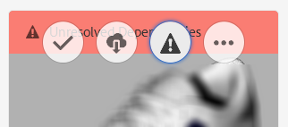

# 解決檔案相依性{#resolving-file-dependencies}

主要3D模型檔案相依性（例如紋理映射檔案）會盡可能自動解析。 此功能是透過讓AEM在Asset檔案夾附近搜尋3D檔案中具有相同名稱的檔案來完成。 如果在「建立預覽處理」階段期間無法解析一或多個相依性，資產的資訊卡會在資訊卡檢視中顯示下列紅色橫 [!UICONTROL 幅訊息]:

**要解決檔案依賴性**:

1. 在「卡 **[!UICONTROL 片檢視]**」中，將指標暫留在卡片的「未解析的相依性 **** 」橫幅訊息上，然後點選驚嘆號圖示。

   

1. 在中繼資料屬性頁面上，點選「相依 **[!UICONTROL 性]** 」標籤。

   AEM無法自動解析的檔案會列在「原始路徑」欄下方，以紅色表示。

1. 執行下列一或多個作業：

   * **[!UICONTROL 瀏覽並選擇相依項]**。 (此選項假定您已上傳相關檔案。

      1. 點選紅 **[!UICONTROL 色路徑左側的]** 「檔案瀏覽」圖示。
      1. 在「選 **[!UICONTROL 取內容]** 」頁面上，導覽至遺失的檔案，然後點選檔案的卡片以選取它。
      1. 在「選取內容」頁面的左上角，點選「關閉( **[!UICONTROL X圖示)」以返回「檢視]** 屬性 ******** 」頁面。
   * **[!UICONTROL 上傳相依性]**。 （此選項假設您尚未上傳遺失的檔案。）

      1. 請注意遺失的路徑和檔案名稱。
      1. 在屬性頁面的右上角附近，點選「關 **[!UICONTROL 閉」]**。

   上傳檔案後，會返回「檢視屬 **[!UICONTROL 性>相依性]** 」頁面。 新上傳的資產現在會正確列為參考的資產。

   * **[!UICONTROL 忽略相依項]**。

      如果不再需要遺失的相依性，請在 **[!UICONTROL Referenced Asset]** （參考資產）欄下方，在遺失檔案左側的文字欄位中，輸入 `n/a` ，讓AEM 3D忽略檔案。

1. 在「檢視屬性」頁面的右上角 **[!UICONTROL 附近]** ，點選「 **[!UICONTROL 儲存」]**。
1. 點選「 **[!UICONTROL 關閉]** 」以返回「卡 **[!UICONTROL 片檢視」]**。

   資產會自動重新處理，並具有新解析的相依性。

