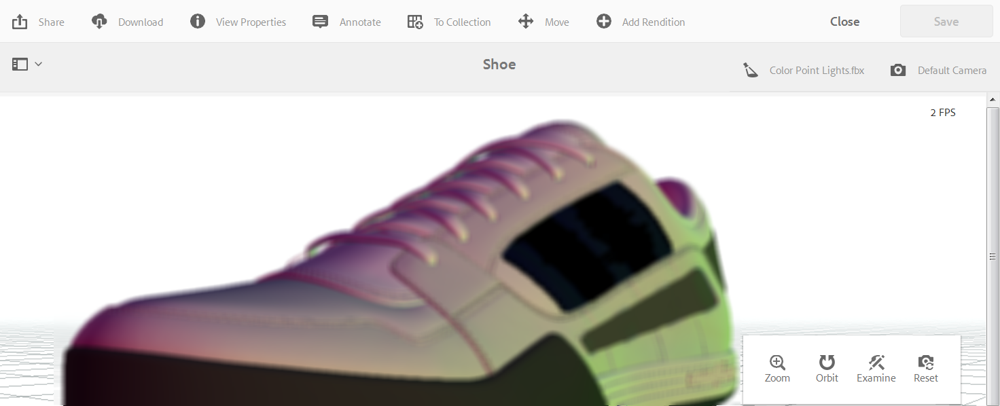

# 檢視3D資產{#viewing-d-assets}

您可從 AEM 中的資產詳細資訊頁面取得互動式 3D 檢視器。這個檢視器還包含一系列互動式相機控制項，可用來環繞、縮放和平移 3D 資產。

除了在AEM 3D中使用預設階段外，您也可以使用您在協力廠商應用程式中建立並上傳至AEM的階段。

請參閱[關於AEM 3D](/help/sites-classic-ui-authoring/classicui-stages-aem3d.md)中階段的使用。

>[!NOTE]
>
>若要檢視3D資產，您的裝置或案頭瀏覽器必須啟用WebGL。 此外，基礎圖形硬體必須具備足夠的功能和記憶體，才能呈現所需大小的模型。

## 檢視3D資產{#performance-considerations-when-you-view-d-assets}時的效能考量

在資產詳細資料頁面檢視中開啟3D資產所花的時間，取決於數個因素。 這些因素包括：

* 伺服器的頻寬和延遲。
* 模型大小（面數）。
* 地圖的數目和大小。
* 舞台的複雜性。 例如，IBL影像的大小。

此外，在您以互動方式操作相機時，用戶端電腦（例如工作站、筆記型電腦或行動觸控裝置）的功能也很重要。 功能相當強大的系統，具備良好的圖形功能，可讓互動式3D檢視體驗更順暢更有利。

**若要檢視3D資產**:

1. 請確定您已將3D資產上傳至AEM。

   請參閱[關於在AEM](/help/sites-classic-ui-authoring/classicui-upload-proc-3d.md)中上傳及處理3D資產。
1. 在&#x200B;**[!UICONTROL Adobe Experience Manager]**&#x200B;的&#x200B;**[!UICONTROL Navigation]**&#x200B;頁面上，點選&#x200B;**[!UICONTROL Assets]**。
1. 在頁面的右上角附近，從&#x200B;**[!UICONTROL View]**&#x200B;下拉式清單中，點選&#x200B;**[!UICONTROL Card View]**。

1. 導覽至您要檢視的3D資產。
1. 點選3D資產的資訊卡，以在資產詳細資訊頁面中開啟它。

1. 執行下列任一操作：

   * 在資產詳細資訊頁面的右下角，使用相機控制浮動視窗來變更資產的各種檢視。

      如果您使用不含滾輪的非觸控輸入裝置（例如傳統的Apple單鍵滑鼠），則仍可在每個不同模式中變更3D資產的縮放或透視。 按住`SHIFT`鍵並按下滑鼠按鈕並向上或向下拖曳，即可完成動作。

      在典型的筆記型電腦上使用觸摸板時，使用雙指手勢通常很難控制縮放或透視行為。 在這種情況下，您可以在動作期間按住`SHIFT`鍵。 這種努力會降低夾捏手勢的速度，並讓您更容易達到所需的精確縮放等級或透視效果。 或者，當按下`SHIFT`鍵時，您可以使用單指向上或向下拖曳，以影響縮放或透視行為。
   <table> 
    <tbody> 
      <tr> 
      <td><strong>相機控制項名稱</strong>  </td> 
      <td><strong>說明</strong></td> 
      </tr> 
      <tr> 
      <td>
縮放
 
或
 
佩爾普
 </td> 
      <td>
點選或按一下，在「縮放」和「透視」模式之間切換。
 
或者，在動作期間按住<code>ALT/OPTION</code>鍵以暫時切換至「透視」模式。  釋放鍵以回復為縮放模式。
 
        <ul> 
        <li><strong>Zoom</strong>-Dolly in and out behaviors that macera deless or delly forme the   assey you wearing.縮放是滑鼠上滾輪的預設行為（如果可用0），是行動裝置上兩指夾捏手勢的預設行為，或是當您使用滑鼠左鍵向上或向下拖曳時按住Shift鍵。</li> 
        <li><strong>透視</strong>-變更相機的焦距（也稱為視野），同時維持檢視中資產的相對大小。透視是滾輪的替代行為（如果有的話）、行動裝置上的雙指夾捏手勢，或是當您使用滑鼠左鍵向上或向下拖曳時按住Shift鍵。</li> 
        </ul> </td> 
      </tr> 
      <tr> 
      <td>
軌道
 
或
 
潘
 </td> 
      <td>
點選或按一下，在「軌道」和「平移」模式之間切換。
 
或者，在動作期間按住<code>ALT/OPTION</code>鍵以暫時切換為「平移」模式。 釋放鍵以恢復為軌道模式。
 
        <ul> 
        <li><strong>軌道</strong>-在位於3D資產中心附近的目標點中心的球體上移動觀看攝像機。Orbit是行動裝置上左鍵拖曳或單鍵拖曳的預設行為。</li> 
        <li><strong>平移</strong>(Pan)在查看平面中移動攝像機。目標點相應移動，因此後續的軌道動作將使攝像機繞新目標點移動。 平移是左鍵拖曳和單鍵拖曳的替代行為。</li> 
        </ul> </td> 
      </tr> 
      <tr> 
      <td>
檢查
 
或
 
目標
 </td> 
      <td>
點選或按一下，在「檢查」和「目標」模式之間切換。
 
        <ul> 
        <li><strong>檢查</strong>-點選或按一下進入Target模式。</li> 
        <li><strong>Target</strong>-點選或按一下3D資產上任一點，以將該資產的檢視置中。  軌道動作使用新的目標點。</li> 
        </ul> </td> 
      </tr> 
      <tr> 
      <td>重設</td> 
      <td>點選或按一下將視圖目標點恢復到模型的中心。 Reset還使相機 更靠近或更遠，以便以合理的觀看大小顯示整個資產。</td> 
      </tr> 
    </tbody> 
    </table>

1. 在資產詳細資料頁面的右上角，點選「舞台選擇器」圖示。 ****&#x200B;選取您要套用至3D資產的背景和光源的舞台名稱。

   

   舞台提供環境——背景、地面和照明-3D模型可檢視。

   請參閱[關於AEM 3D](/help/sites-classic-ui-authoring/classicui-stages-aem3d.md)中階段的使用。

1. 在資產詳細資料頁面的右上角，點選&#x200B;**[!UICONTROL 相機選擇器]**&#x200B;圖示，然後選取您要套用至3D資產的相機檢視。

   

   舞台通常提供預先定義的相機。 您可以重新選取目前的相機，將它還原為預先定義的設定。

   請參閱[關於AEM 3D](/help/sites-classic-ui-authoring/classicui-stages-aem3d.md)中階段的使用。

1. 在頁面的右上角，點選&#x200B;**[!UICONTROL Save]**。
1. 執行下列任一項作業：

   * 演算3D資產。

      請參閱[演算3D資產](/help/sites-classic-ui-authoring/classicui-rendering-3d.md)。

   * 在頁面的右上角，點選&#x200B;**[!UICONTROL Close]**&#x200B;以返回「資產」頁面。

