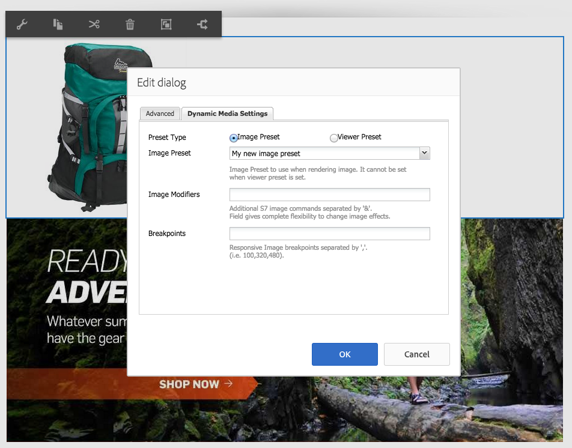

# 將 Dynamic Media 資產新增至頁面{#adding-dynamic-media-assets-to-pages}

>[!CAUTION]
>
>AEM 6.4已結束延伸支援，本檔案不再更新。 如需詳細資訊，請參閱 [技術支援期](https://helpx.adobe.com//tw/support/programs/eol-matrix.html). 尋找支援的版本 [此處](https://experienceleague.adobe.com/docs/).

若要將Dynamic Media功能新增至您在網站上使用的資產，您可以新增 **[!UICONTROL Dynamic Media]** 或 **[!UICONTROL 互動式媒體]** 元件。 您可以輸入 [!UICONTROL 設計] 模式並啟用動態媒體元件。 然後，您可以將這些元件新增至頁面，並新增資產至元件。動態媒體和互動式媒體元件是智慧型的，他們知道您是新增影像還是視訊，而可用的選項會隨之變更。

如果您使用AEM做為WCM，請直接將動態媒體資產新增至頁面。

>[!NOTE]
>
>影像地圖可立即用於輪播橫幅。

## 新增Dynamic Media元件至頁面 {#adding-a-dynamic-media-component-to-a-page}

新增 [!UICONTROL Dynamic Media] 或 [!UICONTROL 互動式媒體] 元件新增至頁面與新增元件至任何頁面相同。 此 [!UICONTROL Dynamic Media] 和 [!UICONTROL 互動式媒體] 以下幾節將詳細說明元件。

若要將Dynamic Media元件/檢視器新增至頁面：

1. 在AEM中，開啟您要新增Dynamic Media元件的頁面。
1. 如果沒有可用的Dynamic Media元件，請按一下 [!UICONTROL Sidekick] 輸入 **[!UICONTROL 設計]** 模式，按一下 **[!UICONTROL 編輯]** parsys，然後選取 **[!UICONTROL Dynamic Media]** 讓Dynamic Media元件可供使用。

   >[!NOTE]
   >
   >請參閱 [在設計模式中配置元件](/help/sites-authoring/default-components-designmode.md) 以取得更多資訊。

1. 返回 **[!UICONTROL 編輯]** 模式，方法是按一下 [!UICONTROL Sidekick].
1. 拖曳 **[!UICONTROL Dynamic Media]** 或 **[!UICONTROL 互動式媒體]** 元件 **[!UICONTROL 其他]** 在sidekick中群組至所需位置中的頁面。
1. 按一下 **[!UICONTROL 編輯]** 以開啟元件。
1. [編輯元件](#dynamic-media-component) 視需要按一下 **[!UICONTROL 確定]** 以儲存變更。

## Dynamic Media元件 {#dynamic-media-components}

[!UICONTROL Dynamic Media] 和 [!UICONTROL 互動式媒體] 在 [!UICONTROL Sidekick] 在 **[!UICONTROL Dynamic Media]**. 您使用 **[!UICONTROL 互動式媒體]** 元件，適用於任何互動式資產，例如互動式視訊、互動式影像或輪播集。 對於所有其他動態媒體元件，請使用 **[!UICONTROL Dynamic Media]** 元件。

>[!NOTE]
>
>預設情況下，這些元件不可用，在使用之前需要在「設計」模式中選取這些元件。 [在「設計」模式中使用](/help/sites-authoring/default-components-designmode.md)，您可以將元件新增至頁面，如同新增任何其他AEM元件。

### Dynamic Media元件 {#dynamic-media-component}

Dynamic Media元件是智慧型的，視您新增影像或影片而定，您有各種選項。 元件支援影像預設集、以影像為基礎的檢視器，例如影像集、回轉集、混合媒體集和視訊。 此外，檢視器回應速度快。 也就是說，螢幕的大小會根據螢幕大小自動變更。 所有檢視器都是以HTML5為基礎的檢視器。

>[!NOTE]
>
>當您新增 [!UICONTROL Dynamic Media] 元件和 **[!UICONTROL Dynamic Media設定]** 空白，或無法正確新增資產，請核取下列項目：
>
>* 您擁有 [啟用Dynamic Media](/help/assets/config-dynamic.md). Dynamic Media預設為停用。
>* 影像具有金字塔Tiff檔案。 在啟用動態媒體之前匯入的影像沒有金字塔Tiff檔案。
>

#### 使用影像時 {#when-working-with-images}

此 [!UICONTROL Dynamic Media] 元件可讓您新增動態影像，包括影像集、回轉集和混合媒體集。 您可以放大、縮小，如果適用，可以在回轉集內開啟影像，或從另一類型的集合中選取影像。

您也可以直接在元件中設定檢視器預設集、影像預設集或影像格式。 若要讓影像具有回應性，您可以設定分界點或套用回應式影像預設集。

您可以按一下「 」，編輯下列Dynamic Media設定 **[!UICONTROL 編輯]** ，然後按一下 **[!UICONTROL Dynamic Media設定]** 標籤。

>[!NOTE]
>
>依預設，動態媒體影像元件是可調式的。如果要將其設為固定大小，請在 **[!UICONTROL 進階]** 標籤 **[!UICONTROL 寬度]** 和 **[!UICONTROL 高度]** 屬性。

**[!UICONTROL 檢視器預設集]**  — 從下拉式選單中選取現有的檢視器預設集。 如果您要尋找的檢視器預設集未顯示，您可能需要將其顯示。 請參閱 [管理檢視器預設集](/help/assets/managing-viewer-presets.md). 如果您使用影像預設集，則無法選取檢視器預設集，反之亦然。

如果您檢視影像集、回轉集或混合媒體集，此選項是唯一可用的選項。 顯示的檢視器預設集也是智慧型的 — 僅顯示相關的檢視器預設集。

**[!UICONTROL 影像預設集]**  — 從下拉式選單中選取現有的影像預設集。 如果您要尋找的影像預設集未顯示，則您可能需要使其可見。 請參閱 [管理影像預設集](/help/assets/managing-image-presets.md). 如果您使用影像預設集，則無法選取檢視器預設集，反之亦然。

如果您正在檢視影像集、回轉集或混合媒體集，則無法使用此選項。

**[!UICONTROL 影像修飾元]**  — 通過提供其他影像命令，可以更改影像效果。 這些說明於 [管理影像預設集](/help/assets/managing-viewer-presets.md) 和 [命令參考](https://experienceleague.adobe.com/docs/dynamic-media-developer-resources/image-serving-api/image-serving-api/http-protocol-reference/command-reference/c-command-reference.html).

如果您正在檢視影像集、回轉集或混合媒體集，則無法使用此選項。

**[!UICONTROL 斷點]**  — 如果您在回應式網站上使用此資產，則需要新增頁面中斷點。 影像斷點必須用逗號(,)分隔。 當影像預設集中未定義高度或寬度時，此選項即可運作。

如果您正在檢視影像集、回轉集或混合媒體集，則無法使用此選項。

您可以編輯下列項目 [!UICONTROL 進階設定] 按一下 **[!UICONTROL 編輯]** 在元件中。

**[!UICONTROL 標題]**  — 變更影像標題。

**[!UICONTROL 替代文字]**  — 為關閉圖形的用戶添加影像標題。

如果您正在檢視影像集、回轉集或混合媒體集，則無法使用此選項。

**[!UICONTROL URL，在中開啟]**  — 您可以從設定資產，以開啟連結。 設定 **[!UICONTROL URL]** 和 **[!UICONTROL 在中開啟]** 以指定要在同一窗口還是新窗口中開啟它。

如果您正在檢視影像集、回轉集或混合媒體集，則無法使用此選項。

**[!UICONTROL 寬度和高度]**  — 如果希望影像大小固定，請輸入值（像素）。 將這些值保留為空白，可讓資產具有適用性。

#### 使用視訊時 {#when-working-with-video}

使用 [!UICONTROL Dynamic Media] 元件，將動態視訊新增至網頁。 編輯元件時，您可以選擇使用預先定義的視訊檢視器預設集來在頁面上播放視訊。

您可以編輯下列項目 [!UICONTROL Dynamic Media設定] 按一下 **[!UICONTROL 編輯]** 在元件中。

>[!NOTE]
>
>依預設，Dynamic Media視訊元件是最適化的。 如果要將其設為固定大小，請在元件中使用 **[!UICONTROL 寬度]** 和 **[!UICONTROL 高度]** 在 **[!UICONTROL 進階]** 標籤。

**[!UICONTROL 檢視器預設集]**  — 從下拉式選單中選取現有的視訊檢視器預設集。 如果您要尋找的檢視器預設集未顯示，您可能需要將其顯示。 請參閱 [管理檢視器預設集](/help/assets/managing-viewer-presets.md).

您可以編輯下列項目 [!UICONTROL 進階] 按一下 **[!UICONTROL 編輯]** 在元件中。

**[!UICONTROL 標題]**  — 變更視訊的標題。

**[!UICONTROL 寬度和高度]**  — 如果您希望視訊大小固定，請輸入像素值。 將這些值保留為空白，可使其變得最適化。

#### 如何傳送安全視訊 {#how-to-delivery-secure-video}

在AEM 6.2中，當您安裝 [FP-13480](https://experience.adobe.com/#/downloads/content/software-distribution/en/aem.html?package=/content/software-distribution/en/details.html/content/dam/aem/public/adobe/packages/cq620/featurepack/cq-6.2.0-featurepack-13480)，您可以控制視訊是透過安全SSL連線(HTTPS)或不安全連線(HTTP)傳送。 依預設，視訊傳送通訊協定會自動從內嵌網頁的通訊協定繼承。 如果網頁透過HTTPS載入，視訊也會透過HTTPS傳送。 反之，如果網頁位於HTTP，則視訊會透過HTTP傳送。 在大多數情況下，此預設行為正常，不需要進行任何設定變更。 不過，您可以透過附加 `VideoPlayer.ssl=on` 至URL路徑的結尾，或內嵌程式碼片段中其他檢視器設定參數的清單，以強制安全傳送視訊。

如需安全視訊傳送和使用 `VideoPlayer.ssl` URL路徑中的設定屬性，請參閱 [安全視訊傳送](https://experienceleague.adobe.com/docs/dynamic-media-developer-resources/library/viewers-aem-assets-dmc/video/c-html5-video-viewer-20-securevideodelivery.html) （位於檢視器參考指南中）。 除了視訊檢視器，混合媒體檢視器和互動式視訊檢視器也提供安全的視訊傳送。

### 互動式媒體元件 {#interactive-media-component}

互動式媒體元件適用於在這些資產上具有互動的熱點或影像地圖。 如果您有互動式影像、互動式視訊或輪播橫幅，請使用 **[!UICONTROL 互動式媒體]** 元件。

此 [!UICONTROL 互動式媒體] 元件是智慧型的 — 視您新增影像或視訊而定，會有各種選項。 此外，檢視器回應速度快。 也就是說，螢幕的大小會根據螢幕大小自動變更。 所有檢視器都是以HTML5為基礎的檢視器。

您可以編輯下列項目 **[!UICONTROL 一般]** 按一下 **[!UICONTROL 編輯]** 在元件中。

**[!UICONTROL 檢視器預設集]**  — 從下拉式選單中選取現有的檢視器預設集。 如果您要尋找的檢視器預設集未顯示，您可能需要將其顯示。 必須先發佈檢視器預設集，才能使用。 請參閱管理檢視器預設集。

**[!UICONTROL 標題]**  — 變更視訊的標題。

**[!UICONTROL 寬度和高度]**  — 如果您希望視訊大小固定，請輸入像素值。 將這些值保留為空白，可使其變得最適化。

您可以編輯下列項目 **[!UICONTROL 添加到購物車]** 按一下 **[!UICONTROL 編輯]** 在元件中。

**[!UICONTROL 顯示產品資產]**  — 預設情況下，此值為已選取。 產品資產會依照商務模組中的定義顯示產品的影像。 清除勾號以不顯示產品資產。

**[!UICONTROL 顯示產品價格]**  — 預設情況下，此值為已選取。 產品價格顯示商務模組中定義的項目價格。 清除勾號以不顯示產品價格。

**[!UICONTROL 顯示產品表單]**  — 預設不會選取此值。 產品表單包含任何產品變體，例如大小和顏色。 清除勾號以不顯示產品變體。
