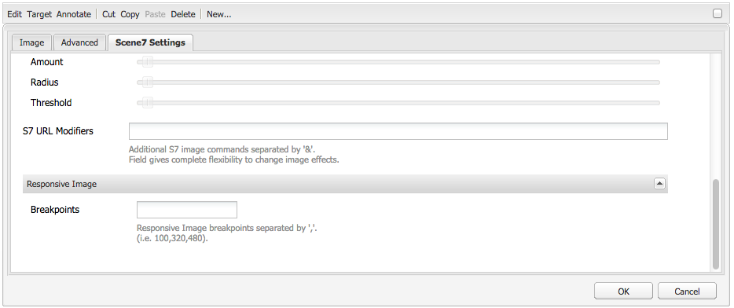
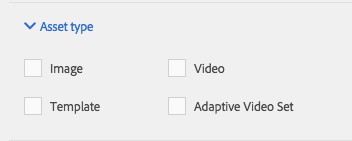

# 將Dynamic Media Classic功能新增至您的頁面{#adding-scene-features-to-your-page}

[Adobe Dynamic Media Classic](https://help.adobe.com/en_US/scene7/using/WS26AB0D9A-F51C-464e-88C8-580A5A82F810.html) 是代管解決方案，適用於管理、增強、發佈和提供多媒體資產至網路、行動裝置、電子郵件和網際網路連線的顯示和印刷品。

您可以在各種檢視器中檢視在Dynamic Media Classic中發佈的AEM資產：

* 縮放
* 飛出
* 影片
* 影像範本
* 影像

您可以直接從AEM發佈數位資產至Dynamic Media Classic，也可以從Dynamic Media Classic發佈數位資產至AEM。

本節說明如何將數位資產從AEM發佈至Dynamic Media Classic，反之亦然。 檢視器也會有詳細說明。 如需為Dynamic Media Classic設定AEM的詳細資訊，請參 [閱「整合Dynamic Media Classic與AEM](/help/sites-administering/scene7.md)」。

另請參閱 [添加影像映射](/help/assets/image-maps.md)。

如需搭配AEM使用視訊元件的詳細資訊，請參閱下列：

* [影片](/help/sites-classic-ui-authoring/manage-assets-classic-s7-video.md)

>[!NOTE]
>
>如果Dynamic Media Classic資產未正確顯示，請確定已停用Dynamic Media  ，然後重新整理頁面。

## 從資產手動發佈至Dynamic Media Classic {#manually-publishing-to-scene-from-assets}

您可以從傳統UI的「資產」主控台或直接從資產發佈數位資產至Dynamic Media Classic。

>[!NOTE]
>
>AEM以非同步方式發佈至Dynamic Media Classic。 按一下「 **[!UICONTROL 發佈]**」後，您的資產可能需要數秒鐘才能發佈至Dynamic Media Classic。

### 從Assets主控台發佈 {#publishing-from-the-assets-console}

若要從「資產」主控台發佈至「動態媒體經典」(Dynamic Media Classic)目標資料夾中的資產：

1. 在AEM Classic UI中，按一下「 **[!UICONTROL Digital Assets]** 」以存取數位資產管理員。

1. 從您要發佈至Dynamic Media Classic的目標資料夾中選取資產（或資產）或資料夾，然後按一下滑鼠右鍵，然後選取「 **[!UICONTROL 發佈至Dynamic Media Classic」]**。 或者，您也可以從「**工 **[!UICONTROL 具」選單中選取「發佈至動態媒體經典版」]** ([!UICONTROL Publish to Dynamic Media Classic)] 。

   

1. 前往Dynamic Media Classic並確認資產已可用。

   >[!NOTE]
   >
   >如果資產不在Dynamic Media Classic同步化資料夾中，則兩個選單中的 **[!UICONTROL 「發佈至Dynamic Media Classic]** 」都會顯示但停用。

### 從資產發佈 {#publishing-from-an-asset}

只要資產位於同步化的Dynamic Media Classic資料夾內，您就可以手動發佈資產。

>[!NOTE]
>
>如果資產未位於Dynamic Media Classic同步化資料夾中，則無法連結 **[!UICONTROL 至Dynamic Media Classic]** 。

**若要直接從數位資產發佈至Dynamic Media Classic**:

1. 在AEM中，按一下「 **[!UICONTROL 數位資產]** 」以存取數位資產管理員。

1. 按兩下以開啟資產。

1. 在資產詳細資訊窗格中，選 **[!UICONTROL 取「發佈至動態媒體經典版]**」。

   

1. 連結會變更 **[!UICONTROL 為「發佈……」]** 然後 **[!UICONTROL 發佈]**。 前往Dynamic Media Classic並確認資產已可用。

   >[!NOTE]
   >
   >如果資產未正確發佈至Dynamic Media Classic，連結會變更為「發 **[!UICONTROL 布失敗」]**。 如果資產已發佈至Dynamic Media Classic，連結會顯示「重新 **[!UICONTROL 發佈至Dynamic Media Classic」]**。 重新發佈可讓您在AEM中變更資產並重新發佈。

### 從CQ目標資料夾外部發佈資產 {#publishing-assets-from-outside-the-cq-target-folder}

Adobe建議您僅從Dynamic Media Classic目標資料夾中的資產，將資產發佈至Dynamic Media Classic。 不過，如果您需要從目標資料夾外的資料夾上傳資產，您仍可將資產上傳至Dynamic Media Classic上的 *臨機資料夾* 。

若要這麼做，請為資產將出現的頁面設定雲端設定。 然後，您可將Dynamic Media Classic元件新增至頁面，並在元件上拖放資產。 為該頁面設定頁面屬性後，會出現「發佈至動態媒體傳統版 **** 」連結，當選取的觸發器上傳至Dynamic Media Classic時。

>[!NOTE]
>
>臨機資料夾中的資產不會顯示在Dynamic Media Classic內容瀏覽器中。

**若要發佈駐留在CQ目標資料夾以外的資產**:

1. 在傳統UI的AEM中，按一下「 **[!UICONTROL Websites]** 」並導覽至您要新增數位資產至尚未發佈至Dynamic Media Classic的網頁。 （套用一般頁面繼承規則）。

1. 在sidekick中，按一下「頁 **[!UICONTROL 面」圖示]** ，然後按一下「 **[!UICONTROL 頁面屬性」]**。

1. 按一 **下「[!UICONTROL雲端服務>新增服務>動態媒體經典(Scene7)」**。
1. 在「Adobe Dynamic Media Classic」下拉式清單中，選取所要的設定，然後按一下「 **[!UICONTROL 確定]**」。

   

1. 在網頁上，將Dynamic Media Classic(Scene7)元件新增至頁面上所需的位置。
1. 從內容搜尋器，將數位資產拖曳至元件。 您會看到「檢查動態媒 **[!UICONTROL 體經典出版物狀態」的連結]**。

   >[!NOTE]
   >
   >如果數位資產位於CQ目標資料夾中，則不會顯示「檢查動態媒體傳 **[!UICONTROL 統出版物狀態]** 」連結。 資產只會放在元件中。

   

1. 按一 **[!UICONTROL 下「檢查動態媒體經典出版物狀態]**」。 如果資產未發佈，AEM會將資產發佈至Dynamic Media Classic。 上傳資產後，資產就會位於臨機資料夾中。 依預設，臨機資料夾位於 `name_of_the_company/CQ5_adhoc`。 如有需 [要，您可以設定此設定](#configuringtheadhocfolder)。

   >[!NOTE]
   >
   >如果資產不在Dynamic Media Classic同步化資料夾中，且目前頁面沒有關聯的Dynamic Media Classic雲端設定，上傳將會失敗。

## Dynamic Media Classic(Scene7)元件 {#scene-components}

AEM提供下列Dynamic Media Classic元件：

* 縮放
* 彈出（縮放）
* 影像範本
* 影像
* 影片

>[!NOTE]
>
>這些元件預設不可用，在使用前必須在 **[!UICONTROL Design]** 模式中選取。

在「設計」模式中提供 **[!UICONTROL 元件後]** ，您可以像其他AEM元件一樣，將元件新增至您的頁面。 尚未發佈至Dynamic Media Classic的資產會發佈至Dynamic Media Classic（位於同步化資料夾、頁面或Dynamic Media Classic雲端組態）。

### Flash viewers end-of-life notice {#flash-viewers-end-of-life-notice}

自2017年1月31日起，Adobe Dynamic Media Classic正式終止對Flash檢視器平台的支援。

如需此重要變更的詳細資訊，請參 [閱Flash檢視器停售常見問答集](https://docs.adobe.com/content/docs/en/aem/6-1/administer/integration/marketing-cloud/scene7/flash-eol.html)。

### 新增Dynamic Media Classic元件至頁面 {#adding-a-scene-component-to-a-page}

將Dynamic Media Classic元件新增至頁面與將元件新增至任何頁面相同。 Dynamic Media Classic元件將在下列章節中詳細說明。

**若要將Dynamic Media Classic元件／檢視器新增至傳統UI中的頁面**:

1. 在AEM中，開啟您要新增Dynamic Media Classic元件的頁面。

1. 如果沒有可用的Dynamic Media Classic元件，請按一下側腳中的尺標以進入 **[!UICONTROL Design]** 模式，按一下「編輯」( **[!UICONTROL Edit]** parsys)，然後選取所有 **[!UICONTROL Dynamic Media Classic]** 元件以使其可用。

1. 按一下側 **[!UICONTROL 腳中的鉛筆]** ，即可返回「編輯」模式。

1. 從側腳中的 **[!UICONTROL Dynamic Media Classic]** 群組拖曳元件至所需位置的頁面。

1. 按一下 **[!UICONTROL 編輯]** ，開啟元件。

1. 視需要編輯元件，然後按一下「 **[!UICONTROL 確定]** 」以儲存變更。

### 將互動式檢視體驗新增至互動式網站 {#adding-interactive-viewing-experiences-to-a-responsive-website}

針對您的資產進行多方互動設計，表示您的資產會依其顯示位置而調整。 透過多方互動設計，相同的資產可在多種裝置上有效顯示。

**若要在傳統UI中將互動式檢視體驗新增至互動式網站**:

1. 登入AEM，並確定您已設定 [Adobe Dynamic Media Classic Cloud Services](/help/sites-administering/scene7.md#configuring-scene-integration) ，且Dynamic Media Classic元件已可供使用。

   >[!NOTE]
   >
   >如果Dynamic Media Classic WCM元件不可用，請務必透過**[!UICONTROL Design] 模式啟用。

1. 在啟用Dynamic Media Classic元件的網站中，將 **[!UICONTROL Image]** viewer拖曳至頁面。
1. 在「動態媒體經典設定」標籤中編輯元 **[!UICONTROL 件並調整中斷點]** 。

   

1. 確認檢視器正在回應性地調整大小，而且所有互動都已針對桌上型電腦、平板電腦和行動裝置最佳化。

### 所有Dynamic Media Classic元件的常用設定 {#settings-common-to-all-scene-components}

雖然配置選項不同，但是所有Dynamic Media Classic元件都有下列通用選項：

* **[!UICONTROL 檔案引用]** -瀏覽到要引用的檔案。 檔案參考會顯示資產URL，但不一定是完整的Dynamic Media Classic URL，包括URL命令和參數。 您無法在此欄位中新增Dynamic Media Classic URL命令和參數。 它們必須透過元件中的對應功能來新增。
* **[!UICONTROL 寬度]** -可讓您設定寬度。
* **[!UICONTROL 高度]** -可讓您設定高度。

您可以透過按兩下Dynamic Media Classic元件來設定這些設定選項，例如，當您開啟 **[!UICONTROL Zoom元件]** :

### 縮放 {#zoom}

當您按+按鈕時，HTML5縮放元件會顯示較大的影像。

資產底部有縮放工具。 按一下 **[!UICONTROL +]** 放大。 按一 **[!UICONTROL 下]** 即可減少。 按一 **[!UICONTROL 下x]** ，或重設縮放箭頭，可將影像重新調整為原來匯入的大小。 按一下對角線箭頭，讓它成為全螢幕。 按一 **[!UICONTROL 下「編輯]** 」以設定元件。 使用此元件，您可以設 [定所有Dynamic Media Classic元件的共同設定](#settings-common-to-all-scene-components)。

### 飛出 {#flyout}

在HTML5 Flyout元件中，資產顯示為分割畫面； 將資產保留在指定的大小； 右側顯示縮放部分。 按一 **[!UICONTROL 下「編輯]** 」以設定元件。 使用此元件，您可以設 [定所有Dynamic Media Classic元件的共同設定](/help/sites-administering/scene7.md#settingscommontoalldynamicmediaclassiccomponents)。

>[!NOTE]
>
>如果您的Flyout元件使用自訂大小，則會使用該自訂大小，並停用元件的回應式設定。
>
>如果您的Flyout元件使用預設大小(如 [!UICONTROL Design] 檢視中所設定)，則會使用預設大小，而元件會延伸以配合頁面版面大小，並啟用元件的回應式設定。 但請注意，元件的回應式設定有限。 當您使用具有自適應設定的彈出式元件時，不應將它用於全頁延伸。 否則，彈出(Flyout)可能會超出頁面的右邊框。

### 影像 {#image}

Dynamic Media Classic Image元件可讓您將Dynamic Media Classic功能新增至影像，例如Dynamic Media Classic修飾元、影像或檢視器預設集，以及銳利化。 Dynamic Media Classic影像元件與AEM中具有特殊Dynamic Media Classic功能的其他影像元件類似。 在此範例中，影像已套用Dynamic Media Classic URL修飾 `&op_invert=1` 元。

**[!UICONTROL 標題、替代文字]** -在「進階」索引標籤中，為影像新增標題，並為關閉圖形的使用者新增替代文字。

**[!UICONTROL URL,Open in]** - You can set an asset from to open a link. 設定 **[!UICONTROL URL]****[!UICONTROL 和「開啟於]** 」，以指出您要在相同視窗或新視窗中開啟。

**[!UICONTROL 檢視器預設]** -從下拉式選單中選取現有的檢視器預設。 如果您所尋找的檢視器預設集不可見，您可能需要將它顯示。 請參閱 [管理檢視器預設集](/help/assets/managing-viewer-presets.md)。 如果您使用影像預設集，則無法選取檢視器預設集，反之亦然。

**[!UICONTROL Dynamic Media Classic Configuration]** —— 選取您要用來從Scene7 Publishing System擷取作用中影像預設集的Dynamic Media Classic組態。

**[!UICONTROL 影像預設集]** -從下拉式選單中選取現有的影像預設集。 如果您要尋找的影像預設集不可見，您可能需要將它顯示。 請參閱 [管理影像預設集](/help/assets/managing-image-presets.md)。 如果您使用影像預設集，則無法選取檢視器預設集，反之亦然。

**[!UICONTROL 輸出格式]** -選擇影像的輸出格式，例如jpeg。 視您選擇的輸出格式而定，您可能會有其他設定選項。 請參閱 [管理影像預設集](/help/assets/managing-image-presets.md)。

**[!UICONTROL 銳利化]** -選擇影像銳利化的方式。 銳利化在 [*Adobe Dynamic Media Classic Image Quality and Sharpening Best Practices中會詳細說明&#x200B;*](/help/assets/assets/s7_sharpening_images.pdf)。

**[!UICONTROL URL修飾元]** -您可以提供額外的Dynamic Media Classic影像指令來變更影像效果。 這些說明在「管理 [影像預設集](/help/assets/managing-image-presets.md) 」和「命 [令」參考中](https://docs.adobe.com/content/help/en/dynamic-media-developer-resources/image-serving-api/image-serving-api/http-protocol-reference/command-reference/c-command-reference.html)。

**[!UICONTROL 中斷點]** -如果您的網站是互動式的，您需要調整中斷點。 中斷點必須以逗號分隔 `,`。

### 影像範本 {#image-template}

[Dynamic Media Classic Image Templates是分層的Photoshop內容](https://help.adobe.com/en_US/scene7/using/WS60B68844-9054-4099-BF69-3DC998A04D3C.html) ，已匯入至Dynamic Media Classic，其中內容和屬性會因變數而參數化。 「影 **[!UICONTROL 像範本]** 」元件可讓您在AEM中匯入影像並動態變更文字。 此外，您可以設定 **[!UICONTROL Image範本元件]** ，使用用戶端內容的值，讓每位使用者都能以個人化的方式體驗影像。

按一 **[!UICONTROL 下「編輯]** 」以設定元件。 您可以設 [定所有Dynamic Media Classic元件的常用設定](/help/sites-administering/scene7.md#settingscommontoalldynamicmediaclassicscomponents) ，以及本節所述的其他設定。

**[!UICONTROL 檔案參考、寬度、高度]** -檢視所有Dynamic Media Classic元件的常用設定。

>[!NOTE]
>
>Dynamic Media Classic URL命令和參數無法直接新增至「檔案參考URL」。 它們只能在「參數」面板的元件UI中 **[!UICONTROL 定義]** 。

**[!UICONTROL 標題、替代文字]** ：在「動態媒體  經典影像範本」標籤中，為影像新增標題，並為已關閉圖形的使用者新增替代文字。

**[!UICONTROL URL, Open in]** You can set an asset from to open a link. 設定 **[!UICONTROL URL]** ，並在「 **[!UICONTROL Open in]** 」（開啟於）中指出您要在相同視窗或新視窗中開啟。

**[!UICONTROL 參數面板]** ：匯入影像時，會預先填入影像的資訊。 如果沒有可動態變更的內容，則此視窗為空。

#### 動態變更文字 {#changing-text-dynamically}

若要動態變更文字，請在欄位中輸入新文字，然後按一下「 **[!UICONTROL 確定]**」。 在此範例中， **[!UICONTROL 價格]** $50，運費為99美分。

影像中的文字會變更。 您可以按一下欄位旁的「重設」，將文字重設回 **[!UICONTROL 原始]** 值。

#### 變更文字以反映用戶端內容值的值 {#changing-text-to-reflect-the-value-of-a-client-context-value}

若要將欄位連結至用戶端上下文值，請按一下「選 **[!UICONTROL 取]** 」以開啟用戶端上下文功能表，選取用戶端上下文，然後按一下「 **[!UICONTROL 確定」]**。 在此示例中，名稱會根據將名稱與配置檔案中的格式化名稱連結而改變。

文字會反映目前登入使用者的名稱。 您可以按一下欄位旁的「重設」，將文字重設回 **[!UICONTROL 原始]** 值。

#### 將Dynamic Media Classic影像範本設為連結 {#making-the-scene-image-template-a-link}

**若要將Dynamic Media Classic影像範本設為連結**:

1. 在具有Dynamic Media Classic影像範本元件的頁面上，按一下「編 **[!UICONTROL 輯」]**。
1. 在「 **[!UICONTROL URL]** 」欄位中，輸入使用者在點按影像時所前往的URL。 在「在 **[!UICONTROL 中開啟]** 」欄位中，選擇您要開啟目標（新視窗或相同視窗）。

   

1. 按一下&#x200B;**[!UICONTROL 「確定」]**。

### 視訊元件 {#video-component}

Dynamic Media Classic **** Video元件（可從側腳的Dynamic Media Classic區段取得）使用裝置和頻寬偵測，為每個螢幕提供正確的視訊。 此元件為HTML5視訊播放器； 它是可跨通道使用的單一檢視器。

它可用於最適化視訊集、單一MP4視訊或單一F4V視訊。

如需 [視訊](/help/sites-classic-ui-authoring/manage-assets-classic-s7-video.md) ，請參閱視訊以取得視訊如何與Dynamic Media Classic整合運作的詳細資訊。 此外，檢視Dynamic [**Media Classic視訊元件與基礎視訊元件** 的比較 ****](/help/sites-classic-ui-authoring/manage-assets-classic-s7-video.md)。

### 視訊元件的已知限制 {#known-limitations-for-the-video-component}

Adobe DAM和WCM會顯示是否上傳主影片。 它們不會顯示下列代理資產：

* 動態媒體經典編碼轉譯
* Dynamic Media Classic可調式視訊集

當搭配Dynamic Media Classic視訊元件使用最適化視訊集時，您必須調整元件大小以符合視訊的尺寸。

## Dynamic Media Classic內容瀏覽器 {#scene-content-browser}

Dynamic Media Classic內容瀏覽器可讓您直接在AEM中從Dynamic Media Classic檢視內容。 若要存取內容瀏覽器，請在「內容搜尋器」中，選取觸控最佳化使用者介面中的 **[!UICONTROL Dynamic Media Classic]** ，或是傳統使用者介面中的 **[!UICONTROL S7]** 圖示。 這兩個使用者介面的功能完全相同。

如果您有多個設定，AEM預設會顯示預 [設設定](/help/sites-administering/scene7.md#configuring-a-default-configuration)。 您可以直接在下拉式選單的Dynamic Media Classic內容瀏覽器中選取不同的設定。

>[!NOTE]
>
>* 位於臨機資料夾的資產不會出現在Dynamic Media Classic內容瀏覽器中。
>* 啟用 [「安全預覽」後](/help/sites-administering/scene7.md#configuring-the-state-published-unpublished-of-assets-pushed-to-scene),Dynamic Media Classic上已發佈和未發佈的資產都會顯示在Dynamic Media Classic內容瀏覽器中。
>* 如果您未在內容瀏覽器中將 **[!UICONTROL Dynamic Media Classic]** 或 **[!UICONTROL S7]** 圖示視為選項，您必須 [設定Dynamic Media Classic以搭配AEM運作](/help/sites-administering/scene7.md)。

   >
   >
* 對於視訊，Dynamic Media Classic內容瀏覽器支援：
   >
   >
* 最適化視訊集： 容器，以便在多個螢幕上順暢播放所需的所有視訊轉譯
>* 單一MP4視訊
>* 單一F4V視訊

### 瀏覽傳統UI中的內容 {#browsing-content-in-the-classic-ui}

按一下 **[!UICONTROL S7標籤，以瀏覽Dynamic Media Classic中]** 的內容。

通過選擇配置，可以更改要訪問的配置。 資料夾會依您選取的組態而改變。

和資產的內容搜尋器一樣，您可以搜尋資產並篩選結果。 不過，與Assets finder不同，在 **[!UICONTROL S7]** 標籤中輸入關鍵字時，檔案名稱會以您輸入的字串開始，而不是在檔案名稱 *中包含*** 關鍵字。

依預設，資產會依檔案名稱顯示。 您也可以依資產類型篩選結果。

>[!NOTE]
>
>對於視訊，WCM的Dynamic Media Classic內容瀏覽器支援：
>
>* 最適化視訊集： 容器，以便在多個螢幕上順暢播放所需的所有視訊轉譯
>* 單一MP4視訊
>* 單一F4V視訊

>

### 使用內容瀏覽器搜尋Dynamic Media Classic資產 {#searching-for-scene-assets-with-the-content-browser}

搜尋Dynamic Media Classic資產類似於搜尋AEM資產，但搜尋時，您實際看到的是Dynamic Media Classic系統中資產的遠端檢視，而非直接將資產匯入AEM。

您可以使用傳統UI或觸控最佳化UI來檢視和搜尋資產。 視介面而定，您的搜尋方式略有不同。

在任一UI中搜尋時，您可依下列條件進行篩選（如觸控最佳化UI中所示）:

**[!UICONTROL 輸入關鍵字]** -您可以依名稱搜尋資產。 在搜尋您輸入的關鍵字時，檔案名稱的開頭為。 例如，輸入&quot;swimming&quot;會尋找任何以該順序的字母開頭的資產檔案名稱。 在輸入詞語以尋找資產後，請務必按一下「輸入」。

**[!UICONTROL 資料夾／路徑]** -顯示的資料夾的名稱取決於您選擇的配置。 您可以按一下資料夾圖示並選取子資料夾，然後按一下核取標籤以選取，以深入檢視下層。

如果您輸入關鍵字並選擇資料夾，AEM會搜尋該資料夾和任何子資料夾。 不過，如果您在搜尋時未輸入任何關鍵字，選取檔案夾將只會顯示該檔案夾中的資產，且不會包含任何子檔案夾。

依預設，AEM會搜尋選取的檔案夾和所有子檔案夾。

**[!UICONTROL 「資產類型]** 」選取「動態媒體經典」以瀏覽Dynamic Media Classic內容。 只有在您已設定Dynamic Media Classic時，才可使用此選項。

**[!UICONTROL 設定]** 如果您在 [!UICONTROL Cloud Services中定義了多個Dynamic Media Classic設定]，您可以在此處選取。 因此，資料夾會根據您選擇的組態而變更。

**[!UICONTROL 資產類型]** ：在Dynamic Media Classic瀏覽器中，您可以篩選結果以包含下列任一項： 影像、範本、視訊和最適化視訊集。 如果您未選取任何資產類型，AEM依預設會搜尋所有資產類型。

>[!NOTE]
>
>* 搜尋視訊時，您會搜尋單一轉譯。 結果會傳回原始轉譯（僅&amp;ast;.mp4）和編碼轉譯。
>* 在搜尋最適化視訊集時，您會搜尋資料夾和所有子資料夾，但前提是您已新增關鍵字至搜尋。 如果您尚未新增關鍵字，AEM不會搜尋子資料夾。

>

**[!UICONTROL 發佈狀態]** ：您可以根據發佈狀態篩選資產： [!UICONTROL 已發佈] 或未 [!UICONTROL 發佈]。 如果您未選取任何「發 [!UICONTROL 布」狀態],AEM依預設會搜尋所有發佈狀態。

