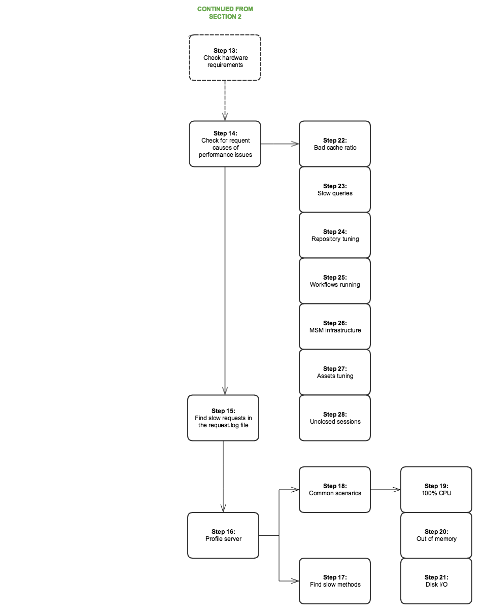

# 效能樹{#performance-tree}

## 範圍 {#scope}

下圖旨在指導您執行哪些步驟以排除效能問題。 它分成5個區段，以方便閱讀。

圖中的每個步驟都會連結至檔案資源或建議。

## 先決條件和假設{#prerequisites-and-assumptions}

假設在指定頁面（AEM主控台或網頁）上會出現效能問題，而且可以一致地重制。 在開始調查之前，必須具備測試或監控效能的方式。

分析從步驟0開始。 其目標是判斷哪個實體（發送器、外部主機或AEM）負責效能問題，然後決定應調查的區域（伺服器或網路）。

### 區段 1 {#section}

### 區段 2 {#section-1}

### 區段 3 {#section-2}

### 區段 4 {#section-3}

### 第5節{#section-4}

## 參考連結{#reference-links}

<table> 
 <tbody> 
  <tr> 
   <td><strong>步驟</strong></td> 
   <td><strong>標題</strong></td> 
   <td><strong>資源</strong></td> 
  </tr> 
  <tr> 
   <td><strong>步驟 0</strong></td> 
   <td>分析請求流程</td> 
   <td>
您可以在瀏覽器中使用標準HTTP請求分析來分析請求流程。 如需如何在Chrome上執行此動作的詳細資訊，請參閱：  
 
<a href="https://developers.google.com/web/tools/chrome-devtools/profile/network-performance/resource-loading">https://developers.google.com/web/tools/chrome-devtools/profile/network-performance/resource-</a><a href="https://developers.google.com/web/tools/chrome-devtools/profile/network-performance/understanding-resource-timing">  loadinghttps://developers.google.com/web/tools/chrome-devtools/profile/network-performance/understanding-resource-timing</a>  
 </td> 
  </tr> 
  <tr> 
   <td><strong>步驟 2</strong></td> 
   <td>請求是否來自外部主機？</td> 
   <td>您可以在瀏覽器中使用標準HTTP請求分析來分析請求流程。 請參閱上述連結，瞭解如何在Chrome上執行此動作。  </td> 
  </tr> 
  <tr> 
   <td><strong>步驟 3</strong></td> 
   <td>是否可快取請求？</td> 
   <td>有關可快取請求和一般Dispatcher效能優化建議的詳細資訊，請參閱<a href="/help/sites-deploying/configuring-performance.md#optimizing-performance-when-using-the-dispatcher">Dispatcher Performance Optimization</a>。</td> 
  </tr> 
  <tr> 
   <td><strong>步驟 4</strong></td> 
   <td>請求是否來自Dispatcher?</td> 
   <td>
請查看<a href="https://helpx.adobe.com/experience-manager/dispatcher/using/dispatcher-configuration.html#debugging">Dispatcher除錯檔案</a>以查看請求是否已正確快取。  
 </td> 
  </tr> 
  <tr> 
   <td><strong>步驟 5</strong></td> 
   <td>Dispatcher是否嘗試透過AEM驗證每個請求？</td> 
   <td>在傳送快取資源之前，請檢查發送器是否會傳送<code>HEAD</code>要求給AEM以進行驗證。 您可以在AEM <code>access.log</code>中尋找<code>HEAD</code>請求來完成此作業。 如需詳細資訊，請參閱<a href="/help/sites-deploying/configure-logging.md">記錄</a>。  </td> 
  </tr> 
  <tr> 
   <td><strong>步驟 6</strong></td> 
   <td>Dispatcher的地理位置離用戶是否很遠？</td> 
   <td>將Dispatcher移至更靠近使用者的位置。</td> 
  </tr> 
  <tr> 
   <td><strong>步驟 7</strong></td> 
   <td>Dispatcher的網路層是否正常？</td> 
   <td>  調查網路層的飽和度和延遲問題。
 
 </td> 
  </tr> 
  <tr> 
   <td><strong>步驟 8</strong></td> 
   <td>慢速度是否可透過本機執行個體重現？</td> 
   <td>  
使用<a href="/help/sites-developing/tough-day.md">Tough Day</a>從生產實例複製「真實世界」條件。 如果這對您的開發方案不現實，請務必在不同的網路內容中測試生產實例（或相同的測試實例）。  
 </td> 
  </tr> 
  <tr> 
   <td><strong>步驟 9</strong></td> 
   <td>伺服器的地理位置是否遠離用戶？</td> 
   <td>將伺服器移至使用者附近。</td> 
  </tr> 
  <tr> 
   <td><strong>步驟10和29</strong></td> 
   <td>調查網路層</td> 
   <td>
調查網路層的飽和度和延遲問題。
 
對於作者層，建議延遲不超過100毫秒。
 
如需效能最佳化秘訣的詳細資訊，請參閱<a href="https://helpx.adobe.com/experience-manager/kb/performance-tuning-tips.html">本頁</a>。
 </td> 
  </tr> 
  <tr> 
   <td><strong>步驟 11</strong></td> 
   <td>更靠近伺服器或在每個區域添加一個</td> 
   <td> </td> 
  </tr> 
  <tr> 
   <td><strong>步驟 12</strong></td> 
   <td>疑難排解AEM伺服器</td> 
   <td>請查看圖中的以下子步驟，以瞭解詳細資訊。</td> 
  </tr> 
  <tr> 
   <td><strong>步驟 13</strong></td> 
   <td>檢查硬體需求</td> 
   <td>查看<a href="/help/managing/hardware-sizing-guidelines.md">硬體尺寸指南</a>的文檔。  </td> 
  </tr> 
  <tr> 
   <td><strong>步驟 14</strong></td> 
   <td>檢查效能問題的常見原因</td> 
   <td> </td> 
  </tr> 
  <tr> 
   <td><strong>步驟 15</strong></td> 
   <td>尋找慢速請求</td> 
   <td>
您可以分析<code>request.log</code>或使用<code>rlog.jar</code>來檢查慢速請求。
 
有關使用rlog.jar的詳細資訊，請參見此頁。
 
請參閱<a href="/help/sites-deploying/monitoring-and-maintaining.md#using-rlog-jar-to-find-requests-with-long-duration-times">使用rlog.jar查找持續時間較長的請求</a>。  
 
 
 </td> 
  </tr> 
  <tr> 
   <td><strong>步驟 16</strong></td> 
   <td>設定檔伺服器</td> 
   <td>
如需可與AEM搭配使用之分析工具的詳細資訊，請參閱<a href="/help/sites-deploying/monitoring-and-maintaining.md#tools-for-monitoring-and-analyzing-performance">監視和分析效能的工具</a>。  
 </td> 
  </tr> 
  <tr> 
   <td><strong>步驟 17</strong></td> 
   <td>在分析中尋找慢速方法</td> 
   <td> </td> 
  </tr> 
  <tr> 
   <td><strong>步驟 18</strong></td> 
   <td>分析的常見情況</td> 
   <td>請參閱「效能優化」部分的<a href="/help/sites-deploying/monitoring-and-maintaining.md#analyzing-specific-scenarios">分析特定方案</a>。  </td> 
  </tr> 
  <tr> 
   <td><strong>步驟 19</strong></td> 
   <td>100% CPU</td> 
   <td><a href="/help/sites-deploying/monitoring-and-maintaining.md#monitoring-performance">https://helpx.adobe.com/experience-manager/6-3/sites-deploying/monitoring-and-maintaining.html#MonitoringPerformance</a></td> 
  </tr> 
  <tr> 
   <td><strong>步驟 20</strong></td> 
   <td>記憶體不足</td> 
   <td>  
    <ol> 
     <li><a href="/help/sites-deploying/monitoring-and-maintaining.md#out-of-memory">記憶體不足</a></li> 
     <li><a href="/help/sites-deploying/troubleshooting.md">我的應用程式會拋出記憶體不足的錯誤</a></li> 
     <li><a href="https://helpx.adobe.com/experience-manager/kb/AnalyzeMemoryProblems.html">分析幫助上的記憶體問題。</a>  </li> 
    </ol> </td> 
  </tr> 
  <tr> 
   <td><strong>步驟 21</strong></td> 
   <td>磁碟I/O</td> 
   <td>
請參閱「監視和維護」文檔中的<a href="/help/sites-deploying/monitoring-and-maintaining.md#disk-i-o">磁碟I/O</a>部分。
 </td> 
  </tr> 
  <tr> 
   <td><strong>步驟22和22.1</strong></td> 
   <td>快取比</td> 
   <td>請參閱<a href="/help/sites-deploying/configuring-performance.md#calculating-the-dispatcher-cache-ratio">計算Dispatcher快取比率</a>。    </td> 
  </tr> 
  <tr> 
   <td><strong>步驟 23</strong></td> 
   <td>慢速查詢</td> 
   <td><a href="/help/sites-deploying/best-practices-for-queries-and-indexing.md">查詢和索引的最佳做法</a></td> 
  </tr> 
  <tr> 
   <td><strong>步驟 24</strong></td> 
   <td>儲存庫優化</td> 
   <td> 
    <ul> 
     <li><a href="https://helpx.adobe.com/experience-manager/kb/performance-tuning-tips.html">效能調整提示</a></li> 
     <li><a href="/help/sites-deploying/configuring-performance.md#configuring-for-performance">效能配置</a></li> 
     <li><a href="https://www.slideshare.net/jukka/repository-performance-tuning">儲存庫效能優化</a></li> 
    </ul> </td> 
  </tr> 
  <tr> 
   <td><strong>步驟 25</strong></td> 
   <td>執行的工作流程</td> 
   <td> 
    <ul> 
     <li><a href="/help/sites-deploying/configuring-performance.md#concurrent-workflow-processing">併發工作流處理</a></li> 
     <li><a href="/help/sites-deploying/configuring-performance.md#configure-the-queue-for-a-specific-workflow">為特定工作流配置隊列</a></li> 
     <li><a href="/help/sites-administering/workflows-administering.md#regular-purging-of-workflow-instances">定期清除工作流實例</a></li> 
     <li><a href="/help/sites-developing/workflows.md#transient-workflows">暫時性工作流程</a>  </li> 
    </ul> 
 
 </td> 
  </tr> 
  <tr> 
   <td><strong>步驟 26</strong></td> 
   <td>MSM Infrastructure</td> 
   <td>
<a href="/help/sites-administering/msm-best-practices.md">多站點管理器最佳實踐</a>  
 </td> 
  </tr> 
  <tr> 
   <td><strong>步驟 27</strong></td> 
   <td>資產調整</td> 
   <td> 
    <ol> 
     <li><a href="/help/sites-deploying/configuring-performance.md#cq-dam-asset-synchronization-service">資產同步服務</a></li> 
     <li><a href="/help/sites-deploying/configuring-performance.md#multiple-dam-instances">多個DAM實例</a></li> 
     <li>效能調整提示文章<a href="https://helpx.adobe.com/experience-manager/kb/performance-tuning-tips.html">這裡</a>和<a href="https://helpx.adobe.com/experience-manager/kb/performance-tuning-tips.html">這裡</a>。  </li> 
    </ol> </td> 
  </tr> 
  <tr> 
   <td><strong>步驟 28</strong></td> 
   <td>未關閉的會話</td> 
   <td>
 
 
<a href="/help/sites-administering/troubleshoot.md#checking-for-unclosed-jcr-sessions">檢查未關閉的JCR會話</a>
 
 
 </td> 
  </tr> 
  <tr> 
   <td><strong>步驟 30</strong></td> 
   <td>更靠近調度程式（每個「地區」添加一個？）</td> 
   <td> </td> 
  </tr> 
  <tr> 
   <td><strong>步驟 31</strong></td> 
   <td>在Dispatcher前面使用CDN</td> 
   <td><a href="https://helpx.adobe.com/experience-manager/dispatcher/using/dispatcher.html#using-dispatcher-with-a-cdn">搭配使用 Dispatcher 與 CDN</a>  </td> 
  </tr> 
  <tr> 
   <td><strong>步驟 32</strong></td> 
   <td>使用分派器層級的作業管理來卸載AEM伺服器</td> 
   <td>
<a href="https://helpx.adobe.com/experience-manager/dispatcher/using/dispatcher-configuration.html#enabling-secure-sessions-sessionmanagement">啟用安全會話</a>
 </td> 
  </tr> 
  <tr> 
   <td><strong>步驟 33</strong></td> 
   <td>讓請求可快取</td> 
   <td> 
    <ol> 
     <li><a href="https://helpx.adobe.com/experience-manager/dispatcher/using/dispatcher.html">一般調度程式配置</a></li> 
     <li><a href="https://helpx.adobe.com/experience-manager/dispatcher/using/dispatcher-configuration.html#configuring-the-dispatcher-cache-cache">配置Dispatcher快取</a></li> 
    </ol> 
如何提高快取率；使請求可快取（Dispatcher最佳做法）
 
此外，請考慮以下設定以優化快取配置  
 
    <ol> 
     <li>為非GET的HTTP請求設定無快取規則</li> 
     <li>將查詢字串設定為不可快取</li> 
     <li>請勿快取遺失副檔名的URL</li> 
     <li>快取驗證標題（自Dispatcher 4.1.10版起可能）</li> 
    </ol> </td> 
  </tr> 
  <tr> 
   <td><strong>步驟 34</strong></td> 
   <td>升級調度程式版本</td> 
   <td>
您可以在以下位置下載最新的Dispatcher版本：
 
<a href="https://helpx.adobe.com/experience-manager/dispatcher/release-notes.html">追蹤連結</a>
 </td> 
  </tr> 
  <tr> 
   <td><strong>步驟 35</strong></td> 
   <td>配置調度程式</td> 
   <td><a href="https://helpx.adobe.com/experience-manager/dispatcher/using/dispatcher-configuration.html">配置Dispatcher</a>  </td> 
  </tr> 
  <tr> 
   <td><strong>步驟 36</strong></td> 
   <td>檢查快取失效</td> 
   <td>  
    <ul> 
     <li><a href="https://helpx.adobe.com/experience-manager/dispatcher/using/page-invalidate.html#invalidating-dispatcher-cache-from-the-authoring-environment">作者層的快取失效；</a></li> 
     <li><a href="https://helpx.adobe.com/experience-manager/dispatcher/using/page-invalidate.html#invalidating-dispatcher-cache-from-a-publishing-instance">發佈層的快取失效。</a></li> 
    </ul> </td> 
  </tr> 
  <tr> 
   <td><strong>步驟37和38</strong></td> 
   <td>延遲載入</td> 
   <td><a href="https://docs.adobe.com/ddc/en/gems/aem-web-performance.html">請參閱「AEM Web Performance的Gem工作階段」。</a>  </td> 
  </tr> 
  <tr> 
   <td><strong>步驟 39</strong></td> 
   <td>使用預連接以減少連接開銷</td> 
   <td>請參見上述Gem會話。 此外，W3c:<a href="https://www.w3.org/TR/resource-hints/#dfn-preconnect"> https://www.w3.org/TR/resource-hints/#dfn-preconnect</a>上的其他檔案已預先連線</td> 
  </tr> 
  <tr> 
   <td><strong>步驟40和41</strong>  </td> 
   <td>外部主機延遲和響應時間</td> 
   <td>調查外部主機的延遲和響應時間。</td> 
  </tr> 
  <tr> 
   <td><strong>步驟45  和47</strong>  </td> 
   <td>使用HTTP/2</td> 
   <td>有關步驟37、38和39，請參見Gem會議。 此外，請查看<a href="https://help-forums.adobe.com/content/adobeforums/en/experience-manager-forum/adobe-experience-manager.topic.html/forum__kdzc-does_anyoneknowwhe.html">此</a>論壇帖子有關HTTP/2支援。  </td> 
  </tr> 
  <tr> 
   <td><strong>步驟 49</strong></td> 
   <td>縮減負載大小</td> 
   <td><a href="/help/sites-deploying/osgi-configuration-settings.md">啟用</a> Gzip並 <a href="https://docs.adobe.com/ddc/en/gems/aem-web-performance.html">縮小影像大小</a>。  </td> 
  </tr> 
  <tr> 
   <td><strong>步驟42和43</strong></td> 
   <td>Keep-Alive</td> 
   <td>
<code>Keep-Alive</code>標題是否存在於重新使用連接的不同請求中？ 否則，這表示每個請求都會導致另一個連接建立，這會帶來不必要的開銷。 （瀏覽器中的標準HTTP請求分析）
 
您可以檢查<a href="/help/sites-administering/proxy-jar.md">Proxy Server工具</a>以檢查Keep-Alive連接。  
 </td> 
  </tr> 
  <tr> 
   <td><strong>步驟 44</strong></td> 
   <td>提出多少要求？</td> 
   <td>在瀏覽器中執行標準HTTP請求分析。</td> 
  </tr> 
  <tr> 
   <td><strong>步驟 46</strong></td> 
   <td>減少請求數</td> 
   <td> 
    <ol> 
     <li>串連資源（影像、CSS精靈、JSON等）  </li> 
     <li>Clientlibs內嵌： 
      <ol> 
       <li><a href="/help/sites-developing/clientlibs.md#creating-client-library-folders">建立用戶端程式庫資料夾</a> -請參閱「使用內嵌功能將請求減至最少」標題</li> 
      </ol> </li> 
    </ol> </td> 
  </tr> 
  <tr> 
   <td><strong>步驟 48</strong></td> 
   <td>有效載荷的大小是多少？</td> 
   <td>瀏覽器中的標準HTTP請求分析</td> 
  </tr> 
  <tr> 
   <td><strong>步驟50和51</strong></td> 
   <td>JS程式碼封鎖</td> 
   <td><a href="https://docs.adobe.com/ddc/en/gems/aem-web-performance.html">https://docs.adobe.com/ddc/en/gems/aem-web-performance.html</a></td> 
  </tr> 
 </tbody> 
</table>

