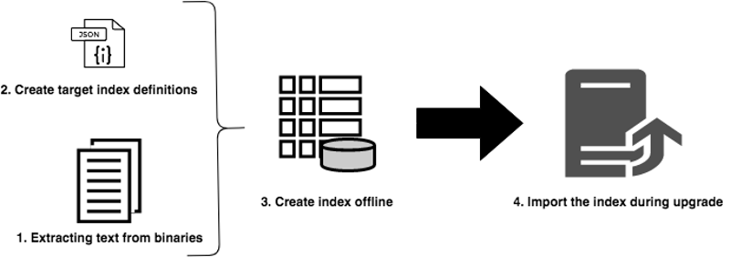

# 使用離線重新索引以減少升級期間的停機時間 {#offline-reindexing-to-reduce-downtime-during-upgrades}

## 簡介 {#introduction}

升級Adobe Experience Manager的主要挑戰之一，是執行就地升級時與製作環境相關的停機時間。 內容作者在升級期間將無法存取環境。 因此，最好將執行升級所花費的時間減至最少。 針對大型存放庫，尤其是AEM Assets專案，其通常具有大型資料存放區且每小時有高層級的資產上傳，重新索引Oak索引的索引需佔升級時間的很大一部分。

本節說明如何使用Oak-run工具為存放庫重新編列索引 **befor** 執行升級，從而減少實際升級期間的停機時間。 所呈現的步驟可套用至 [盧塞內](https://jackrabbit.apache.org/oak/docs/query/lucene.html) AEM 6.4及更新版本的索引。

## 概觀 {#overview}

新版AEM會在功能集展開時對Oak索引定義進行變更。 升級AEM執行個體時，Oak索引的變更會強制重新索引。 由於資產中的文字（例如pdf檔案中的文字）會擷取並編列索引，因此重新索引資產部署的成本很高。 有了MongoMK儲存庫，資料會透過網路保存，進一步增加重新索引所需的時間。

大多數客戶在升級過程中遇到的問題是減少停機時間。 解決方案是 **跳過** 升級期間重新索引活動。 這可以通過建立新的索引實現 **先前** 執行升級，然後在升級期間直接匯入。

## 方法 {#approach}



其構想是在升級前，根據目標AEM版本的索引定義，使用 [Oak-run](/help/sites-deploying/indexing-via-the-oak-run-jar.md) 工具。 上圖顯示離線重新索引的方法。

此外，以下是方法中所述步驟的順序：

1. 會先擷取二進位檔的文字
2. 已建立Target索引定義
3. 已建立離線索引
4. 然後，在升級過程中將導入索引

### 文字提取 {#text-extraction}

若要在AEM中啟用完整索引，會擷取來自二進位檔(例如PDF)的文字，並新增至索引中。 這通常是索引過程中費用高昂的步驟。 文字擷取是最佳化步驟，尤其是針對儲存大量二進位檔的資產存放庫重新索引。


系統中儲存之二進位檔的文字，可透過tika程式庫使用oak-run工具來擷取。 在升級前可以克隆生產系統，並可用於此文本提取過程。 接著，此程式會執行下列步驟，建立文字存放區：

**1. 周遊存放庫並收集二進位檔的詳細資訊**

此步驟會產生CSV檔案，其中包含二進位檔的元組，包含路徑和blob ID。

從要從中建立索引的目錄中執行以下命令。 以下示例假設存放庫主目錄。

```
java java -jar oak-run.jar tika <nodestore path> --fds-path <datastore path> --data-file text-extraction/oak-binary-stats.csv --generate
```

其中 `nodestore path` 是 `mongo_ur` 或 `crx-quickstart/repository/segmentstore/`

使用 `--fake-ds-path=temp` 參數，而非 `–fds-path` 來加快進程。

**2. 重複使用現有索引中可用的二進位文本儲存**

從現有系統轉儲索引資料並提取文本儲存。

可以使用以下命令轉儲現有索引資料：

```
java -jar oak-run.jar index <nodestore path> --fds-path=<datastore path> --index-dump
```

其中 `nodestore path` 是 `mongo_ur` 或 `crx-quickstart/repository/segmentstore/`

然後，使用上述索引轉儲來填充儲存：

```
java -jar oak-run.jar tika --data-file text-extraction/oak-binary-stats.csv --store-path text-extraction/store --index-dir ./indexing-result/index-dumps/<oak-index-name>/data populate
```

其中 `oak-index-name` 是全文索引的名稱，例如&quot;lucene&quot;。

**3. 使用tika程式庫，針對上述步驟遺漏的二進位檔執行文字擷取程式**

```
java -cp oak-run.jar:tika-app-1.21.jar org.apache.jackrabbit.oak.run.Main tika --data-file text-extraction/oak-binary-stats.csv --store-path text-extraction/store --fds-path <datastore path> extract
```

其中 `datastore path` 是二進位資料儲存的路徑。

所建立的文本儲存可以更新，並可在將來重新索引方案時重複使用。

如需有關文字擷取程式的詳細資訊，請參閱 [Oak-run檔案](https://jackrabbit.apache.org/oak/docs/query/pre-extract-text.html).

### 離線重新索引 {#offline-reindexing}


在升級前離線建立Lucene索引。 如果使用MongoMK，建議直接在其中一個MongoMk節點上執行，因為這樣可避免網路開銷。

要離線建立索引，請執行以下步驟：

**1. 產生目標AEM版本的Oak Lucene索引定義**

轉儲現有索引定義。 已變更的索引定義是使用目標AEM版本和oak-run的AdobeGranite存放庫套件組合產生。

從 **來源** AEM例項，執行以下命令：

>[!NOTE]
>
>有關傾銷指數定義的詳細資訊，請參閱 [Oak檔案](https://jackrabbit.apache.org/oak/docs/query/oak-run-indexing.html#async-index-data).

```
java -jar oak-run.jar index --fds-path <datastore path> <nodestore path> --index-definitions
```

其中 `datastore path` 和 `nodestore path` 為 **來源** AEM例項。

然後，從 **目標** AEM版本，使用target版本的Granite存放庫套件組合。

```
java -cp oak-run.jar:bundle-com.adobe.granite.repository.jar org.apache.jackrabbit.oak.index.IndexDefinitionUpdater --in indexing-definitions_source.json --out merge-index-definitions_target.json --initializer com.adobe.granite.repository.impl.GraniteContent
```

>[!NOTE]
>
> 只有 `oak-run-1.12.0` 版本之後。 目標定位是使用Granite存放庫套件完成 `com.adobe.granite.repository-x.x.xx.jar`.

上述步驟會建立名為的JSON檔案 `merge-index-definitions_target.json` 即索引定義。

**2. 在存放庫中建立查核點**

在生產環境中建立查核點 **來源** 存留期較長的AEM例項。 複製存放庫之前，應先執行此操作。

透過位於 `http://serveraddress:serverport/system/console/jmx`，前往 `CheckpointMBean` 並建立具有足夠長存留期的查核點（例如200天）。 為此，請叫用 `CheckpointMBean#createCheckpoint` with `17280000000` 作為期限期間的引數（以毫秒為單位）。

完成此操作後，複製新建立的查核點ID並使用JMX驗證存留期 `CheckpointMBean#listCheckpoints`.

>[!NOTE]
>
> 稍後導入索引時，將刪除此檢查點。

如需詳細資訊，請參閱 [查核點建立](https://jackrabbit.apache.org/oak/docs/query/oak-run-indexing.html#out-of-band-create-checkpoint) 從Oak檔案。

**對生成的索引定義執行離線索引**

Lucene重新索引可使用oak-run離線完成。 此過程將在磁碟下建立索引資料 `indexing-result/indexes`. 是的 **not** 寫入存放庫，因此不需要停止執行中的AEM例項。 建立的文字存放區會饋送至此程式：

```
java -Doak.indexer.memLimitInMB=500 -jar oak-run.jar index <nodestore path> --reindex --doc-traversal-mode --checkpoint <checkpoint> --fds-path <datastore path> --index-definitions-file merge-index-definitions_target.json --pre-extracted-text-dir text-extraction/store

Sample <checkpoint> looks like r16c85700008-0-8
—fds-path: path to data store.
--pre-extracted-text-dir: Directory of pre-extracted text.
merge-index-definitions_target: JSON file having merged definitions for the target AEM instance. indexes in this file will be re-indexed.
```

使用 `--doc-traversal-mode` 參數在MongoMK安裝中很實用，因為它可將存放庫內容假設為本機一般檔案，大幅改善重新索引時間。 但是，它需要額外的磁碟空間，其大小是儲存庫的兩倍。

若是MongoMK，如果此步驟是在更接近MongoDB例項的例項中執行，則可加速此程式。 如果在同一台電腦上運行，則可以避免網路開銷。

如需其他技術詳細資訊，請參閱 [索引的oak-run檔案](https://jackrabbit.apache.org/oak/docs/query/oak-run-indexing.html).

### 導入索引 {#importing-indexes}

使用AEM 6.4及更新版本時，AEM具有內建功能，可依啟動順序從磁碟匯入索引。 資料夾 `<repository>/indexing-result/indexes` 在啟動期間會監看是否有索引資料。 您可以在 [升級程式](in-place-upgrade.md#performing-the-upgrade) 之前，請先開始使用 **目標** AEM jar。 AEM會將其匯入存放庫，並從系統中移除對應的查核點。 因此完全避免了重新索引。

## 其他提示和疑難排解 {#troubleshooting}

以下提供一些實用提示和疑難排解指示。

### 減少對即時生產系統的影響 {#reduce-the-impact-on-the-live-production-system}

建議克隆生產系統，並使用克隆建立離線索引。 這消除了對生產系統的任何潛在影響。 但是，導入索引所需的檢查點必須存在於生產系統中。 因此，在取用克隆之前建立檢查點至關重要。

### 準備Runbook和試用運行 {#prepare-a-runbook-and-trial-run}

建議您準備 [runbook](https://experienceleague.adobe.com/docs/experience-manager-65/deploying/upgrading/upgrade-planning.html#building-the-upgrade-and-rollback-runbook) 並在生產環境中運行升級之前，先執行一些測試。

### 離線索引的Doc遍歷模式 {#doc-traversal-mode-with-offline-indexing}

離線索引需要對整個儲存庫進行多次周遊。 使用MongoMK安裝後，儲存庫可通過網路訪問，從而影響索引過程的效能。 一個選項是在MongoDB副本本身上運行離線索引進程，這將消除網路開銷。 另一個選項是使用doc遍歷模式。

可通過添加命令行參數來應用doc遍歷模式 `—doc-traversal` oak-run命令進行離線索引。 此模式會將本地磁碟中整個儲存庫的副本作為平面檔案進行假離線，並使用它運行索引。
