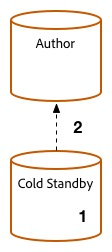

# 升級過程{#upgrade-procedure}

>[!NOTE]
>
>由於大部分AEM升級都是就地執行，因此升級需要製作層級的停機時間。 遵循這些最佳實務，可將發佈層級停機時間最小化或消除。

升級AEM環境時，您需要考慮升級製作環境或發佈環境之間的方法差異，以將作者和使用者的停機時間減至最少。 本頁概述升級當前在AEM 6.x版上運行的AEM拓撲的高級過程。由於製作和發佈層級，以及Mongo和TarMK部署之間的程式不同，因此每個層級和微內核已列在個別區段中。 執行部署時，建議您先升級製作環境、判斷是否成功，然後繼續前往發佈環境。

## TarMK作者階層{#tarmk-author-tier}

### 啟動拓撲{#starting-topology}

此部分假定的拓撲由運行在TarMK上且具有冷備用的製作伺服器組成。 從製作伺服器復寫至TarMK發佈伺服器場。 雖然此處未說明，但此方法也可用於使用卸載的部署。 在Author例項上停用復寫代理後，以及重新啟用復寫代理之前，請務必升級或重建新版本上的卸載例項。

### 升級準備{#upgrade-preparation}

1. 停止內容編寫
1. 停止備用實例
1. 停用作者上的復寫代理
1. 運行[升級前維護任務](/help/sites-deploying/pre-upgrade-maintenance-tasks.md)。

### 升級執行{#upgrade-execution-1}

1. 運行[就地升級](/help/sites-deploying/in-place-upgrade.md)
1. 如有需要，請更新Dispatcher模組&#x200B;**
1. QA驗證升級
1. 關閉製作例項。

### 如果{#if-successful}成功

1. 複製升級實例以建立新的冷備用
1. 啟動Author例項
1. 啟動備用實例。

### 如果失敗（回滾）{#if-unsuccessful-rollback}

1. 將冷備用實例啟動為新主實例
1. 從冷待機重建製作環境。

## MongoMK作者叢集{#mongomk-author-cluster}

### 啟動拓撲 {#starting}

此區段的假設拓撲包含MongoMK製作叢集，其中至少包含兩個AEM製作執行個體，且至少有兩個MongoMK資料庫作為後備。 所有製作執行個體都共用資料存放區。 這些步驟應同時套用至S3和檔案資料存放區。 從製作伺服器復寫至TarMK發佈伺服器陣列。

### 升級準備 {#preparation}

1. 停止內容編寫
1. 克隆資料儲存以進行備份
1. 除了一個AEM Author例項（您的主要作者）以外，請停止所有
1. 從副本集（即主Mongo實例）中刪除除一個MongoDB節點之外的所有節點
1. 更新主作者上的`DocumentNodeStoreService.cfg`檔案，以反映您的單個成員複製副本集
1. 重新啟動主作者，確保其重新正常啟動
1. 停用主要作者上的復寫代理
1. 在主要Author例項上執行[升級前維護任務](/help/sites-deploying/pre-upgrade-maintenance-tasks.md)
1. 如有必要，請使用WiredTiger將主Mongo實例上的MongoDB升級到3.2版

### 升級執行 {#execution}

1. 在主要作者上執行[就地升級](/help/sites-deploying/in-place-upgrade.md)
1. 如有需要，請更新Dispatcher或Web模組&#x200B;**
1. QA驗證升級

### 如果{#successful-1}成功

1. 建立新的6.3製作執行個體，連線至升級的Mongo執行個體
1. 重建已從群集中刪除的MongoDB節點
1. 更新`DocumentNodeStoreService.cfg`檔案以反映完整的複製副本集
1. 重新啟動Author例項，一次一個
1. 移除複製的資料存放區。

### 如果失敗（回滾）{#if-unsuccessful}

1. 重新設定次要製作執行個體以連線至複製的資料存放區
1. 關閉升級的Author主執行個體
1. 關閉升級的Mongo主實例。
1. 啟動次Mongo實例，其中一個實例作為新主實例
1. 在次要Author例項上配置`DocumentNodeStoreService.cfg`檔案，以指向尚未升級的Mongo例項的副本集
1. 啟動次要製作例項
1. 清除升級的製作例項、Mongo節點和資料存放區。

## TarMK發佈伺服器陣列{#tarmk-publish-farm}

### TarMK發佈伺服器陣列{#publish-farm}

此區段的假設拓撲包含兩個TarMK發佈執行個體，前端為Dispatcher，後端為負載平衡器。 從製作伺服器復寫至TarMK發佈伺服器陣列。

### 升級執行{#execution-upgrade}

1. 在負載平衡器上停止發佈2例項的流量
1. 在發佈2上運行[升級前維護](/help/sites-deploying/pre-upgrade-maintenance-tasks.md)
1. 在發佈2上執行[就地升級](/help/sites-deploying/in-place-upgrade.md)
1. 如有需要，請更新Dispatcher或Web模組&#x200B;**
1. 排清Dispatcher快取
1. QA會透過防火牆後的Dispatcher驗證Publish 2
1. 關閉發佈2
1. 複製Publish 2例項
1. 開始發佈2

### 如果{#successful-2}成功

1. 啟用流量以發佈2
1. 停止流量以發佈1
1. 停止Publish 1例項
1. 將Publish 1例項取代為Publish 2
1. 如有需要，請更新Dispatcher或Web模組&#x200B;**
1. 排清發佈1的Dispatcher快取
1. 開始發佈1
1. QA會透過防火牆後的Dispatcher驗證Publish 1

### 如果失敗（回滾） {#rollback}

1. 建立發佈1的副本
1. 將Publish 2例項取代為Publish 1復本
1. 排清發佈2的Dispatcher快取
1. 開始發佈2
1. QA會透過防火牆後的Dispatcher驗證Publish 2
1. 啟用流量以發佈2

## 最終升級步驟{#final-upgrade-steps}

1. 啟用流量以發佈1
1. QA會從公用URL執行最終驗證
1. 從製作環境啟用復寫代理
1. 繼續內容製作
1. 執行[升級後檢查](/help/sites-deploying/post-upgrade-checks-and-troubleshooting.md)。

