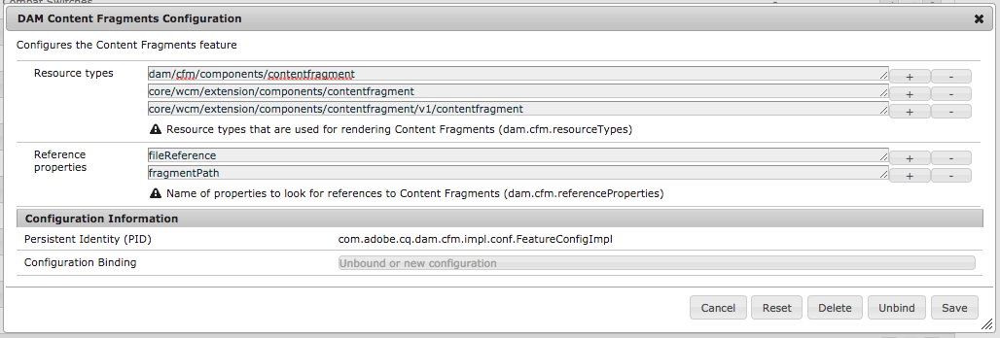

# 自訂和擴充內容片段{#customizing-and-extending-content-fragments}

>[!CAUTION]
>
>某些內容片段功能需要 [AEM 6.4 Service Pack 2(6.4.2.0)的應用程式](/help/release-notes/sp-release-notes.md)。

內容片段延伸了標準資產；請參閱：

* [使用內容片段建立和管理內容片段](/help/assets/content-fragments.md) , [以及使用內容片段製作頁面](/help/sites-authoring/content-fragments.md) ，以取得有關內容片段的詳細資訊。

* [管理資產](/help/assets/managing-assets-touch-ui.md) 、自 [訂和擴充資產](/help/assets/extending-assets.md) ，以取得標準資產的詳細資訊。

## 架構 {#architecture}

內容片 [段的基](/help/assets/content-fragments.md#constituent-parts-of-a-content-fragment) 本組成部分包括：

* 內容 *片段，*
* 由一或多個內容 *元素*&#x200B;組成，
* 以及哪些變數可包含一或多 *個內容*&#x200B;變數。

視片段類型而定，也會使用模型或範本：

>[!CAUTION]
>
>[現在建議使用內容片段模型](/help/assets/content-fragments-models.md) ，以建立您的所有片段。
>
>We.Retail中的所有範例都使用內容片段模型。

* 內容片段模型:

   * 用於定義包含結構化內容的內容片段。
   * 內容片段模型會定義內容片段建立時的結構。
   * 片段參照模型；因此，對模型的更改可能會／會影響任何相依片段。
   * 模型是由資料類型組成。
   * 新增變數等的函式必須相應地更新片段。
   >[!CAUTION]
   >
   >對現有內容片段模型所做的任何變更都會影響相關片段；這會導致這些片段中的孤立屬性。

* 內容片段範本：

   * 用於定義簡單內容片段。
   * 範本可定義內容片段建立時的（基本、僅限文字）結構。
   * 模板建立時被複製到片段；因此，範本的進一步變更將不會反映在現有片段中。
   * 新增變數等的函式必須相應地更新片段。
   * [內容片段範本](/help/sites-developing/content-fragment-templates.md) ，其運作方式與AEM生態系統中其他範本機制（例如頁面範本等）的方式不同。 因此，應單獨考慮。
   * 根據範本管理內容的MIME類型；這表示每個元素和變數都可以有不同的MIME類型。

## 與資產整合 {#integration-with-assets}

內容片段管理(CFM)是AEM資產的一部份，其格式為：

* 內容片段是資產。
* 他們使用現有的資產功能。
* 它們與資產（管理控制台等）完全整合。

### 將結構化內容片段對應至資產 {#mapping-structured-content-fragments-to-assets}


具有結構化內容的內容片段（即基於內容片段模型）被映射到單一資產：

* 所有內容都儲存在資 `jcr:content/data` 產的節點下：

   * 元素資料儲存在主子節點下：

      `jcr:content/data/master`

   * 變數會儲存在子節點下，子節點會攜帶變數的名稱：

      例如， `jcr:content/data/myvariation`

   * 每個元素的資料作為具有元素名稱的屬性儲存在相應的子節點中：

      例如，元素的內容 `text` 儲存為屬性 `text``jcr:content/data/master`

* 中繼資料和相關內容儲存在下方 `jcr:content/metadata`

   除標題和說明外，標題和說明不被視為傳統中繼資料，並儲存在 `jcr:content`

### 將簡單內容片段對應至資產 {#mapping-simple-content-fragments-to-assets}


簡單內容片段（以範本為基礎）會對應至由主要資產和（選用）子資產組成的組合：

* 片段的所有非內容資訊（例如標題、說明、中繼資料、結構）都會專門管理在主資產上。
* 片段的第一元素的內容被映射到主資產的原始格式副本。

   * 第一個元素的變化（如果有的話）會對應至主要資產的其他轉譯。

* 其他元素（如果現有）會對應至主要資產的子資產。

   * 這些附加元素的主要內容映射到相應子資產的原始格式副本。
   * 其他元素的其他變動（如適用）會對應至個別子資產的其他轉譯。

### 資產位置 {#asset-location}

與標準資產一樣，內容片段的持有方式如下：

* `/content/dam`

### 資產權限 {#asset-permissions}

如需詳細資訊，請參 [閱內容片段——刪除考量事項](/help/assets/content-fragments-delete.md)。

### 功能整合 {#feature-integration}

* 內容片段管理(CFM)功能建立在Assets核心上，但應盡可能獨立於它。
* CFM針對卡片／欄/清單檢視中的項目提供其專屬的實作；這些外掛程式可插入現有的Assets內容轉譯實作。
* 已擴充數個「資產」元件，以迎合內容片段的需求。

## 在頁面中使用內容片段 {#using-content-fragments-in-pages}

>[!CAUTION]
>
>現在 [建議使用內容片段核心元件](https://helpx.adobe.com/experience-manager/core-components/using/content-fragment-component.html) 。 如需詳 [細資訊，請參閱開發核心](https://helpx.adobe.com/experience-manager/core-components/using/developing.html) 元件。

您可從AEM頁面參考內容片段，就像任何其他資產類型一樣。 AEM提供 [**Content Fragment **core元件](https://helpx.adobe.com/experience-manager/core-components/using/content-fragment-component.html)-此元[件可讓您在頁面上包含內容片段](/help/sites-authoring/content-fragments.md#adding-a-content-fragment-to-your-page)。 您也可以延伸此內容**&#x200B;片段核心元件&#x200B;**。

* 元件使用屬 `fragmentPath` 性來參考實際內容片段。 該 `fragmentPath` 財產的處理方式與其他資產類型的類似財產相同；例如，當內容片段移至其他位置時。

* 該元件允許您選擇要顯示的變化。
* 此外，還可以選擇一系列段落來限制輸出；例如，這可用於多欄輸出。
* 此元件可 [讓內容介於](/help/sites-developing/components-content-fragments.md#in-between-content):

   * 此元件可讓您放置其他資產（影像等）在引用片段的段落之間。
      * 對於中介內容，您需要：

         * 注意參考資料不穩定的可能性；內容之間（在編寫頁面時新增）與其旁邊的段落沒有固定關係，在內容之間位置之前插入新段落（在內容片段編輯器中）可能會失去相對位置
            * 考慮其他參數（例如變數和段落篩選），以避免搜尋結果中的誤報

>[!NOTE]
>
>**內容片段模型:**
>
>當使用以頁面上的內容片段模型為基礎的內容片段時，會參考模型。 這表示如果模型在您發佈頁面時尚未發佈，則會標籤此模型，並將模型新增至要隨頁面一起發佈的資源。
>
>**內容片段範本：**
>
>當使用以頁面上的內容片段範本為基礎的內容片段時，建立片段時，沒有範本複製時的參考。

### 使用OSGi控制台進行配置 {#configuration-using-osgi-console}

例如，內容片段的後端實作負責讓頁面上使用的片段執行個體可供搜尋，或管理混合媒體內容。 此實作需要知道哪些元件用於轉換片段，以及轉換的參數化方式。

此參數可在 [Web Console中設定](/help/sites-deploying/configuring-osgi.md#osgi-configuration-with-the-web-console)，以用於OSGi搭售 **DAM內容片段設定**。

* **資源類型**

   可提供一 `sling:resourceTypes` 份清單，以定義用於呈現內容片段的元件，以及應套用背景處理的元件。

* **參考屬性**

   屬性清單可被配置以指定對所述片段的引用被儲存於所述各個元件的位置。

>[!NOTE]
>
>屬性和元件類型之間沒有直接映射。
>
>AEM只會擷取可在段落上找到的第一個屬性。 因此，您應謹慎選擇屬性。



您仍需遵循一些准則，以確保元件與內容片段背景處理相容：

* 定義要呈現的元素的屬性名稱必須為或 `element` 或 `elementNames`。

* 定義要呈現的變數的屬性名稱必須為 `variation` 或 `variationName`。

* 如果支援多個元素的輸出(使用指 `elementNames` 定多個元素)，則實際顯示模式由屬性定義 `displayMode`:

   * 如果值是 `singleText` （且只設定了一個元素），則元素會呈現為文字，內含內容、版面支援等。 這是僅呈現單一元素之片段的預設值。
   * 否則，會使用更簡單的方法（可稱為「表單檢視」），其中不支援中間內容，且片段內容會以「原樣」呈現。

* 如果片段是為 `displayMode` ==(隱 `singleText` 含或明確)呈現，則會播放下列其他屬性：

   * `paragraphScope` 定義是否應呈現所有段落或僅呈現一系列段落(值： `all` 與 `range`)
   * if `paragraphScope` == `range` then property `paragraphRange` defines the rendered of farges to be rendered

### 與其他架構整合 {#integration-with-other-frameworks}

內容片段可與下列項目整合：

* **翻譯**

   內容片段與 [AEM轉譯工作流程完全整合](/help/sites-administering/tc-manage.md)。 在建築層面，這意味著：

   * 內容片段的個別翻譯實際上是分開的片段；例如：

      * 它們位於不同的語言根系下：

         `/content/dam/<path>/en/<to>/<fragment>`

         與

         `/content/dam/<path>/de/<to>/<fragment>`

      * 但它們在語言根目錄下的相對路徑完全相同：

         `/content/dam/<path>/en/<to>/<fragment>`

         與

         `/content/dam/<path>/de/<to>/<fragment>`
   * 除了基於規則的路徑外，內容片段的不同語言版本之間沒有進一步的聯繫；雖然UI提供在語言變數之間導覽的方式，但是它們會以兩個不同的片段處理。
   >[!NOTE]
   >
   >AEM翻譯工作流程可搭配 `/content`:
   >
   >  * 由於內容片段模型位於 `/conf`其中，因此這些模型不包含在此類翻譯中。 您可以 [將UI字串國際化](/help/sites-developing/i18n-dev.md)。
   >  * 範本會複製以建立片段，因此會隱含。


* **中繼資料結構**

   * 內容片段（重新）使用可 [以使用標準資產定義的中繼資料結構](/help/assets/metadata-schemas.md)。
* CFM提供其專屬的特定架構：

   `/libs/dam/content/schemaeditors/forms/contentfragment`

   如有需要，可加以擴充。
* 各個模式表單與片段編輯器整合。

## 內容片段管理API —— 伺服器端 {#the-content-fragment-management-api-server-side}

您可以使用伺服器端API來存取您的內容片段；請參閱：

<pre><a href="https://helpx.adobe.com/experience-manager/6-4/sites/developing/using/reference-materials/javadoc/com/adobe/cq/dam/cfm/package-summary.html">com.adobe.cq.dam.cfm</a></pre>

>[!CAUTION]
>
>強烈建議您使用伺服器端API，而非直接存取內容結構。

### 主要介面 {#key-interfaces}

以下三個介面可用作入口點：

* **片段範本**

   <pre><a href="https://helpx.adobe.com/experience-manager/6-4/sites/developing/using/reference-materials/javadoc/com/adobe/cq/dam/cfm/FragmentTemplate.html">FragmentTemplate</a></pre>

   用 `FragmentTemplate.createFragment()` 於建立新片段。

   ```
   Resource templateOrModelRsc = resourceResolver.getResource("...");
   FragmentTemplate tpl = templateOrModelRsc.adaptTo(FragmentTemplate.class);
   ContentFragment newFragment = tpl.createFragment(parentRsc, "A fragment name", "A fragment description.");
   ```

   此介面代表：

   * 內容片段模型或內容片段範本，以建立內容片段，
   * 和（在建立後）該碎片的結構資訊
   這些資訊包括：

   * 存取基本資料（標題、說明）
   * 存取片段元素的範本／模型：

      * 清單元素範本
      * 取得特定元素的結構資訊
      * 存取元素範本(請參閱 `ElementTemplate`)
   * 存取片段變化的範本：

      * 清單變數範本
      * 獲取給定變數的結構資訊
      * 存取變數範本(請參閱 `VariationTemplate`)
   * 取得初始相關內容
   代表重要資訊的介面：

   * `ElementTemplate`

      * 取得基本資料（名稱、標題）
      * 取得初始元素內容
   * `VariationTemplate`

      * 取得基本資料（名稱、標題、說明）


* **內容片段**

   <pre><a href="https://helpx.adobe.com/experience-manager/6-4/sites/developing/using/reference-materials/javadoc/com/adobe/cq/dam/cfm/ContentFragment.html">ContentFragment</a></pre>

   此介面可讓您以抽象方式處理內容片段。

   >[!CAUTION]
   >
   >強烈建議通過此介面訪問片段。 應避免直接更改內容結構。

   此介面提供您以下方式：

   * 管理基本資料(例如：取得名稱；get/set title/description)
   * 存取中繼資料
   * 存取元素：

      * 清單元素
      * 依名稱取得元素
      * 建立新元素(請參閱 [說明](#caveats))
      * 存取元素資料(請參 `ContentElement`閱)
   * 為片段定義的清單變化
   * 全域建立新變化
   * 管理相關內容：

      * 清單系列
      * 新增系列
      * 移除系列
   * 存取片段的模型或範本
   代表片段主要元素的介面包括：

   * **內容元素**

      <pre><a href="https://helpx.adobe.com/experience-manager/6-4/sites/developing/using/reference-materials/javadoc/com/adobe/cq/dam/cfm/ContentElement.html">ContentElement</a></pre>

      * 取得基本資料（名稱、標題、說明）
      * 取得／設定內容
      * 存取元素的變化：

         * 清單變化
         * 依名稱取得變化
         * 建立新的變化(請參 [閱說明](#caveats))
         * 移除變數(請參 [閱說明](#caveats))
         * 存取變數資料(請參 `ContentVariation`閱)
      * 解決變數的捷徑（如果指定的變數不適用於元素，則套用某些額外的實施特定備援邏輯）
   * **內容變化**

      <pre><a href="https://helpx.adobe.com/experience-manager/6-4/sites/developing/using/reference-materials/javadoc/com/adobe/cq/dam/cfm/ContentVariation.html">ContentVariation</a></pre>

      * 取得基本資料（名稱、標題、說明）
      * 取得／設定內容
      * 簡單同步，基於上次修改的資訊
   這三個介面( `ContentFragment`、 `ContentElement`、 `ContentVariation``Versionable` )都擴充了新增內容片段所需版本控制功能的介面：

   * 建立元素的新版本
   * 元素的清單版本
   * 取得版本化元素的特定版本內容


### 適應——使用adaptTo() {#adapting-using-adaptto}

可調整下列項目：

* `ContentFragment` 可適用於：

   * `Resource` -基礎Sling資源；請注意，直接更新基 `Resource` 礎對象需要重建對 `ContentFragment` 像。
   * `Asset` -代表內 `Asset` 容片段的DAM抽象化；請注意，直接更 `Asset` 新需要重建對 `ContentFragment` 像。

* `ContentElement` 可適用於：

   * `ElementTemplate` -用於訪問元素的結構資訊。

* `FragmentTemplate` 可適用於：

   * `Resource` -確 `Resource` 定所複製的參考模型或原始模板；

      * 通過所做的更改 `Resource` 不會自動反映在中 `FragmentTemplate`。

* `Resource` 可適用於：

   * `ContentFragment`
   * `FragmentTemplate`

### 注意事項 {#caveats}

應當指出：

* 實作API以提供UI支援的功能。
* 整個API的設計不會 **自動** 保留變更（除非API javaDoc另有說明）。 因此，您必須始終提交相應請求的資源解析器（或實際使用的解析器）。
* 可能需要額外努力的任務：

   * 建立／移除新元素不會更新簡單片段的資料結構（以片段範本為基礎）。
   * 從中建立新變 `ContentElement` 數不會更新資料結構(但是從自願全域建 `ContentFragment` 立)。
   * 移除現有變數不會更新資料結構。

## 內容片段管理API —— 用戶端 {#the-content-fragment-management-api-client-side}

>[!CAUTION]
>
>對於AEM 6.4，用戶端API是內部的。

### 其他資訊 {#additional-information}

請參閱下列內容：

* `filter.xml`

   內 `filter.xml` 容片段管理的設定，不會與Assets核心內容套件重疊。

## 編輯工作階段 {#edit-sessions}

當用戶在其中一個編輯器頁面中開啟內容片段時，開始編輯會話。 當使用者離開編輯器時，編輯工作階段會完成，方法是選取「 **儲存** 」 **或「取消」**。

### 需求 {#requirements}

控制編輯會話的要求包括：

* 編輯可跨多個檢視（= HTML頁面）的內容片段應是原子。
* 編輯工作也應該是單 *次的*;在編輯作業結束時，變更必須提交（儲存）或回退（取消）。
* 邊緣案件應妥善處理；這些情況包括使用者手動輸入URL或使用全域導覽離開頁面的情形。
* 應提供定期自動儲存（每x分鐘），以防止資料遺失。
* 如果內容片段由兩個使用者同時編輯，則不應覆寫彼此的變更。

### 程序 {#processes}

所涉及的流程包括：

* 啟動會話

   * 內容片段的新版本隨即建立。
   * 自動儲存即會開始。
   * Cookie已設定；這些定義了當前編輯的片段，並且有一個編輯會話開啟。

* 完成作業

   * 自動儲存已停止。
   * 提交時：

      * 上次修改的資訊將更新。
      * Cookie已移除。
   * 回滾時：

      * 還原啟動編輯作業時建立的內容片段版本。
      * Cookie已移除。


* 編輯

   * 所有變更（自動儲存）都會在作用中的內容片段上完成——而不是在個別的受保護區域中。
   * 因此，這些變更會立即反映在參考個別內容片段的AEM頁面上

### 動作 {#actions}

可能的動作包括：

* 輸入頁面

   * 檢查是否已存在編輯會話；透過檢查個別Cookie。

      * 如果存在，請確認正在編輯的內容片段的編輯會話已啟動

         * 如果當前片段，請重新建立會話。
         * 如果沒有，請嘗試取消對先前編輯的內容片段的編輯，並移除Cookie（之後未出現編輯工作階段）。
      * 如果不存在編輯會話，請等待用戶進行的第一次更改（請參見下面）。
   * 檢查頁面上是否已參考內容片段，若已參考則顯示適當資訊。


* 內容變更

   * 每當使用者變更內容而沒有編輯工作階段時，就會建立新的編輯工作階段(請參 [閱啟動工作階段](#processes))。

* 離開頁面

   * 如果編輯工作階段存在且變更尚未持續，則會顯示模式確認對話方塊，通知使用者可能遺失的內容，並允許使用者留在頁面上。

## 範例 {#examples}

### 範例：存取現有內容片段 {#example-accessing-an-existing-content-fragment}

若要達成此目的，您可以將代表API的資源調整為：

`com.adobe.cq.dam.cfm.ContentFragment`

例如：

```java
// first, get the resource
Resource fragmentResource = resourceResolver.getResource("/content/dam/fragments/my-fragment");
// then adapt it
if (fragmentResource != null) {
    ContentFragment fragment = fragmentResource.adaptTo(ContentFragment.class);
    // the resource is now accessible through the API
} 
```

### 範例：建立新內容片段 {#example-creating-a-new-content-fragment}

若要以程式設計方式建立新的內容片段，您必須使用：

`com.adobe.cq.dam.cfm.ContentFragmentManager#create`

例如：

```java
Resource templateOrModelRsc = resourceResolver.getResource("...");
FragmentTemplate tpl = templateOrModelRsc.adaptTo(FragmentTemplate.class);
ContentFragment newFragment = tpl.createFragment(parentRsc, "A fragment name", "A fragment description.");
```

### 範例：指定自動儲存間隔 {#example-specifying-the-auto-save-interval}

可使用配置管理器(ConfMgr)定義自動保存間隔（以秒為單位）:

* 節點： `<conf-root>/settings/dam/cfm/jcr:content`
* 屬性名稱: `autoSaveInterval`
* 類型: `Long`

* 預設值： `600` （10分鐘）;此定義於 `/libs/settings/dam/cfm/jcr:content`

如果要設定5分鐘的自動儲存間隔，您需要在節點上定義屬性；例如：

* 節點： `/conf/global/settings/dam/cfm/jcr:content`
* 屬性名稱: `autoSaveInterval`

* 類型: `Long`

* 值： `300` （5分鐘等於300秒）

## 內容片段範本 {#content-fragment-templates}

如需完 [整資訊，請參閱內容片段範本](/help/sites-developing/content-fragment-templates.md) 。

## 頁面製作的元件 {#components-for-page-authoring}

如需詳細資訊，請參閱

* [核心元件——內容片段元件](https://helpx.adobe.com/experience-manager/core-components/using/content-fragment-component.html) （建議）
* [內容片段元件——頁面製作的元件](/help/sites-developing/components-content-fragments.md#components-for-page-authoring)