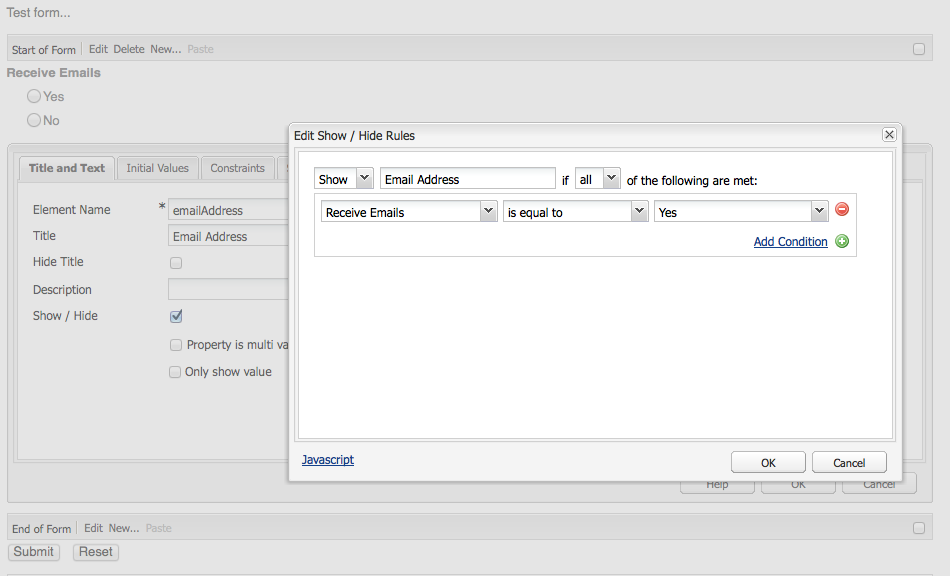

# 開發Forms（傳統UI）{#developing-forms-classic-ui}

表單的基本結構是：

* 表單開始
* 表單元素
* 表單端

所有這些都是使用一系列預設[表單元件](/help/sites-authoring/default-components.md)來實現的，這些元件可在標準AEM安裝中使用。

除了[開發新元件](/help/sites-developing/developing-components-samples.md)以用於表單之外，您還可以：

* [使用值預先載入表單](#preloading-form-values)
* [使用多個值預載入（某些）欄位](#preloading-form-fields-with-multiple-values)
* [開發新動作](#developing-your-own-form-actions)
* [開發新的限制](#developing-your-own-form-constraints)
* [顯示或隱藏特定表單欄位](#showing-and-hiding-form-components)

[視需](#developing-scripts-for-use-with-forms) 要使用指令碼來擴充功能。

>[!NOTE]
>
>本檔案著重於使用傳統UI中的[Foundation元件](/help/sites-authoring/default-components-foundation.md)開發表單。 Adobe建議在觸控式UI中，運用新的[核心元件](https://docs.adobe.com/content/help/zh-Hant/experience-manager-core-components/using/introduction.html)和[隱藏條件](/help/sites-developing/hide-conditions.md)來開發表單。

## 預先載入表單值{#preloading-form-values}

表單開始元件提供&#x200B;**載入路徑**&#x200B;的欄位，此可選路徑指向儲存庫中的節點。

「載入路徑」是節點屬性的路徑，用於將預定義值載入到表單上的多個欄位中。

這是一個可選欄位，它指定儲存庫中節點的路徑。 如果此節點的屬性與欄位名稱匹配，則表單上的相應欄位將預載這些屬性的值。 如果不存在匹配項，則欄位包含預設值。

>[!NOTE]
>
>[form action](#developing-your-own-form-actions)還可以設定從中載入初始值的資源。 這是使用`init.jsp`內的`FormsHelper#setFormLoadResource`來完成的。
>
>只有在未設定時，作者才會從開始表單元件中設定的路徑填入表單。

## 預先載入多個值{#preloading-form-fields-with-multiple-values}的表單欄位

各種表單欄位也有&#x200B;**項目載入路徑**，同樣是指向儲存庫中節點的可選路徑。

**Items Load Path**&#x200B;是節點屬性的路徑，用於將預定義值載入到表單上的特定欄位，例如[下拉清單](/help/sites-authoring/default-components-foundation.md#dropdown-list)、[複選框組](/help/sites-authoring/default-components-foundation.md#checkbox-group)或[無線電組](/help/sites-authoring/default-components-foundation.md#radio-group)。

### 範例 — 預先載入多個值{#example-preloading-a-dropdown-list-with-multiple-values}的下拉式清單

下拉式清單可以設定您要選取的值範圍。

**項目載入路徑**&#x200B;可用於從儲存庫中的資料夾訪問清單，並將這些清單預載到欄位中：

1. 建立新的Sling資料夾(`sling:Folder`)

   例如， `/etc/designs/<myDesign>/formlistvalues`

1. 新增多值字串類型(`String[]`)的新屬性（例如`myList`），以包含下拉式項目清單。 也可以使用指令碼導入內容，例如使用JSP指令碼或shell指令碼中的cURL。

1. 在&#x200B;**項目載入路徑**&#x200B;欄位中使用完整路徑：

   例如， `/etc/designs/geometrixx/formlistvalues/myList`

請注意，如果`String[]`中的值的格式如下：

* `AL=Alabama`
* `AK=Alaska`
* *等。*

然後AEM會產生清單，如下所示：

* `<option value="AL">Alabama</option>`
* `<option value="AK">Alaska</option>`

例如，在多語言設定中，可以很好地使用此功能。

### 開發自己的表單操作{#developing-your-own-form-actions}

表單需要動作。 動作會定義當表單隨使用者資料提交時所執行的操作。

標準AEM安裝提供了一系列動作，您可在下方查看：

`/libs/foundation/components/form/actions`

和&#x200B;**Form**&#x200B;元件的&#x200B;**Action Type**&#x200B;清單中：

本節說明如何開發您自己的表單動作，以納入此清單。

您可以在`/apps`下新增自己的動作，如下所示：

1. 建立`sling:Folder`類型的節點。 指定反映要實作之動作的名稱。

   例如：

   `/apps/myProject/components/customFormAction`

1. 在此節點上定義以下屬性，然後按一下&#x200B;**Save All**&#x200B;以保留您的更改：

   * `sling:resourceType`  — 設定為  `foundation/components/form/action`
   * `componentGroup`  — 定義為  `.hidden`
   * （可選）:

      * `jcr:title`  — 指定您選擇的標題，此標題將顯示在下拉式選取清單中。如果未設定，則顯示節點名稱
      * `jcr:description`  — 輸入您選擇的說明

1. 在資料夾中建立對話方塊節點：

   1. 新增欄位，讓作者在選擇動作後即可編輯表單對話方塊。

1. 在資料夾中建立以下任一項：

   1. 貼文指令碼。

      指令碼的名稱為`post.POST.<extension>`，例如`post.POST.jsp`

      提交表單以處理表單時，會叫用貼文指令碼，其中包含處理從表單`POST`到達的資料的代碼。

   1. 添加在提交表單時調用的轉發指令碼。

      指令碼的名稱為`forward.<extension`>，例如`forward.jsp`

      此指令碼可定義路徑。 然後，將當前請求轉發到指定路徑。
   必要的呼叫為`FormsHelper#setForwardPath`（2種變體）。 典型的案例是執行一些驗證或邏輯，以尋找目標路徑，然後轉送至該路徑，讓預設的SlingPOSTservlet執行JCR中的實際儲存。

   也可能有另一個Servlet來執行實際處理，在這種情況下，表單動作和`forward.jsp`只會作為「膠水」程式碼。 例如，`/libs/foundation/components/form/actions/mail`處的郵件操作會將詳細資訊轉發到郵件servlet所在的`<currentpath>.mail.html`。

   因此：

   * a `post.POST.jsp`對於動作本身完全完成的小操作非常有用
   * 而`forward.jsp`在僅需要委派時很有用。

   指令碼的執行順序為：

   * 呈現表單時(`GET`):

      1. `init.jsp`
      1. 針對所有欄位的限制：`clientvalidation.jsp`
      1. 表單的validationRT:`clientvalidation.jsp`
      1. 如果已設定，則透過載入資源載入表單
      1. `addfields.jsp` 在內呈現  `<form></form>`
   * 處理表單`POST`時：

      1. `init.jsp`
      1. 針對所有欄位的限制：`servervalidation.jsp`
      1. 表單的validationRT:`servervalidation.jsp`
      1. `forward.jsp`
      1. 如果已設定前進路徑(`FormsHelper.setForwardPath`)，請轉送請求，然後呼叫`cleanup.jsp`
      1. 如果未設定前進路徑，請呼叫`post.POST.jsp`（此處結束，未呼叫`cleanup.jsp`）

1. 在資料夾中再次選擇新增：

   1. 用於添加欄位的指令碼。

      指令碼的名稱為`addfields.<extension>`，例如`addfields.jsp`

      在寫入表單開始的HTML後，會立即叫用addfields指令碼。 這可讓動作在表單內新增自訂輸入欄位或其他HTML。

   1. 初始化指令碼。

      指令碼的名稱為`init.<extension>`，例如`init.jsp`

      表單呈現時會叫用此指令碼。 它可用來初始化動作細節。 &quot;

   1. 清除指令碼。

      指令碼的名稱為`cleanup.<extension>`，例如`cleanup.jsp`

      此指令碼可用於執行清除。

1. 在parsys中使用&#x200B;**Forms**&#x200B;元件。 **動作類型**&#x200B;下拉式清單現在會包含您的新動作。

   >[!NOTE]
   >
   >若要查看屬於產品一部分的預設動作：
   >
   >`/libs/foundation/components/form/actions`

### 開發自己的表單約束{#developing-your-own-form-constraints}

可在兩個層面施加限制：

* 針對[個別欄位（請參閱下列程式）](#constraints-for-individual-fields)
* 作為[form-global validation](#form-global-constraints)

#### 個別欄位{#constraints-for-individual-fields}的限制

您可以為個別欄位（在`/apps`下）新增您自己的限制，如下所示：

1. 建立`sling:Folder`類型的節點。 指定反映要實施的約束的名稱。

   例如：

   `/apps/myProject/components/customFormConstraint`

1. 在此節點上定義以下屬性，然後按一下&#x200B;**Save All**&#x200B;以保留您的更改：

   * `sling:resourceType`  — 設為  `foundation/components/form/constraint`
   * `constraintMessage`  — 根據限制，在提交表單時，如果欄位無效，則會顯示自訂訊息
   * （可選）:

      * `jcr:title`  — 指定您選擇的標題，此標題將顯示在選擇清單中。如果未設定，則顯示節點名稱
      * `hint`  — 使用者如何使用欄位的其他資訊

1. 在此資料夾內，您可以需要下列指令碼：

   * 客戶端驗證指令碼：

      指令碼的名稱為`clientvalidation.<extension>`，例如`clientvalidation.jsp`

      表單欄位呈現時會叫用此名稱。 它可用來建立用戶端javascript，以驗證用戶端上的欄位。

   * 伺服器驗證指令碼：

      指令碼的名稱為`servervalidation.<extension>`，例如`servervalidation.jsp`

      提交表單時會叫用此名稱。 它可用來在提交後驗證伺服器上的欄位。

>[!NOTE]
>
>範例限制可在下方顯示：
>
>`/libs/foundation/components/form/constraints`

#### 表單全局約束{#form-global-constraints}

通過在啟動表單元件(`validationRT`)中配置資源類型來指定form-global驗證。 例如：

`apps/myProject/components/form/validation`

然後您可以定義：

* a `clientvalidation.jsp` — 會在欄位的用戶端驗證指令碼之後插入
* 和`servervalidation.jsp` — 也在對`POST`進行單個欄位伺服器驗證後調用。

### 顯示和隱藏表單元件{#showing-and-hiding-form-components}

您可以設定表單，以根據表單中其他欄位的值顯示或隱藏表單元件。

只有在特定條件下才需要欄位時，變更表單欄位的可見性會很實用。 例如，在意見表單中，有問題詢問客戶是否希望在電子郵件中將產品資訊傳送給他們。 選取「是」時，會出現文字欄位，讓客戶輸入其電子郵件地址。

使用&#x200B;**編輯顯示/隱藏規則**&#x200B;對話框指定在其中顯示或隱藏表單元件的條件。

使用對話方塊頂端的欄位來指定下列資訊：

* 是否指定用於隱藏或顯示元件的條件。
* 要顯示或隱藏元件，任何或所有條件都必須為true。

這些欄位下方會顯示一或多個條件。 條件會比較其他表單元件（在相同表單上）的值與值。 如果欄位中的實際值滿足條件，則條件會評估為true。 條件包括下列資訊：

* 測試的表單欄位標題。
* 運算子。
* 會比較值與欄位值。

例如，標題為`Receive email notifications?`* *的單選按鈕組元件包含`Yes`和`No`單選按鈕。 標題為`Email Address`的文本欄位元件使用以下條件，以便在選中`Yes`時顯示它：

在Javascript中，條件會使用「元素名稱」屬性的值來參考欄位。 在上例中，Radio Group元件的Element Name屬性為`contact`。 下列程式碼就該範例而言是相等的Javascript程式碼：

`((contact == "Yes"))`

**要顯示或隱藏表單元件，請執行以下操作：**

1. 編輯特定表單元件。

1. 選擇&#x200B;**顯示/隱藏**&#x200B;以開啟&#x200B;**編輯顯示/隱藏規則**&#x200B;對話框：

   * 在第一個下拉式清單中，選取&#x200B;**Show**&#x200B;或&#x200B;**Hide**，以指定條件是否決定要顯示或隱藏元件。
   * 在頂端行結尾的下拉式清單中選取：

      * **all**  — 如果所有條件必須為true，才能顯示或隱藏元件
      * **any**  — 如果只有一或多個條件必須為true，則顯示或隱藏元件
   * 在條件行中（預設顯示一個），選取元件、運算子，然後指定值。
   * 視需要按一下&#x200B;**新增條件**&#x200B;以新增更多條件。

   例如：

   

1. 按一下&#x200B;**OK**&#x200B;以儲存定義。

1. 儲存定義後，表單元件屬性中的&#x200B;**顯示/隱藏**&#x200B;選項旁會出現&#x200B;**編輯規則**&#x200B;連結。 按一下此連結可開啟&#x200B;**編輯顯示/隱藏規則**&#x200B;對話框進行更改。

   按一下&#x200B;**OK**&#x200B;以保存所有更改。

   

   >[!CAUTION]
   >
   >可查看和測試「顯示/隱藏」定義的效果：
   >
   >* 在製作環境的&#x200B;**預覽**&#x200B;模式中（首次切換為預覽時需要頁面重新載入）
   >* 在發佈環境中

#### 處理中斷的元件引用{#handling-broken-component-references}

顯示/隱藏條件使用「元素名稱」屬性的值來參照表單中的其他元件。 當任何條件都參考已刪除或已變更元素名稱屬性的元件時，顯示/隱藏設定無效。 發生此情況時，您必須手動更新條件，或表單載入時發生錯誤。

當「顯示/隱藏」設定無效時，只會以JavaScript程式碼的形式提供設定。 編輯代碼以更正問題。該代碼使用原本用於引用元件的Element Name屬性。

### 開發與Forms {#developing-scripts-for-use-with-forms}搭配使用的指令碼

有關可在編寫指令碼時使用的API元素的詳細資訊，請參閱[與forms](https://helpx.adobe.com/experience-manager/6-4/sites/developing/using/reference-materials/javadoc/com/day/cq/wcm/foundation/forms/package-summary.html)相關的javadoc。

您可以將此功能用於下列動作，例如在提交表單前呼叫服務，以及在服務失敗時取消服務：

* 定義驗證資源類型
* 納入指令碼以進行驗證：

   * 在JSP中，調用Web服務並建立包含錯誤消息的`com.day.cq.wcm.foundation.forms.ValidationInfo`對象。 如果發生錯誤，則不會張貼表單資料。
