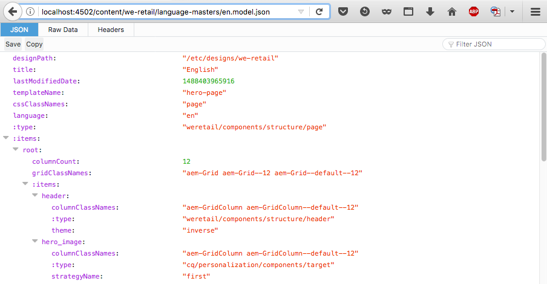

# 內容服務的JSON匯出器{#json-exporter-for-content-services}

AEM Content services的設計目的，是將AEM中／來自AEM的內容描述和傳送，從而延伸到網頁。

它們使用可供任何用戶端使用的標準化方法，將內容傳送至非傳統AEM網頁的頻道。 這些渠道可以包括：

* 單頁應用程式
* 原生行動應用程式
* AEM外部的其他通道和觸點

透過使用結構化內容的內容片段，您可以使用JSON匯出器來提供內容服務，以JSON資料模型格式傳送(y)AEM頁面的內容。 然後，您自己的應用程式就可使用這個功能。

>[!NOTE]
>
>自核心元件1.1.0版以來，所有核心元 [件都可使用此處所述的功能](https://docs.adobe.com/content/docs/en/core-components/v1.html)。

## 包含內容片段核心元件的JSON匯出器 {#json-exporter-with-content-fragment-core-components}

使用AEM JSON匯出器，您可以以JSON資料模型格式傳送(y)AEM頁面的內容。 然後，您自己的應用程式就可使用這個功能。

在AEM中，傳送是使用字尾來達成

`.model.json`

1. 例如，URL，例如：

   ```shell
   http://localhost:4502/content/we-retail/language-masters/en.model.json
   ```

1. 將提供內容，例如：

   

您也可以透過明確定位結構化內容片段來提供內容。

這是使用片段的整個路徑(透過 `jcr:content`);例如，加上尾碼，如。

`.../jcr:content/root/responsivegrid/contentfragment.model.json`

您的頁面可以包含單一內容片段或多種類型的元件。 您也可以使用清單元件等機制，自動搜尋相關內容。

* 例如，URL，例如：

   ```shell
   http://localhost:4502/content/we-retail/language-masters/en/manchester-airport/jcr:content/root/responsivegrid/contentfragment.model.json
   ```

* 將提供內容，例如：

   

   >[!NOTE]
   >
   >您可以 [調整自己的元件](/help/sites-developing/json-exporter-components.md) ，以存取和使用此資料。

### 更多資訊 {#further-information}

另請參閱:

* Assets HTTP API

   * [Assets HTTP API](/help/assets/mac-api-assets.md)

* Sling Models:

   * [Sling Models —— 將模型類別與自130以來的資源類型關聯](https://sling.apache.org/documentation/bundles/models.html#associating-a-model-class-with-a-resource-type-since-130)

* AEM with JSON:

   * [以JSON格式取得頁面資訊](/help/sites-developing/pageinfo.md)

## 相關檔案 {#related-documentation}

如需詳細資訊，請參閱：

* 「資 [產」使用指南中的「內容片段」主題](https://helpx.adobe.com/experience-manager/6-4/assets/user-guide.html?topic=/experience-manager/6-4/assets/morehelp/content-fragments.ug.js)

* [內容片段模型](/help/assets/content-fragments-models.md)
* [使用內容片段製作](/help/sites-authoring/content-fragments.md)
* [為元件啟用JSON匯出](/help/sites-developing/json-exporter-components.md)

* [核心元件](https://docs.adobe.com/content/help/en/experience-manager-core-components/using/introduction.html) 和內容 [片段元件](https://helpx.adobe.com/experience-manager/core-components/using/content-fragment-component.html)

