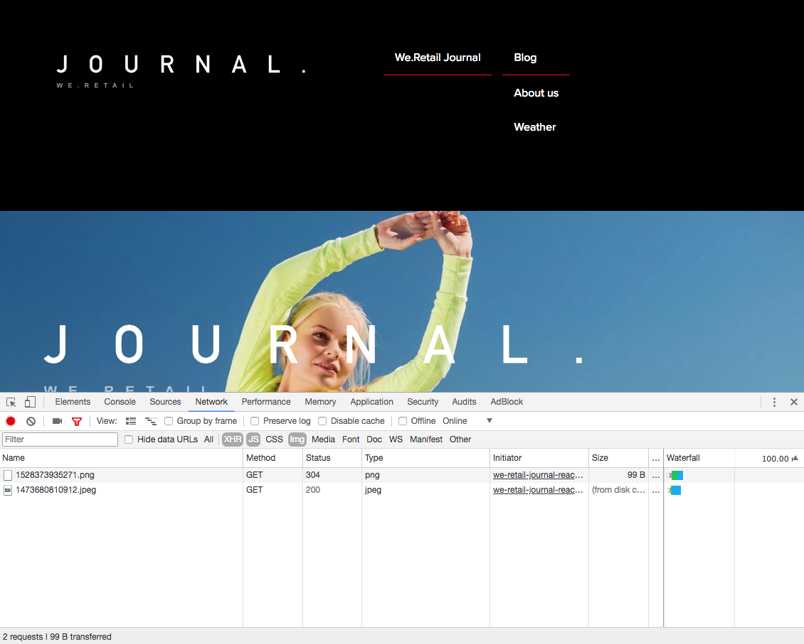

# SPA 簡介和逐步解說{#spa-introduction-and-walkthrough}

>[!CAUTION]
>
>AEM 6.4已結束延伸支援，本檔案不再更新。 如需詳細資訊，請參閱 [技術支援期](https://helpx.adobe.com//tw/support/programs/eol-matrix.html). 尋找支援的版本 [此處](https://experienceleague.adobe.com/docs/).

單頁應用程式 (SPA) 可為網站使用者提供引人入勝的體驗。開發人員希望能使用 SPA 框架建立網站，而作者則想在 AEM 中為使用這類框架建立網站，順暢地編輯內容。

SPA 編輯器提供了一個全面的解決方案來支援在 AEM 中使用 SPA。本文章逐步解說如何使用基本 SPA 應用程式進行編寫，並說明它與基礎 AEM SPA 編輯器的關係。

>[!NOTE]
>
>單頁應用程式(SPA)編輯器功能需要AEM 6.4 service pack 2或更新版本。
>
>若專案需要SPA架構的用戶端轉譯(例如React或Angular),SPA Editor是建議的解決方案。

## 簡介 {#introduction}

### 文章目標 {#article-objective}

本文章介紹 SPA 的基本概念，然後透過使用簡單 SPA 應用程式來示範基本的內容編輯，逐步引導讀者了解 SPA 編輯器。然後深入探討頁面的結構以及 SPA 應用程式如何與 AEM SPA 編輯器相關及互動。

此簡介和逐步解說的目的是向 AEM 開發人員示範 SPA 為何相關、其一般運作方式、AEM SPA 編輯器如何處理 SPA，以及它與標準 AEM 應用程式有何不同。

逐步說明以標準AEM功能和範例We.Retail Journal應用程式為基礎。 必須符合下列要求：

* [AEM 6.4版（含service pack 2或更新版本）](/help/release-notes/sp-release-notes.md)
* [在此安裝範例GitHub上可用的We.Retail Journal應用程式。](https://github.com/Adobe-Marketing-Cloud/aem-sample-we-retail-journal)

>[!CAUTION]
>
>本檔案使用 [We.Retail Journal應用程式](https://github.com/Adobe-Marketing-Cloud/aem-sample-we-retail-journal) 僅供示範之用。 它不應用於任何專案。
>
>任何 AEM 專案都應利用 [AEM 專案原型](https://experienceleague.adobe.com/docs/experience-manager-core-components/using/developing/archetype/overview.html?lang=zh-Hant)，它支援使用 React 或 Angular 的 SPA 專案並利用 SPA SDK。

### 什麼是 SPA？ {#what-is-a-spa}

單頁應用程式 (SPA) 與傳統頁面的不同之處在於它是在用戶端呈現並且主要由 Javascript 驅動，依賴 Ajax 呼叫來載入資料和動態更新頁面。在單頁載入時一次擷取大部分或所有內容，並根據使用者與頁面的互動，視需要非同步載入其他資源。

這減少了頁面重新整理的需要，讓使用者擁有順暢、快速且像是使用原生應用程式的體驗。

AEM SPA 編輯器允許前端開發人員建立可整合到 AEM 網站的 SPA，從而允許內容作者輕鬆編輯 SPA 內容，像編輯任何其他 AEM 內容一樣輕鬆。

### 為什麼是 SPA？ {#why-a-spa}

由於 SPA 的運作本質，SPA 可以更流暢、快速且像是原生應用程式，不僅對網頁訪客而且對行銷人員和開發人員來說都是一種極具吸引力的體驗。


**訪客**

* 訪客在與內容互動時希望獲得類似原生的體驗。
* 有明確資料代表頁面生成越快，就越可能發生轉換。

**行銷人員**

* 行銷人員希望提供豐富的、類似原生的體驗，以吸引訪客與內容完全互動。
* 個人化可以使這些體驗更具吸引力。

**開發人員**

* 開發人員希望清楚分開內容和展示之間的考量點。
* 清楚分開使系統更具可擴展性，並允許獨立的前端開發。

### SPA 如何運作？ {#how-does-a-spa-work}

SPA的主要思想是減少呼叫和對伺服器的依賴，以將伺服器呼叫所造成的延遲降至最低，以便SPA接近原生應用程式的回應。

在傳統的循序網頁中，僅載入即時頁面所需的資料。這表示當訪客移至另一個頁面時，將呼叫伺服器以取得額外資源。當訪客與頁面上的元素互動時，可能需要進行其他呼叫。 由於頁面必須趕上訪客的要求，因此這些多次呼叫可能會讓人產生延滯或延遲的感覺。


為獲得更流暢的體驗，即接近訪客從行動裝置、原生應用程式預期的體驗，SPA會在首次載入時為訪客載入所有必要資料。 雖然這在開始時可能需要較長的時間，但之後就不需要額外呼叫伺服器。

透過在用戶端上呈現，頁面元素的反應更快，且訪客與頁面的互動即時。 系統會以非同步方式呼叫可能需要的任何其他資料，以最大化頁面速度。

>[!NOTE]
>
>如需SPA在AEM中如何運作的技術詳細資訊，請參閱文章 [AEM中的SPA快速入門](/help/sites-developing/spa-getting-started-react.md).
>
>如需深入了解SPA編輯器的設計、架構和技術工作流程，請參閱文章 [SPA編輯器概述](/help/sites-developing/spa-overview.md).

## SPA 的內容編輯體驗 {#content-editing-experience-with-spa}

建置SPA以運用AEM SPA編輯器時，內容作者在編輯和建立內容時沒有發現差異。 可以使用常用的 AEM 功能，作者的工作流程無需變更。

>[!NOTE]
>
>逐步說明以標準AEM功能和範例We.Retail Journal應用程式為基礎。 必須符合下列要求：
>
>* [AEM 6.4版（含service pack 2）](/help/release-notes/sp-release-notes.md)
>* [在此安裝範例GitHub上可用的We.Retail Journal應用程式。](https://github.com/Adobe-Marketing-Cloud/aem-sample-we-retail-journal)
>


1. 在AEM中編輯We.Retail Journal應用程式。

   `http://localhost:4502/editor.html/content/we-retail-journal/react.html`

   

1. 選取標題元件，並注意工具列的顯示方式與任何其他元件相同。 選取&#x200B;**[!UICONTROL 編輯]**。

   

1. 在 AEM 中正常編輯內容，並注意變更已保留。

   

   >[!NOTE]
   >請參閱 [SPA編輯器概述](spa-overview.md#requirements-limitations) 以取得現成文字編輯器和SPA的詳細資訊。

1. 使用資產瀏覽器將新影像拖放到影像元件中。

   

1. 變更已保留。

   

如同任何非 SPA 應用程式，支援其他編寫工具，例如在頁面上拖放其他元件、重新排列元件和修改版面。

>[!NOTE]
>
>SPA 編輯器不會修改應用程式的 DOM。SPA 自行負責 DOM。
>
>若要了解其運作原理，請繼續閱讀本文的下一章節：[SPA 應用程式和 AEM SPA 編輯器](/help/sites-developing/spa-walkthrough.md#spa-apps-and-the-aem-spa-editor)。

## SPA 應用程式和 AEM SPA 編輯器 {#spa-apps-and-the-aem-spa-editor}

體驗SPA對一般使用者的行為，然後檢查SPA頁面，有助於更清楚了解SAP應用程式如何與AEM中的SPA編輯器搭配運作。

### 使用 SPA 應用程式 {#using-an-spa-application}

1. 在發佈伺服器上或使用選項載入We.Retail Journal應用程式 **[!UICONTROL 檢視為已發佈]** 從 **頁面資訊** 功能表。

   `/content/we-retail-journal/react.html`

   

   請注意頁面結構，包括導覽至子頁面、天氣Widget和文章。

1. 使用選單導覽到子頁面，可以看到頁面立即載入，無需重新整理。

   

1. 開啟瀏覽器內建的開發人員工具，並在您瀏覽子頁面時監控網路活動。

   

   當您在應用程式中從一個頁面移動到另一個頁面時，流量非常小。該頁面不會重新載入，只會要求新影像。

   SPA 完全在用戶端管理內容和路由。

那麼如果在子頁面間瀏覽時頁面沒有重新載入，它是如何載入？

下一節， [載入SPA應用程式](/help/sites-developing/spa-walkthrough.md#loading-an-spa-application)，深入了解載入SPA的機制，以及如何以同步和非同步方式載入內容。

### 載入 SPA 應用程式 {#loading-an-spa-application}

1. 如果尚未載入，請在發佈伺服器上或使用選項載入We.Retail Journal應用程式 **[!UICONTROL 檢視為已發佈]** 從 **頁面資訊** 功能表。

   `/content/we-retail-journal/react.html`

   

1. 使用瀏覽器的內建工具檢視頁面的來源。
1. 請注意，來源的內容極為有限。

   ```
   <!DOCTYPE HTML>
   <html lang="en-CH">
       <head>
       <meta charset="UTF-8">
       <title>We.Retail Journal</title>
   
       <meta name="template" content="we-retail-react-template"/>
   
   <link rel="stylesheet" href="/etc.clientlibs/we-retail-journal/react/clientlibs/we-retail-journal-react.css" type="text/css">
   
   <link rel="stylesheet" href="/libs/wcm/foundation/components/page/responsive.css" type="text/css">
   
   </head>
       <body class="page basicpage">
   
   <div id="page"></div>
   
   <script type="text/javascript" src="/etc.clientlibs/we-retail-journal/react/clientlibs/we-retail-journal-react.js"></script>
   
       </body>
   </html>
   ```

   頁面的內文中沒有任何內容。它主要由樣式表和對React指令碼的調用組成， `we-retail-journal-react.js`.

   此React指令碼是此應用程式的主要驅動程式，負責呈現所有內容。

1. 使用瀏覽器的內建工具檢查頁面。查看完全載入之 DOM 的內容。

   

1. 切換到檢查器中的「網路」索引標籤並重新載入頁面。

   忽略影像要求，注意為頁面載入的主要資源是頁面本身、CSS、React Javascript、其相依性，以及頁面的 JSON 資料。

   

1. 在新索引標籤中載入 `react.model.json`。

   `/content/we-retail-journal/react.model.json`

   

   AEM SPA 編輯器利用 [AEM 內容服務](/help/assets/content-fragments.md)將頁面的全部內容以 JSON 模型傳遞。

   透過實作特定的介面，Sling 模型為 SPA 提供必要的資訊。JSON 資料的傳遞工作向下委派給每個元件 (從頁面到段落到元件等)。

   每個元件都會選擇公開的項目及呈現方式（在伺服器端使用HTL，或在用戶端使用React）。 當然，本文著重於使用React進行用戶端轉譯。

1. 此模型還可以將頁面群組在一起，以便同步載入，從而減少所需的頁面重新載入次數。

   在We.Retail Journal的範例中， `home`, `blog`，和 `aboutus` 頁面會同步載入，因為訪客通常會瀏覽這些頁面。 不過 `weather` 頁面會以非同步方式載入，因為訪客不太可能造訪頁面。

   此行為不是強制性的，而且完全可定義的。

   

1. 若要檢視此行為差異，請重新載入  頁面並清除檢查器的網路活動。導覽至部落格，並在頁面功能表中導覽關於我們的頁面，查看未回報任何網路活動。

   導覽至天氣頁面，並查看 `weather.model.json` 非同步呼叫。

   

### 與 SPA 編輯器的互動 {#interaction-with-the-spa-editor}

使用範例We.Retail Journal應用程式，運用內容服務進行JSON內容傳送以及非同步載入資源，可清楚知道應用程式的運作方式和在發佈時載入。

此外，內容作者可在 AEM 中使用 SPA 編輯器順暢地建立內容。

在下一章節中，我們將探討允許 SPA 編輯器將 SPA 元件與 AEM 元件相關聯並實現此無縫編輯體驗的合約。

1. 在編輯器中載入We.Retail Journal應用程式，並切換至 **預覽** 模式。

   `http://localhost:4502/editor.html/content/we-retail-journal/react.html`

1. 使用瀏覽器的內建開發人員工具，檢查頁面的內容。使用選取工具，在頁面上選取一個可編輯的元件並查看元素詳細資料。

   請注意，該元件有新的資料屬性 `data-cq-data-path`。

   

   例如

   `data-cq-data-path="root/responsivegrid/paragraph_1`

   此路徑允許檢索和關聯每個元件的編輯上下文配置對象。

   這是編輯器將其識別為 SPA 中的可編輯元件所需的唯一標記屬性。根據此屬性，SPA 編輯器將確定哪個可編輯設定與元件關聯，以便載入正確的框架、工具列等。

   也會新增一些特定類別名稱，用於標記預留位置和資產拖放功能。

   >[!NOTE]
   >
   >這是AEM中伺服器端轉譯頁面的行為變更，其中 `cq` 為每個可編輯元件插入的元素。
   >
   >SPA中的此方法不需要插入自訂元素，而僅需依賴其他資料屬性，讓前端開發人員可更輕鬆地加上標籤。

## 後續步驟 {#next-steps}

現在您已經了解 AEM 中的 SPA 編輯體驗，以及 SPA 與 SPA 編輯器的關係，接下來要更深入地了解如何建立 SPA。

* [AEM中的SPA快速入門](/help/sites-developing/spa-getting-started-react.md) 顯示如何建置基本SPA以搭配AEM中的SPA編輯器運作
* [SPA 編輯器概述](/help/sites-developing/spa-overview.md)更深入地介紹 AEM 和 SPA 之間的通訊模型。
* [為 AEM 開發 SPA](/help/sites-developing/spa-architecture.md) 介紹如何讓前端開發人員為 AEM 開發 SPA，以及 SPA 如何與 AEM 架構互動。
