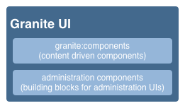

# AEM Touch-Enabled UI的概念{#concepts-of-the-aem-touch-enabled-ui}

透過AEM 5.6,Adobe針對作者環境推出具有互動式設計 [的全新觸控](/help/sites-authoring/responsive-layout.md) UI。 這與原有的傳統UI有很大不同，因為它設計為可在觸控和桌上型裝置上運作。

此觸控式UI現在是AEM的標準UI，取代傳統UI。

>[!NOTE]
>
>觸控式UI是AEM的標準UI，不過仍支援傳統UI。

啟用觸控的UI包括：

* 套裝標題：

   * 顯示標誌
   * 提供全域導覽的連結
   * 提供其他一般動作的連結； 例如搜尋、說明、Marketing Cloud解決方案、通知和使用者設定。

* 左側邊欄（視需要顯示且可隱藏），可顯示：

   * 時間軸
   * 引用
   * 濾鏡

* 導覽標題，此頁首也會區分上下文，並可顯示：

   * 指出您目前使用的控制台和／或該控制台中的位置
   * 左側導軌的選取
   * 階層連結
   * 存取適當的 **Create** 動作
   * 檢視選擇

* 內容區域：

   * 列出內容項目（無論是頁面、資產、論壇貼文等）
   * 可依要求格式化，例如欄、卡片或清單
   * 使用互動式設計（顯示器會根據您的裝置和／或視窗大小自動調整大小）
   * 使用無限捲動（不再編頁，所有項目都會列在一個視窗中）


>[!NOTE]
>
>幾乎所有的AEM功能都已移植至觸控式UI。 但是，在某些有限的情況下，功能會回復為傳統UI。 如需詳 [細資訊，請參閱Touch UI Feature](/help/release-notes/touch-ui-features-status.md) Status。

Adobe已設計觸控式UI，以提供跨多種產品的使用者體驗一致性。 它基於：

* **Coral UI** (CUI)是Adobe針對觸控式UI的視覺樣式實作。 Coral UI提供您的產品／專案／網頁應用程式採用UI視覺風格所需的一切。
* **Granite UI元件** 是使用Coral UI建立的。

觸控式UI的基本原則為：

* 行動優先（以桌上型電腦為先）
* 互動式設計
* 相關內容顯示
* 可重複使用
* 包含內嵌的參考檔案
* 包含內嵌測試
* 自底向上設計，以確保這些原則適用於每個元素和元件

如需觸控式UI結構的進一步概觀，請參閱「AEM觸控式 [UI的結構」文章](/help/sites-developing/touch-ui-structure.md)。

## AEM Technology Stack {#aem-technology-stack}

AEM以Granite平台為基礎，Granite平台包括Java內容儲存庫等。


## Granite {#granite}

Granite是Adobe的Open Web堆疊，提供多種元件，包括：

* 應用程式啟動程式
* OSGi架構，可部署所有功能
* 一些OSGi簡編服務，以支援建立應用程式
* 提供各種記錄API的完整記錄架構
* JCR API規範的CRX儲存庫實施
* Apache Sling Web Framework
* 目前CRX產品的其他部分

>[!NOTE]
>
>Granite是以開放開發專案的方式在Adobe中執行： 對程式碼、討論和問題的貢獻來自整個公司。
>
>不過，Granite並非 **開放** 原始碼專案。 它主要以數個開放原始碼專案（尤其是Apache Sling、Felix、Jackrabbit和Lucene）為基礎，但Adobe在公開項目與內部專案之間劃清了界限。

## Granite UI {#granite-ui}

Granite工程平台也提供了一個基礎UI架構。 其主要目標是：

* 提供精細的UI Widget
* 實作UI概念並說明最佳實務（長清單轉換、清單篩選、物件CRUD、CUD精靈……）
* 提供可擴充的外掛程式管理UI

這些要求符合：

* 尊重「行動優先」
* 可擴充
* 易於覆寫


Granite UI:

* 使用Sling的REST風格架構
* 建置元件庫，以建立內容導向的網頁應用程式
* 提供精細的UI Widget
* 提供預設的標準化UI
* 可擴充
* 專為行動與桌上型裝置設計（首先考慮行動）
* 可用於任何以Granite為基礎的平台／產品／專案； eg AEM



* [Granite UI Foundation元件](#granite-ui-foundation-components)

   此基礎元件庫可供其他元件庫使用或擴充。

* [Granite UI管理元件](#granite-ui-administration-components)

### 用戶端與伺服器端 {#client-side-vs-server-side}

Granite UI中的客戶機與伺服器通信由超文本（而非對象）組成，因此客戶機無需瞭解業務邏輯

* 伺服器利用語義資料豐富HTML
* 客戶端利用超媒體豐富超文本（交互）


#### Client-Side {#client-side}

這會使用HTML辭彙表的擴充功能，讓作者可以表達建立互動式網頁應用程式的意願。 WAI-ARIA和微格 [式也是](https://www.w3.org/TR/wai-aria/) 這 [樣](http://microformats.org/)。

它主要包含由JS和CSS程式碼解譯的互動模式（例如，非同步提交表格）集合，在用戶端執行。 用戶端的角色是增強互動性的標籤（以伺服器提供的超媒體支援為準）。

用戶端獨立於任何伺服器技術。 只要伺服器提供適當的標籤，用戶端就能發揮其作用。

目前，JS和CSS程式碼會以Granite [clientlibs的形式](/help/sites-developing/clientlibs.md) ，傳送在類別中：

`granite.ui.foundation and granite.ui.foundation.admin`

這些內容會以內容套件的方式提供：

`granite.ui.content`

#### 伺服器端 {#server-side}

這是由sling元件集合所組成，可讓作者快速 *合成* webapp。 開發人員開發元件，作者將元件組裝成網頁應用程式。 伺服器端的角色是為用戶端提供超媒體可負擔性（標籤）。

這些元件當前位於Granite儲存庫中，網址為：

`/libs/granite/ui/components/foundation`

這是內容套件的一部分：

`granite.ui.content`

### 與傳統UI的差異 {#differences-with-the-classic-ui}

Granite UI和ExtJS（用於傳統UI）之間的差異也值得關注：

<table> 
 <tbody> 
  <tr> 
   <td><strong>ExtJS</strong></td> 
   <td><strong>Granite UI</strong></td> 
  </tr> 
  <tr> 
   <td>遠程過程調用<br /> </td> 
   <td>州過渡</td> 
  </tr> 
  <tr> 
   <td>資料傳輸對象</td> 
   <td>Hypermedia</td> 
  </tr> 
  <tr> 
   <td>客戶端瞭解伺服器內部</td> 
   <td>客戶不知道內部</td> 
  </tr> 
  <tr> 
   <td>"胖客戶"</td> 
   <td>"瘦客戶機"</td> 
  </tr> 
  <tr> 
   <td>專用的用戶端程式庫</td> 
   <td>通用用戶端程式庫</td> 
  </tr> 
 </tbody> 
</table>

### Granite UI Foundation元件 {#granite-ui-foundation-components}

Granite UI [基礎元件](https://helpx.adobe.com/experience-manager/6-4/sites/developing/using/reference-materials/granite-ui/api/jcr_root/libs/granite/ui/index.html) ，提供建立任何UI所需的基本建置區塊。 其中包括：

* 按鈕
* 超連結
* 使用者頭像

可在以下位置找到基礎元件：

`/libs/granite/ui/components/foundation`

此程式庫包含每個Coral元素的Granite UI元件。 元件是內容驅動的，其配置駐留在儲存庫中。 這樣，就可以不用手寫HTML標籤來合成Granite UI應用程式。

目的：

* HTML元素的元件模型
* 組分組合物
* 自動單元和功能測試

實施:

* 基於儲存庫的構成和配置
* 運用Granite平台提供的測試設施
* JSP模板

此基礎元件庫可供其他元件庫使用或擴充。

### ExtJS與對應的Granite UI元件 {#extjs-and-corresponding-granite-ui-components}

將ExtJS程式碼升級為使用Granite UI時，下列清單提供ExtJS xtypes和節點類型及其等效Granite UI資源類型的簡單概述。

| **ExtJS xtype** | **Granite UI資源類型** |
|---|---|
| `button` | `granite/ui/components/foundation/form/button` |
| `checkbox` | `granite/ui/components/foundation/form/checkbox` |
| `componentstyles` | `cq/gui/components/authoring/dialog/componentstyles` |
| `cqinclude` | `granite/ui/components/foundation/include` |
| `datetime` | `granite/ui/components/foundation/form/datepicker` |
| `dialogfieldset` | `granite/ui/components/foundation/form/fieldset` |
| `hidden` | `granite/ui/components/foundation/form/hidden` |
| `html5smartfile, html5smartimage` | `granite/ui/components/foundation/form/fileupload` |
| `multifield` | `granite/ui/components/foundation/form/multifield` |
| `numberfield` | `granite/ui/components/foundation/form/numberfield` |
| `pathfield, paragraphreference` | `granite/ui/components/foundation/form/pathbrowser` |
| `selection` | `granite/ui/components/foundation/form/select` |
| `sizefield` | `cq/gui/components/authoring/dialog/sizefield` |
| `tags` | `granite/ui/components/foundation/form/autocomplete` `cq/gui/components/common/datasources/tags` |
| `textarea` | `granite/ui/components/foundation/form/textarea` |
| `textfield` | `granite/ui/components/foundation/form/textfield` |

| **節點類型** | **Granite UI資源類型** |
|---|---|
| `cq:WidgetCollection` | `granite/ui/components/foundation/container` |
| `cq:TabPanel` | `granite/ui/components/foundation/container` `granite/ui/components/foundation/layouts/tabs` |
| `cq:panel` | `granite/ui/components/foundation/container` |

### Granite UI管理元件 {#granite-ui-administration-components}

Granite UI管 [理元件以基礎元件為基礎](https://helpx.adobe.com/experience-manager/6-4/sites/developing/using/reference-materials/granite-ui/api/jcr_root/libs/granite/ui/index.html) ，以提供任何管理應用程式都可實施的通用建置區塊。 其中包括：

* 全域導覽列
* 邊欄（骨架）
* 搜尋面板

目的：

* 管理應用程式的統一外觀與感覺
* 管理應用程式的RAD

實施:

* 使用基礎元件的預先定義元件
* 可自訂元件

## Coral UI {#coral-ui}

Coral UI(CUI)是Adobe針對觸控式UI的視覺風格實作，旨在提供跨多種產品的一致使用體驗。 Coral UI提供您所需的一切，讓您採用製作環境中使用的視覺化樣式。

>[!CAUTION]
>
>Coral UI是AEM客戶提供的UI程式庫，可讓他們在授權使用產品的範圍內建立應用程式和網頁介面。
>
>僅允許使用Coral UI:
>
>* 已隨附於AEM。
>* 用於擴充製作環境的現有UI時。
>* Adobe公司文宣、廣告和簡報。
>* Adobe品牌應用程式的使用者介面（該字型必須無法供其他用途使用）。
>* 有少量自訂。

>
>
Coral UI的使用應避免於：
>
>* 檔案和其他與Adobe無關的項目。
>* 內容建立環境（前面的項目可能由其他人產生）。
>* 未明確連線至Adobe的應用程式／元件／網頁。

>


Coral UI是開發網頁應用程式的建置區塊集。


從開始設計為模組化，每個模組根據其主要角色形成不同的層。 雖然這些圖層設計為彼此支援，但您也可以視需要獨立使用。 這可讓您在任何具HTML功能的環境中建置Coral的使用體驗。

使用Coral UI時，並非必須使用特定開發模型和／或平台。 Coral的主要目標是提供統一且簡潔的HTML5標籤，不受實際發出此標籤的方法所限。 這可能用於用戶端或伺服器端轉譯、範本、JSP、PHP或甚至Adobe Flash RIA應用程式——例如。

### HTML元素——標籤圖層 {#html-elements-the-markup-layer}

HTML元素提供所有基本UI元素（包括導覽列、按鈕、選單、邊欄等）的共同外觀和感覺。

在最基本的層級，HTML元素是具有專用類別名稱的HTML標籤。 更複雜的元素可由多個標籤組成，這些標籤彼此巢狀內嵌（以特定方式）。

CSS可用來提供實際的外觀和感覺。 為了能夠輕鬆自訂外觀和感覺（例如品牌），實際樣式值會宣告為變數，並在執行時期期間由 [LESS](https://lesscss.org/) precossor擴充。

目的：

* 提供具備共同外觀和感覺的基本UI元素
* 提供預設格線系統

實施:

* HTML標籤，其樣式靈感來自引導 [集](https://twitter.github.com/bootstrap/)
* 類在LESS檔案中定義
* 圖示定義為字型精靈

例如，標籤：

```xml
<button class="btn btn-large btn-primary" type="button">Large button</button> 
<button class="btn btn-large" type="button">Large button</button>
```

顯示為：


外觀和感覺定義為LESS，以專用類別名稱系結至元素（為簡便起見，下列摘取已縮短）:

```xml
.btn {
    font-size: @baseFontSize; 
    line-height: @baseLineHeight; 
    .buttonBackground(@btnBackground,
                                @btnBackgroundHighlight,
                                @grayDark, 0 1px 1px rgba(255,255,255,.75));
```

實際值在LESS變數檔案中定義（以下摘取已縮短，以便簡化）:

```xml
@btnBackgroundHighlight: darken(@white, 10%); 
@btnPrimaryBackgroundHighlight: spin(@btnPrimaryBackground, 20%); 
@baseFontSize: 17px;
@baseFontFamily: @sansFontFamily;
```

### 元素外掛程式 {#element-plugins}

許多HTML元素需要顯示某種動態行為，例如開啟和關閉快顯功能表。 這是元素外掛程式的角色，它可使用JavaScript控制DOM來完成此類工作。

外掛程式可以是：

* 設計為在特定DOM元素上運作。 例如，對話外掛程式需要尋找 `DIV class=dialog`
* 一般性。 例如，版面配置管理員提供任何元素清單 `DIV` 的版 `LI` 面

外掛程式行為可透過下列其中一種方式，以參數自訂：

* 透過javascript呼叫傳遞參數
* 使用系 `data-*` 結至HTML標籤的專用屬性

雖然開發人員可以針對任何外掛程式選擇最佳方式，但經驗法則是：

* `data-*` 屬性。 例如，若要指定欄數
* API選項／類別，以取得與資料相關的功能。 例如，建構要顯示的項目清單

相同的概念用於實作表單驗證。 對於要驗證的元素，您必須將所需的輸入表單指定為自訂屬 `data-*` 性。 然後，此屬性會用作驗證外掛程式的選項。

>[!NOTE]
>
>應盡可能使用HTML5原生表單驗證及／或擴充。

目的：

* 提供HTML元素的動態行為
* 使用純CSS無法提供自訂版面
* 執行表單驗證
* 執行進階DOM控制

實施:

* jQuery plugin，系結至特定DOM元素
* 使用 `data-*` 屬性自訂行為

範例標籤的摘取(請注意指定為data-&amp;ast; 屬性):

```xml
<ul data-column-width="220" data-layout="card" class="cards">
  <li class="item">
    <div class="thumbnail">
       
      <div class="caption">
        <h4>Toolbar</h4>
          <p><small>toolbar</small><br></p>
      </div>
    </div>
  </li>
  <li class="item">
    <div class="thumbnail">
       
      <div class="caption">
        <h4>Toolbar</h4>
        <p><small>toolbar</small><br></p>
      </div>
    </div>
  </li>
```

對jQuery外掛程式的呼叫：

```
$(‘.cards’).cardlayout ();
```

這將顯示為：


外掛 `cardLayout` 程式會根據各自的高 `UL` 度，並考量父項的寬度，來排列封閉的元素。

### HTML元素Widget {#html-elements-widgets}

介面工具集結合一或多個基本元素與javascript外掛程式，以形成「較高層級」的UI元素。 它們可實作比單一元素更複雜的行為，也能提供更複雜的外觀和感覺。 標籤選擇器或邊欄Widget就是很好的例子。

介面工具集可觸發並監聽自訂事件，以配合頁面上的其他介面工具集。 有些Widget實際上是使用Coral HTML元素的原生jQuery Widget。

目的：

* 實作表現複雜行為的更高階UI元素
* 觸發和處理事件

實施:

* jQuery plugin + HTML markup
* 可運用用戶端／伺服器端範本

示例標注為：

```
<input type="text" name="tags" placeholder="Tags" class="tagManager"/>
```

對jQuery外掛程式的呼叫（含選項）:

```
$(".tagManager").tagsManager({
        prefilled: ["Pisa", "Rome"] })
```

外掛程式會發出HTML標籤（此標籤會使用基本元素，這些元素可能會在內部使用其他外掛程式）:

```
<span>Pisa</span>
<a title="Removing tag" tagidtoremove="0"
   id="myRemover_0" class="myTagRemover" href="#">x</a></span>

<span id="myTag_1" class="myTag"><span>Rome</span>
<a title="Removing tag" tagidtoremove="1"
   id="myRemover_1" class="myTagRemover" href="#">x</a></span>

<input type="text" data-original-title="" class="input-medium tagManager"
       placeholder="Tags" name="tags" data-provide="typeahead" data-items="6"
       autocomplete="off">
```

這將顯示為：


### 實用程式庫 {#utility-library}

此程式庫是Javascript Helper外掛程式和／或函式的集合，這些外掛程式和／或函式包括：

* UI獨立
* 但對於建立功能完整的Web應用程式而言，仍至關重要

這些包括XSS處理和事件匯流排。

雖然HTML元素外掛程式和Widget可能仰賴公用程式程式庫提供的功能，但公用程式庫不能對元素和Widget本身有任何硬性的依賴。

目的：

* 提供通用功能
* 事件匯流排實施
* 用戶端範本
* XSS

實施:

* jQuery外掛程式或與AMD相容的JavaScript模組

