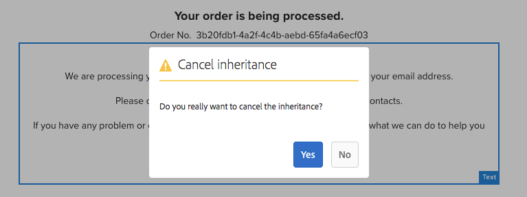

# 在We.Retail中試用核心元件{#trying-out-core-components-in-we-retail}

核心元件是現代化、有彈性的元件，具備簡單的擴充性，並可讓您輕鬆整合至專案中。 核心元件是以數種主要設計原則為基礎，例如HTL、可用性立即可用、可設定性、版本控制和擴充性。 We.Retail是建立在核心元件上。

## 試用 {#trying-it-out}

1. 使用We.Retail範例內容啟動AEM，並開啟「元 [件控制台」](/help/sites-authoring/default-components-console.md)。

   **全域導覽->工具->元件**

1. 在「元件控制台」中開啟邊欄時，您可以篩選特定元件群組。 核心元件位於

   * `.core-wcm`:標準核心元件
   * `.core-wcm-form`:表單提交核心元件
   選擇 `.core-wcm`。

   

1. 請注意，所有核心元件皆命 **名為v1**，這反映出這是此核心元件的第一個版本。 日後將推出一般版本，其版本將與AEM相容，並可輕鬆升級，讓您運用最新的功能。
1. 按一 **下「文字(v1)**」。

   查看組 **件的資源類** 型是 `/apps/core/wcm/components/text/v1/text`。 核心元件位於下方， `/apps/core/wcm/components` 並依每個元件進行版本控制。

   

1. 按一下「文 **件** 」標籤，以檢視元件的開發人員檔案。

   

1. 返回元件控制台。 篩選群組 **We.Retail** ，然後選 **取Text元件** 。
1. 查看「資 **源類型** 」(Resource Type `/apps/weretail` )如預期指向元件，但「資源超級類型」( **Resource Super Type** )指向核心元件 `/apps/core/wcm/components/text/v1/text`。

   

1. 按一下「 **即時使用** 」標籤，查看目前使用此元件的頁面。 按一下第一 **個感謝頁** ，以編輯頁面。

   

1. 在「感謝」頁面上，選擇文本元件，然後在元件的編輯菜單中按一下「取消繼承」表徵圖。

   [We.Retail採用全球化的網站結構](/help/sites-developing/we-retail-globalized-site-structure.md) ，透過稱為繼承的機制，將內容從語言 [主版推送至即時副本](/help/sites-administering/msm.md)。 因此，必須取消繼承，才能允許用戶手動編輯文本。

   

1. 按一下「是」確認 **取消**。

   

1. 取消繼承後，您選擇文本元件後，可以使用更多選項。 按一下**編輯**。

   

1. 您現在可以看到文字元件有哪些編輯選項可用。

   

1. 從「頁面 **資訊」功能表** ，選取「 **編輯範本」**。
1. 在頁面的範本編輯器中，按一下頁面 **的** 「版面容器」中「文字」元件 **** 的「原則」圖示。

   

1. 核心元件可讓範本作者設定頁面作者可使用的屬性。 這些功能包括允許的貼上來源、格式選項、可用段落樣式等。

   此類設計對話方塊適用於許多核心元件，並可與範本編輯器搭配運作。 在啟用後，作者可透過元件編輯器使用這些工具。

   

## 更多資訊 {#further-information}

如需核心元件的詳細資訊，請參閱編寫檔案 [Core Components](https://docs.adobe.com/content/help/en/experience-manager-core-components/using/introduction.html) ，以取得核心元件功能的概觀，而開發人員檔案 [Developing Core Components](https://helpx.adobe.com/experience-manager/core-components/using/developing.html) ，則可取得技術概觀。

此外，您可能希望進一步調查可編 [輯的範本](/help/sites-developing/we-retail-editable-templates.md)。 有關可編輯模板的完 [整詳細資訊，請參閱編寫文檔](/help/sites-authoring/templates.md) 「建立頁面模板」或開發人 [員文檔頁面模板——可編輯模板](/help/sites-developing/page-templates-editable.md) 。
