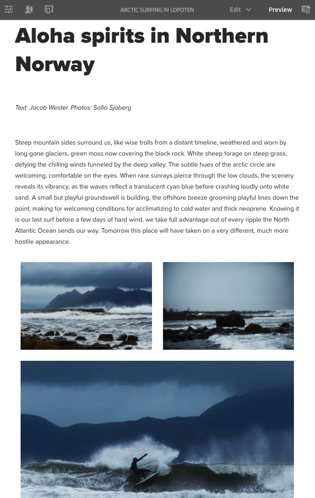

# 在We.Retail中嘗試回應式版面{#trying-out-responsive-layout-in-we-retail}

>[!CAUTION]
>
>AEM 6.4已結束延伸支援，本檔案不再更新。 如需詳細資訊，請參閱 [技術支援期](https://helpx.adobe.com//tw/support/programs/eol-matrix.html). 尋找支援的版本 [此處](https://experienceleague.adobe.com/docs/).

所有We.Retail頁面都使用「版面容器」元件來實作回應式設計。 版面容器提供段落系統，可讓您將元件置於回應式格線內。 此網格可根據設備/窗口大小和格式重新排列佈局。 該元件與 **版面** 模式，可讓您根據裝置建立和編輯回應式版面。

## 試試 {#trying-it-out}

1. 在語言主分支的「體驗」部分編輯「北極衝浪」頁。

   http://localhost:4502/editor.html/content/we-retail/language-masters/en/experience/arctic-surfing-in-lofoten.html

1. 切換至 **預覽** 來查看對網站訪客呈現的頁面樣式。 向下捲動至文章內容 *挪威北部的阿羅哈神*.

   

1. 調整瀏覽器視窗的大小，並隨著版面隨調整大小而動態調整。

   

1. 切換至「配置」模式。 模擬器工具列會自動顯示，讓您可依目標裝置來規劃版面。

   選取元件會在編輯選單中顯示浮動和隱藏選項，以及調整元件的控點大小。

   

1. 抓取並拖曳元件的大小調整控制滑塊會自動顯示版面網格，以協助您調整大小。

   

## 更多資訊 {#further-information}

有關詳細資訊，請參閱創作文檔 [回應式版面](/help/sites-authoring/responsive-layout.md) 或管理員文檔 [配置佈局容器和佈局模式](/help/sites-administering/configuring-responsive-layout.md) 以取得完整的技術詳細資訊。
