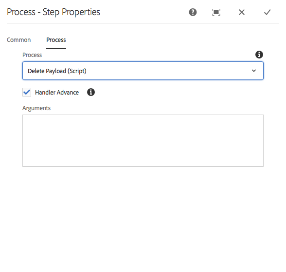

# 工作流程步驟參考{#workflow-step-reference}

工作流模型由各種類型的一系列步驟組成。 根據類型，這些步驟可以設定並擴充為參數和指令碼，以提供您所需的功能和控制。

>[!NOTE]
>
>本節介紹標準工作流程步驟。
>
>有關模組的特定步驟，另請參閱：
>
>* [AEM Forms工作流程步驟參考資料](/help/forms/using/aem-forms-workflow-step-reference.md)
* [使用媒體處理常式和工作流程處理資產](/help/assets/media-handlers.md)


## 步驟屬性 {#step-properties}

每個步驟元件都有一個&#x200B;**[!UICONTROL 步驟屬性]**&#x200B;對話框，允許您定義和編輯所需屬性。

### 步驟屬性 — 公共頁簽{#step-properties-common-tab}

屬性對話框的&#x200B;**[!UICONTROL Common]**&#x200B;頁簽上提供了以下屬性組合，可用於大多數工作流步驟元件：

* **[!UICONTROL 標題]**

   步驟的標題。

* **[!UICONTROL 說明]**

   步驟的說明。

* **[!UICONTROL 工作流程分段]**

   將[Stage](/help/sites-developing/workflows.md#workflow-stages)套用至步驟的下拉式選取器。

* **[!UICONTROL 逾時]**

   此步驟之後將「逾時」的時段。

   您可以選取：**[!UICONTROL Off]**,**[!UICONTROL Immediate]**,**[!UICONTROL 1h]**,**[!UICONTROL 6h]**,**[!UICONTROL 12h]**,**[!UICONTROL 24h]**。

* **[!UICONTROL 逾時處理常式]**

   步驟逾時時控制工作流程的處理常式；例如：

   `Auto Advancer`

* **[!UICONTROL 處理常式前進]**

   選取此選項，即可在執行後自動將工作流程推進至下一個步驟。 如果未選取，實施指令碼必須處理工作流程進階。

#### 步驟屬性 — 「用戶/組」頁簽{#step-properties-user-group-tab}

以下屬性可用於屬性對話框的&#x200B;**[!UICONTROL 用戶/組]**&#x200B;頁簽上的許多工作流步驟元件：

* **[!UICONTROL 通過電子郵件通知用戶]**

   * 您可以在工作流到達步驟時向參與者發送電子郵件，以通知他們。
   * 如果啟用，則會向由屬性&#x200B;**[!UICONTROL User/Group]**&#x200B;定義的用戶發送電子郵件；如果已定義組，則向組的每個成員發送電子郵件。

* **[!UICONTROL 使用者/群組]**

   * 下拉式選取方塊可讓您導覽並選取使用者或群組。
   * 如果您將步驟指派給特定使用者，則只有此使用者可以對步驟採取動作。
   * 如果您將步驟指派給整個組，則當工作流到達此步驟時，此組中的所有用戶將在其&#x200B;**[!UICONTROL 工作流收件箱]**&#x200B;中執行操作。
   * 如需詳細資訊，請參閱[參與工作流程](/help/sites-authoring/workflows-participating.md) 。

## AND 拆分 {#and-split}

**[!UICONTROL AND Split]**&#x200B;會在工作流程中建立分割，之後兩個分支都會生效。 您可以視需要將工作流程步驟新增至每個分支。 此步驟可讓您將多個處理路徑引入工作流程中。 例如，您可以允許同時執行某些審核步驟，以節省時間。


### 和分割 — 配置{#and-split-configuration}

* 編輯&#x200B;**[!UICONTROL AND Split]**&#x200B;屬性：

   * **[!UICONTROL 拆分名稱]**:為解釋目的指定名稱。
   * 選取所需的分支數；2、3、4或5。

* 視需要將工作流程步驟新增至分支。

   

## 容器步驟 {#container-step}

**[!UICONTROL 容器]**&#x200B;步驟將啟動作為子工作流運行的另一個工作流模型。

此&#x200B;**[!UICONTROL 容器]**&#x200B;可讓您重複使用工作流模型以實施常見的步驟順序。 例如，翻譯工作流程模型可用於多個編輯工作流程。


### 容器步驟 — 配置{#container-step-configuration}

若要設定此步驟，請編輯並使用下列標籤：

* [**[!UICONTROL 常見]**](#step-properties-common-tab)
* **[!UICONTROL 容器]**

   * **[!UICONTROL 子工作流]**:選取要啟動的工作流程。

## 移至步驟 {#goto-step}

**[!UICONTROL 轉到步驟]**&#x200B;允許您根據ECMAScript的結果指定要執行的工作流模型中的下一步：

* `true`:「轉 **[!UICONTROL 到]** 步驟完成」(Goto Stepcompletes)，工作流引擎將執行指定的步驟。

* `false`:「轉 **[!UICONTROL 到]** 步驟」和正常的路由邏輯決定下一個要執行的步驟。

**[!UICONTROL 轉至步驟]**&#x200B;允許您在工作流模型中實施高級路由結構。 例如，要實施循環，可以定義&#x200B;**[!UICONTROL 轉到步驟]**&#x200B;以執行工作流中的前一步驟，指令碼將評估循環條件。

### 轉到步驟 — 配置{#goto-step-configuration}

若要設定此步驟，請編輯並使用下列標籤：

* [**[!UICONTROL 常見]**](#step-properties-common-tab)
* **[!UICONTROL 程序]**

   * **[!UICONTROL 前往]**&#x200B;的步驟：選取要執行的步驟。
   * **[!UICONTROL 指令碼路徑]**:ECMAScript的路徑，它確定是否執行「轉 **[!UICONTROL 到步驟」]**。
   * **[!UICONTROL 指令碼]**:確定是否執行「轉到步 **[!UICONTROL 驟」的ECMAScript]**。

>[!CAUTION]
指定&#x200B;**[!UICONTROL 指令碼路徑]**&#x200B;或&#x200B;**[!UICONTROL 指令碼]**。 兩個選項不能同時使用。 如果為這兩個屬性指定值，則步驟使用&#x200B;**[!UICONTROL 指令碼路徑]**。

#### 模擬環{#simulating-a-for-loop}的

模擬for循環需要保持已發生循環迭代次數的計數：

* 計數通常代表在工作流程中處理之項目的索引。
* 計數會評估為回圈的退出准則。

例如，若要實作在數個JCR節點上執行動作的工作流程，您可以使用循環計數器作為節點的索引。 若要保留計數，請將`integer`值儲存在工作流程例項的資料映射中。 使用&#x200B;**[!UICONTROL 轉至步驟]**&#x200B;的指令碼來增加計數，並比較計數與退出條件。

```
function check(){
   var count=0;
   var keyname="loopcount"
   try{
      if (workflowData.getMetaDataMap().containsKey(keyname)){ 
        log.info("goto script: found loopcount key");
        count= parseInt(workflowData.getMetaDataMap().get(keyname))+1;
      } 
 
     workflowData.getMetaDataMap().put(keyname,count);
 
     }catch(err) {
         log.info(err.message);
         return false;
    }
   if (parseInt(count) <7){
       return true;
   } else {
      return false;
   }
}
```

## OR 拆分 {#or-split}

**[!UICONTROL OR Split]**&#x200B;會在工作流中建立分割，之後只會有一個分支生效。 此步驟可讓您將條件式處理路徑引入工作流程中。 您可以視需要將工作流程步驟新增至每個分支。

>[!NOTE]
有關建立OR分割的詳細資訊，請參閱：[https://helpx.adobe.com/experience-manager/using/aem64_workflow_servlet.html](https://helpx.adobe.com/experience-manager/using/aem64_workflow_servlet.html)


### OR Split — 配置{#or-split-configuration}

* 編輯&#x200B;**[!UICONTROL OR Split]**&#x200B;屬性：

   * **[!UICONTROL 常見]**

      * 選取所需的分支數；2、3、4或5。
   * **[!UICONTROL 分支： *x*>]**

      * **[!UICONTROL 指令碼路徑]**:包含指令碼的檔案的路徑。
      * **[!UICONTROL 指令碼]**:在方塊中新增指令碼。
      * **[!UICONTROL 預設路由]**:多個分支評估為true時，會依循預設分支。您只能指定一個分支作為預設值。

   >[!NOTE]
   每個分支都有個別的索引標籤：
   * 每個分支的指令碼一次評估一個。
   * 分支由左到右計算。
   * 會執行評估為true的第一個指令碼。
   * 如果沒有分支評估為true，則工作流程不會前進。


   >[!CAUTION]
   指定&#x200B;**[!UICONTROL 指令碼路徑]**&#x200B;或&#x200B;**[!UICONTROL 指令碼]**。 兩個選項不能同時使用。 如果為這兩個屬性指定值，則步驟使用&#x200B;**[!UICONTROL 指令碼路徑]**。

   >[!NOTE]
   請參閱[定義OR分割的規則](/help/sites-developing/workflows-models.md#example-defining-a-rule-for-an-or-split)。

* 視需要將工作流程步驟新增至分支。

## 參與者步驟和選擇器{#participant-steps-and-choosers}

### 參與者步驟 {#participant-step}

**[!UICONTROL 參與者步驟]**&#x200B;允許您為特定操作分配所有權。 只有當使用者手動確認步驟時，工作流程才會繼續。 當您希望某人對工作流程採取動作時，就會使用此功能；例如，檢閱步驟。

雖然與用戶授權不直接相關，但在分配操作時必須考慮用戶授權；使用者必須擁有工作流程裝載之頁面的存取權。

#### 參與者步驟 — 配置{#participant-step-configuration}

若要設定此步驟，請編輯並使用下列標籤：

* [**[!UICONTROL 常見]**](#step-properties-common-tab)
* [**[!UICONTROL 使用者/群組]**](#step-properties-user-group-tab)

>[!NOTE]
當發生下列情況時，一律會通知工作流發起程式：
* 工作流程已完成（已完成）。
* 工作流程已中止（終止）。


>[!NOTE]
您需要設定某些屬性，才能啟用電子郵件通知。 您也可以自訂電子郵件範本，或為新語言新增電子郵件範本。 請參閱[設定電子郵件通知](/help/sites-administering/notification.md)以在AEM中設定電子郵件通知。

### 對話方塊參與者步驟 {#dialog-participant-step}

使用&#x200B;**[!UICONTROL 對話參與者步驟]**&#x200B;從分配了工作項的用戶收集資訊。 此步驟對於收集稍後用於工作流程的少量資料非常有用。

完成此步驟後，**[!UICONTROL 完成工作項]**&#x200B;對話框包含您在對話框中定義的欄位。 在欄位中收集的資料會儲存在工作流程裝載的節點中。 之後的工作流程步驟便可從存放庫讀取值。

要配置步驟，請指定要為其分配工作項的組或用戶以及對話框的路徑。

#### 對話參與者步驟 — 配置{#dialog-participant-step-configuration}

若要設定此步驟，請編輯並使用下列標籤：

* [**[!UICONTROL 常見]**](#step-properties-common-tab)
* [**[!UICONTROL 使用者/群組]**](#step-properties-user-group-tab)
* **[!UICONTROL 對話方塊]**

   * **[!UICONTROL 對話路徑**]:您建立的[對話框](#dialog-participant-step-creating-a-dialog)的對話框節點的路徑。

#### 對話參與者步驟 — 建立對話{#dialog-participant-step-creating-a-dialog}

要建立對話框：

* 決定產生的資料將儲存在有效負載](#dialog-participant-step-storing-data-in-the-payload)中的哪個位置。[
* [定義對話方塊；這包括定義用於收集（和儲存）資料的欄位](#dialog-participant-step-dialog-definition)。

#### 對話參與者步驟 — 在裝載{#dialog-participant-step-storing-data-in-the-payload}中儲存資料

您可以在工作流程裝載或工作項元資料中儲存介面工具集資料。 介面工具集節點的`name`屬性格式決定資料的儲存位置。

* **[!UICONTROL 使用裝載儲存資料]**

   * 若要將Widget資料儲存為工作流程裝載的屬性，請對Widget節點的name屬性值使用以下格式：

      `./jcr:content/nodename`

   * 資料儲存在有效負載節點的`nodename`屬性中。 如果節點不包含該屬性，則會建立屬性。
   * 與裝載一併儲存時，具有相同裝載之對話方塊的後續使用會覆寫屬性的值。

* **[!UICONTROL 將資料與工作項一起儲存]**

   * 要將Widget資料儲存為工作項元資料的屬性，請對name屬性的值使用以下格式：

      `nodename`

   * 資料儲存在工作項`metadata`的`nodename`屬性中。 如果對話方塊後續與相同裝載搭配使用，則會保留資料。

#### 對話參與者步驟 — 對話定義{#dialog-participant-step-dialog-definition}

1. **[!UICONTROL 對話框結構]**

   對話框參與者步驟對話框與為創作元件建立的對話框類似。 它們儲存在：

   `/apps/myapp/workflow/dialogs`

   標準觸控式UI的對話方塊具有下列節點結構：

   ```xml
   newComponent (cq:Component)
     |- cq:dialog (nt:unstructured)
       |- content 
         |- layout 
           |- items 
             |- column 
               |- items 
                 |- component0
                 |- component1
                 |- ...
   ```

   >[!NOTE]
   有關詳細資訊，請參閱[建立和配置對話框](/help/sites-developing/developing-components.md#creating-and-configuring-a-dialog)。

1. **[!UICONTROL 對話框路徑屬性]**

   **[!UICONTROL 對話參與者步驟]**&#x200B;具有&#x200B;**[!UICONTROL 對話路徑]**&#x200B;屬性（連同[參與者步驟](#participant-step)的屬性）。 **[!UICONTROL Dialog Path]**&#x200B;屬性的值是對話框`dialog`節點的路徑。

   例如，該對話框包含在儲存在節點中名為`EmailWatch`的元件中：

   `/apps/myapp/workflows/dialogs`

   對於觸控式UI,**[!UICONTROL 對話方塊路徑]**&#x200B;屬性會使用下列值：

   `/apps/myapp/workflow/dialogs/EmailWatch/cq:dialog`

   

1. **示例對話框定義**

   以下XML代碼片段表示一個對話框，該對話框將`String`值儲存在裝載內容的`watchEmail`節點中。 標題節點表示[TextField](https://helpx.adobe.com/experience-manager/6-4/sites/developing/using/reference-materials/granite-ui/api/jcr_root/libs/granite/ui/components/coral/foundation/form/textfield/index.html)元件：

   ```xml
   jcr:primaryType="nt:unstructured" 
       jcr:title="Watcher Email Address Dialog" 
       sling:resourceType="cq/gui/components/authoring/dialog">
       <content jcr:primaryType="nt:unstructured"
           sling:resourceType="granite/ui/components/foundation/container">
           <layout jcr:primaryType="nt:unstructured" 
               margin="false" 
               sling:resourceType="granite/ui/components/foundation/layouts/fixedcolumns"
           />
           <items jcr:primaryType="nt:unstructured">
               <column jcr:primaryType="nt:unstructured"
                   sling:resourceType="granite/ui/components/foundation/container">
                   <items jcr:primaryType="nt:unstructured">
                       <title jcr:primaryType="nt:unstructured" 
                           fieldLabel="Notification Email Address" 
                           name="./jcr:content/watchEmails"
                           sling:resourceType="granite/ui/components/foundation/form/textfield"
                       />
                   </items>
               </column>
           </items>
       </content>
   </cq:dialog>
   ```

   此範例在觸控式UI的案例中，會產生下列對話方塊：

   

### 動態參與者步驟 {#dynamic-participant-step}

**[!UICONTROL 動態參與者步驟]**&#x200B;元件與&#x200B;**[!UICONTROL 參與者步驟]**&#x200B;類似，其差異是參與者在運行時自動選擇。

要配置步驟，請選擇&#x200B;**[!UICONTROL 參與者選擇器]**，該選擇器標識要將工作項目分配給的參與者，並選擇對話框。

#### 動態參與者步驟 — 配置{#dynamic-participant-step-configuration}

若要設定此步驟，請編輯並使用下列標籤：

* [**[!UICONTROL 常見]**](#step-properties-common-tab)
* **[!UICONTROL 參與者選擇器]**

   * **[!UICONTROL 參與者選擇器]**:您建立的參 [與者選擇者的名稱](#dynamic-participant-step-developing-the-participant-chooser)。
   * **[!UICONTROL 引數]**:任何必要引數。
   * **[!UICONTROL 電子郵件]**:是否應將電子郵件通知傳送給使用者。

* **[!UICONTROL 對話方塊]**

   * **[!UICONTROL 對話方塊路徑]**:所建立對話框的對話框節 [點的路徑(與對話參與者 **步驟一樣**)](#dialog-participant-step-creating-a-dialog)。

#### 動態參與者步驟 — 開發參與者選擇器{#dynamic-participant-step-developing-the-participant-chooser}

建立參與者選擇器。 因此，您可以使用任何選擇邏輯或條件。 例如，您的參與者選擇器可以選擇工作項目最少的用戶（在組內）。 您可以建立任意數量的參與者選擇器，以用於工作流模型中&#x200B;**動態參與者步驟**&#x200B;元件的不同實例。

建立OSGi服務或ECMAScript，以選擇用戶將工作項指派給它。

* **[!UICONTROL ECMAscript]**

   指令碼必須包含名為getParticipant的函式，該函式將用戶ID返回為`String`值。 將自訂指令碼儲存在中，例如`/apps/myapp/workflow/scripts`資料夾或子資料夾。

   標準AEM例項中包含範例指令碼：

   `/libs/workflow/scripts/initiator-participant-chooser.ecma`

   >[!CAUTION]
   您&#x200B;*必須*&#x200B;不要變更`/libs`路徑中的任何項目。
   這是因為下次升級執行個體時會覆寫`/libs`的內容（當您套用Hotfix或Feature Pack時，則會覆寫）。

   此指令碼選擇工作流啟動器作為參與者：

   ```
   function getParticipant() {
       return workItem.getWorkflow().getInitiator();
   }
   ```

   >[!NOTE]
   **[!UICONTROL 工作流啟動器參與者選擇器]**&#x200B;元件擴展了&#x200B;**[!UICONTROL 動態參與者步驟]**&#x200B;並將此指令碼用作步驟實施。

* **[!UICONTROL OSGi服務]**

   服務必須實施[com.day.cq.workflow.exec.ParticipantStepChooser](https://helpx.adobe.com/experience-manager/6-4/sites/developing/using/reference-materials/javadoc/com/day/cq/workflow/exec/ParticipantStepChooser.html)介面。 介面定義以下成員：

   * `SERVICE_PROPERTY_LABEL` 欄位：使用此欄位指定參與者選擇器的名稱。該名稱顯示在&#x200B;**[!UICONTROL 動態參與者步驟]**&#x200B;屬性中的可用參與者選擇器清單中。
   * `getParticipant` 方法：將動態解析的主體ID返回 `String` 值。

   >[!CAUTION]
   `getParticipant`方法返回動態解析的主體ID。 這可以是群組id或使用者id。
   但是，當返回參與者清單時，組ID只能用於&#x200B;**[!UICONTROL 參與者步驟]**。 對於&#x200B;**[!UICONTROL 動態參與者步驟]** ，返回一個空清單，該清單不能用於委派。

   若要讓您的實施可供&#x200B;**[!UICONTROL 動態參與者步驟]**&#x200B;元件使用，請將您的Java類添加到導出服務的OSGi捆綁包中，並將捆綁包部署到AEM伺服器。

   >[!NOTE]
   **[!UICONTROL 隨機參與]** 者選擇是選取隨機使用者( `com.day.cq.workflow.impl.process.RandomParticipantChooser`)的範例服務。**[!UICONTROL 隨機參與者選擇器]**&#x200B;步驟元件示例擴展了&#x200B;**[!UICONTROL 動態參與者步驟]**&#x200B;並將此服務用作步驟實施。

#### 動態參與者步驟 — 參與者選擇器服務示例{#dynamic-participant-step-example-participant-chooser-service}

以下Java類實現`ParticipantStepChooser`介面。 類返回啟動工作流的參與者的名稱。 程式碼使用的邏輯與範例指令碼(`initator-participant-chooser.ecma`)所使用的邏輯相同。

`@Property`注釋將`SERVICE_PROPERTY_LABEL`欄位的值設定為`Workflow Initiator Participant Chooser`。

```java
package com.adobe.example;

import org.apache.felix.scr.annotations.Component;
import org.apache.felix.scr.annotations.Properties;
import org.apache.felix.scr.annotations.Property;
import org.apache.felix.scr.annotations.Service;
import org.osgi.framework.Constants;
import org.slf4j.Logger;
import org.slf4j.LoggerFactory;

import com.adobe.granite.workflow.WorkflowException;
import com.adobe.granite.workflow.WorkflowSession;
import com.adobe.granite.workflow.exec.ParticipantStepChooser;
import com.adobe.granite.workflow.exec.WorkItem;
import com.adobe.granite.workflow.metadata.MetaDataMap;

@Component
@Service
@Properties({
        @Property(name = Constants.SERVICE_DESCRIPTION, value = "An example implementation of a dynamic participant chooser."),
        @Property(name = ParticipantStepChooser.SERVICE_PROPERTY_LABEL, value = "Workflow Initiator Participant Chooser (service)") })
public class InitiatorParticipantChooser implements ParticipantStepChooser {

 private Logger logger = LoggerFactory.getLogger(this.getClass());

 public String getParticipant(WorkItem arg0, WorkflowSession arg1,
   MetaDataMap arg2) throws WorkflowException {

  String initiator = arg0.getWorkflow().getInitiator();
  logger.info("Assigning Dynamic Participant Step work item to {}",initiator);

  return initiator;
 }
}
```

在&#x200B;**[!UICONTROL 動態參與者步驟]**&#x200B;屬性對話框中，**[!UICONTROL 參與者選擇器]**&#x200B;清單包含代表此服務的項`Workflow Initiator Participant Chooser (script)`。

「啟動工作流模型時，日誌指示啟動工作流的用戶的ID以及為其分配了工作項的用戶。 在此示例中，`admin`用戶啟動了工作流。

`13.09.2015 15:48:53.037 *INFO* [10.176.129.223 [1347565733037] POST /etc/workflow/instances HTTP/1.1] com.adobe.example.InitiatorParticipantChooser Assigning Dynamic Participant Step work item to admin`

### 表單參與者步驟 {#form-participant-step}

**[!UICONTROL 表單參與者步驟]**&#x200B;在開啟工作項時顯示表單。 當用戶填寫並提交表單時，欄位資料儲存在工作流裝載的節點中。

要配置步驟，請指定要為其分配工作項的組或用戶以及表單的路徑。

>[!CAUTION]
本節內容為頁面編寫的Foundation元件](/help/sites-authoring/default-components-foundation.md#form)的[Forms區段。

#### 表單參與者步驟 — 配置{#form-participant-step-configuration}

若要設定此步驟，請編輯並使用下列標籤：

* [**[!UICONTROL 常見]**](#step-properties-common-tab)
* [**[!UICONTROL 使用者/群組]**](#step-properties-user-group-tab)
* **[!UICONTROL 表單]**

   * **[!UICONTROL 表單路徑]**:您建立的 [表單路徑](#form-participant-step-creating-the-form)。

#### 表單參與者步驟 — 建立表單{#form-participant-step-creating-the-form}

建立表單，以便與&#x200B;**[!UICONTROL 表單參與者步驟]**&#x200B;一如常使用。 但是，表單參與者步驟的表單必須有下列配置：

* **[!UICONTROL Start of Form]**&#x200B;元件必須將&#x200B;**[!UICONTROL Action Type]**&#x200B;屬性設定為`Edit Workflow Controlled Resource(s)`。

* **[!UICONTROL 表單的開頭]**&#x200B;元件必須具有`Form Identifier`屬性的值。

* 表單元件必須將&#x200B;**元素名稱**&#x200B;屬性設定為儲存欄位資料的節點路徑。 路徑必須在工作流程裝載內容中找到節點。 值使用下列格式：

   `./jcr:content/path_to_node`

* 表單必須包含&#x200B;**[!UICONTROL 工作流程提交按鈕]**&#x200B;元件。 不配置元件的任何屬性。

工作流程的需求決定您應將欄位資料儲存於何處。 例如，欄位資料可用來設定頁面內容的屬性。 **[!UICONTROL 元素名稱]**&#x200B;屬性的以下值將欄位資料儲存為`jcr:content`節點的`redirectTarget`屬性的值：

`./jcr:content/redirectTarget`

在以下範例中，欄位資料會作為裝載頁面上&#x200B;**[!UICONTROL Text]**&#x200B;元件的內容：

`./jcr:content/par/text_3/text`

&quot;第一個範例可用於`cq:Page`元件轉譯的任何頁面。 唯有有效負載頁面包含ID為`text_3`的&#x200B;**Text**&#x200B;元件時，才能使用第二個範例。

表單可以位於儲存庫中的任意位置，但工作流用戶必須獲得讀取表單的授權。

### 隨機參與者選擇器 {#random-participant-chooser}

**[!UICONTROL 隨機參與者選擇器]**&#x200B;步驟是參與者選擇器，它將生成的工作項分配給從清單中隨機選擇的用戶。


#### 隨機參與者選擇器 — 配置{#random-participant-chooser-configuration}

若要設定此步驟，請編輯並使用下列標籤：

* [**[!UICONTROL 常見]**](#step-properties-common-tab)
* **[!UICONTROL 引數]**

   * **[!UICONTROL 參與者]**:指定可供選擇的用戶清單。若要將用戶添加到清單中，請按一下&#x200B;**[!UICONTROL 添加項]**&#x200B;並鍵入用戶節點的主路徑或用戶ID。 用戶的順序不會影響被分配工作項目的可能性。

### 工作流程發起人參與者選擇器 {#workflow-initiator-participant-chooser}

**[!UICONTROL 工作流啟動器參與者選擇器]**&#x200B;步驟是參與者選擇器，它將生成的工作項分配給啟動工作流的用戶。 除了&#x200B;**[!UICONTROL Common]**&#x200B;屬性以外，沒有其他屬性可配置。

#### 工作流啟動器參與者選擇器 — 配置{#workflow-initiator-participant-chooser-configuration}

若要設定此步驟，請使用下列標籤進行編輯：

* [**[!UICONTROL 常見]**](#step-properties-common-tab)

## 程序步驟 {#process-step}

**[!UICONTROL 處理步驟]**&#x200B;運行ECMAScript或調用OSGi服務以執行自動處理。



### 進程步驟 — 配置{#process-step-configuration}

若要設定此步驟，請編輯並使用下列標籤：

* [**[!UICONTROL 常見]**](#step-properties-common-tab)
* **[!UICONTROL 程序]**

   * **[!UICONTROL 程式]**:要執行的程式實作。使用下拉菜單選擇ECMAScript或OSGi服務。 關於後述資訊：:

      * 有關標準的ECMAScript和OSGi服務，請參見[內置進程以了解流程步驟](/help/sites-developing/workflows-process-ref.md)。
      * 為&#x200B;**[!UICONTROL Process]**&#x200B;步驟建立ECMAScript，請參閱[使用ECMAScript](/help/sites-developing/workflows-customizing-extending.md#using-ecmascript)實施流程步驟。
      * 為&#x200B;**[!UICONTROL Process]**&#x200B;步驟建立OSGi服務，請參閱[使用Java類](/help/sites-developing/workflows-customizing-extending.md#implementing-a-process-step-with-a-java-class)實施流程步驟。
   * **[!UICONTROL 處理常式進階]**:選取此選項，即可在執行後自動將工作流程推進至下一個步驟。如果未選取，實施指令碼必須處理工作流程進階。
   * **[!UICONTROL 引數]**:要傳遞至此進程的參數。
